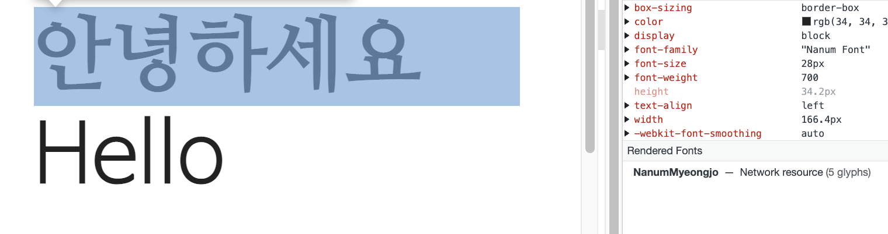
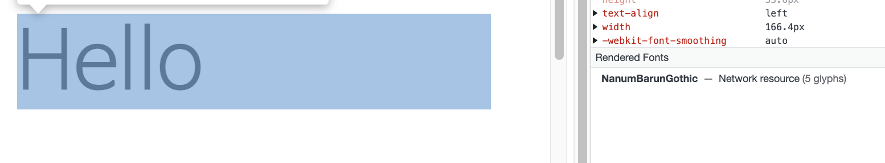

## 들어가며

회사 서비스는 Pretendard Variable 폰트를 사용하고 5개 국어 다국어 처리를 하고 있다. <br/>
어느 날 일본어의 일부 문자에서만 폰트가 깨지는 이슈를 발견했는데, 비단 우리만 겪었던 문제는 아니였는지 <br/>
기존 폰트와 별도로 일본어/한자 대응을 위한 Pretendard JP 폰트가 배포되어 있었다.

해당 이슈는 Pretendard JP 폰트와 unicode-range를 활용해 해결했는데,
이와 같이 언어마다 혹은 문자에 따라 다른 폰트를 적용해야 할 경우 어떻게 처리하면 될지 정리해보는 글


## @font-face
unicode-range는 @font-face 로 정의한 폰트가 적용될 범위를 설정하는 속성으로, <br/>
우선 @font-face부터 정리해보자.

@font-face는 웹에 표시할 사용자 지정 글꼴을 정의하는 CSS의 규칙으로 사용자의 컴퓨터에 설치되지 않은 웹 폰트를 적용할 수 있게 해준다. 
적용할 땐 아래의 문법에 따라 사용하면 된다.

```css
@font-face {
  font-family: '커스텀 폰트명';
  src: (local(경로)) url(폰트 파일 경로) format(폰트 파일 형식);
  font-style: //폰트 스타일;
  font-weight: //폰트 굵기;
}
```

- `font-family` : 사용자가 지정하는 폰트명(유지보수를 위해 실제 폰트명과 동일하게 작성하길 추천)

- `src` : `(local(경로)) url(폰트 파일 경로) format(폰트 파일 형식)`의 문법으로 원격 폰트의 경로와 파일 형식을 적어준다. 이 때 `local(경로)`을 함께 작성할 경우 사용자 컴퓨터에 해당 폰트가 설치되어있는지 확인하고, 설치되어 있지 않을 경우 폰트 파일 경로로 되돌아가 원격 서버에서 폰트를 다운받게된다.


@font-face는 웹 브라우저에게 정의한 폰트명, 다운받을 위치를 정의해주기만 할 뿐이라서 실제로 적용하기 위해선 아래와 같이 font-family에 정의한 폰트명을 넣어주어야 한다.

```css
font-family: '커스텀 폰트명';
```

## unicode-range
@font-face 로 정의한 폰트가 적용될 범위를 설정하는 속성 <br/>
각 언어마다, 문자마다 정의되어 있는데 대표적인 범위는 아래 정도가 있다. 

|    구분	     | unicode-range  |
|:----------:|:--------------:|
|   한국어	 	   |  U+AC00-D7A3   |
|  알파벳 소문자   |  U+0061-007A   |
|  알파벳 대문자   |  U+0041-005A   |
| 숫자 (0-9)		 |  U+0030-0039   |


### unicode-range 참고 링크
그 외에도 각각의 unicode-range는 아래의 사이트에서 찾아볼 수 있다.

- [unicode-table](https://unicode-table.com/kr/blocks/)
- https://www.unicode.org/charts/

## 적용예시
한글엔 나눔명조체, 알파벳엔 나눔바른고딕체가 적용되는 `Nanum Font`를 정의하고 설정해보았다.

````css
/* index.css*/

/*한글 - 나눔명조체 적용*/
@font-face {
    font-family: 'Nanum Font';
    src: url('https://cdn.jsdelivr.net/gh/wizfile/font/NanumMyeongjo.woff') format('woff');
    font-style: normal;
    unicode-range: U+AC00-D7A3; 
}

/*알파벳 대소문자 - 나눔바른고딕체 적용*/
@font-face {
    font-family: 'Nanum Font';
    src: url(https://cdn.jsdelivr.net/gh/webfontworld/naver/NanumBarunGothicUltraLight.woff2) format('woff2');
    font-style: normal;
    unicode-range: U+0061-007A, U+0041-005A; 
}

* {
    ....
    font-family: 'Nanum Font';
}
````

## 결과화면
> 현재 적용된 폰트는 `개발자도구 > Elements > Computed` 탭에서 확인할 수 있다.

별도의 스타일링없이 한글과 영어를 작성해보았다.


**한글**



한글의 경우 나눔명조체가 적용되었고,


**알파벳**



알파벳의 경우 나눔바른고딕체가 적용되었다! <br/>
우측 상단의 font-family 속성을 통해 한글/알파벳 모두 Nanum Font가 적용되었음을 확인할 수 있다.

언어, 특수문자에 따라 폰트를 달리하고싶다면 이와 같은 방법으로 unicode와 @font-face를 활용하자.

```toc
```