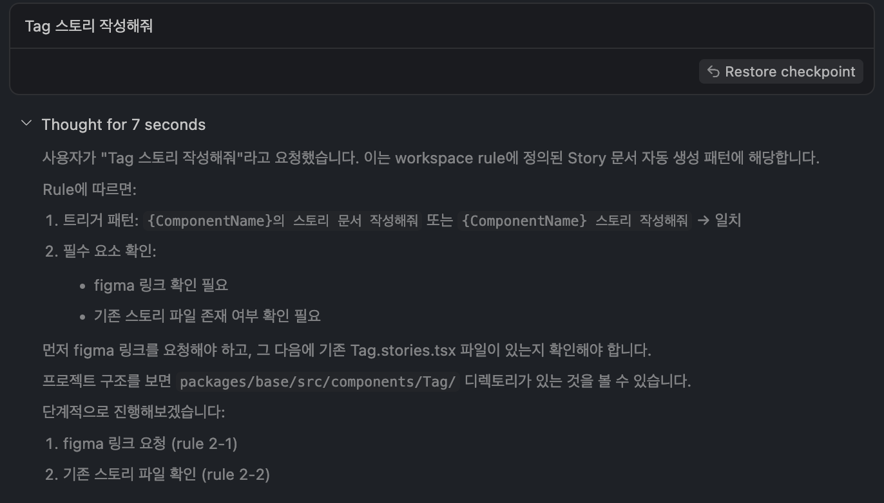
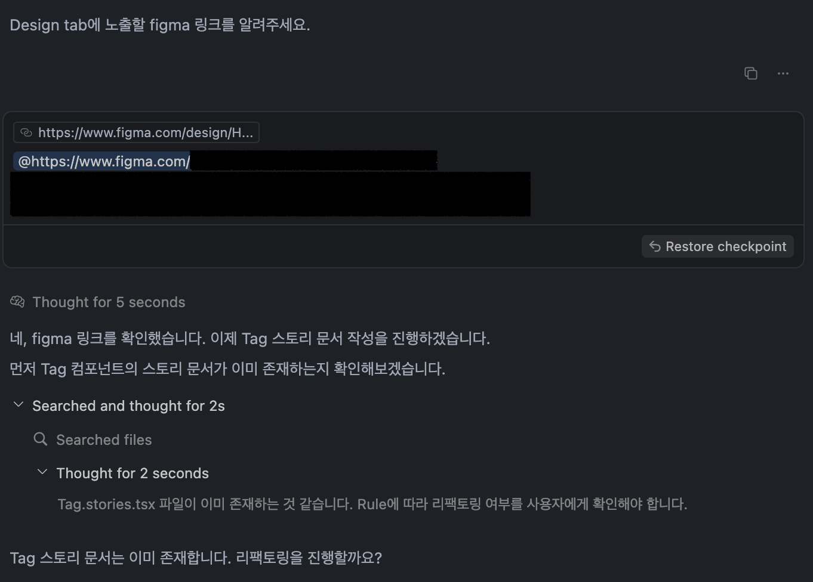
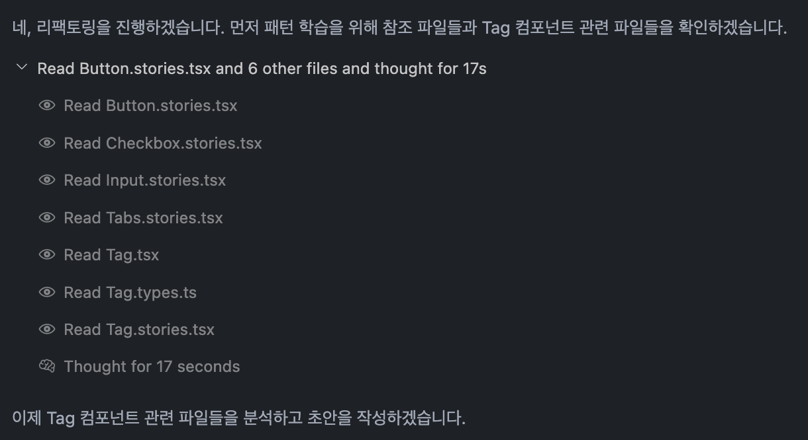
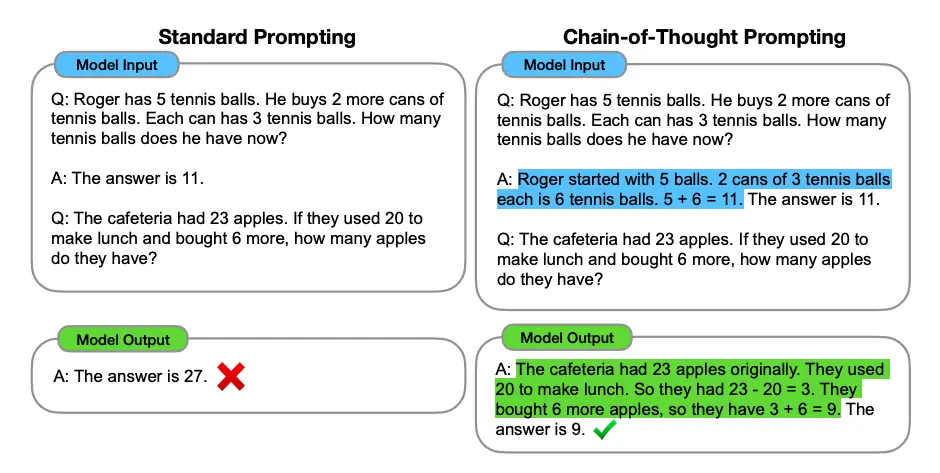
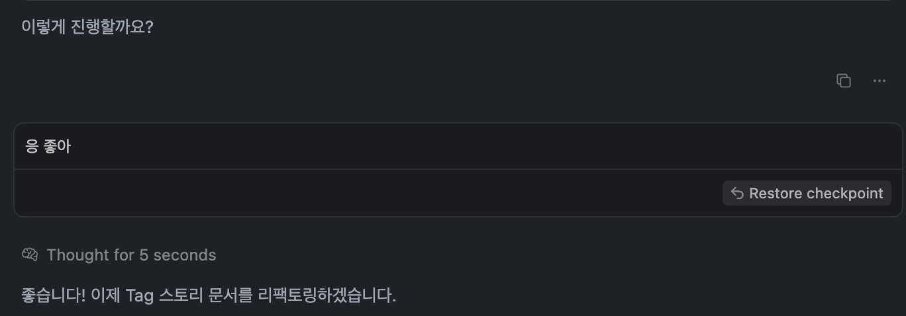

## 들어가며

재직 중인 회사의 프론트엔드팀에선 디자인 시스템을 직접 운영하고 있다.
공통 토큰과 컴포넌트 중심으로 UI를 구성하면서 component-driven development를 실무에 녹여낼 수 있었고, 팀의 생산성도 눈에 띄게 향상됐다.

다만 그 생산성을 유지하려면 피할 수 없는 루틴한 작업이 있었다. <br/>
바로 **컴포넌트를 만들 때마다 storybook 문서 작성하기.**

컴포넌트마다 예제 코드, Props, Playground 등을 포함한 문서를 템플릿에 맞춰 작성해야 했다.
복잡하진 않지만 시간이 오래 걸리고, 귀찮고, 실수가 잦은 작업이었다.
템플릿을 기준으로 복사-붙여넣기하는 흐름이라 작성자마다 표현 방식이 달라지고, 한두 개의 섹션을 빠뜨리는 실수도 종종 있었다.

이런 작업을 반복하다보니 문득 **이 문서를 꼭 사람이 써야되나..?** 🥱 생각이 들었다.

마침 우리 팀은 Cursor를 도입해 적극적으로 활용하고 있었고, 자동화에 대한 관심도 높은 편이었다. Cursor Rule을 작성해 보일러플레이트 코드를 자동 생성하는 실험도 활발히 이루어졌고, 주간 회의에서는 어떤 자동화를 시도해봤는지 공유하고는 했다.
이런 팀 분위기 덕분에 **Storybook 문서화 같은 반복 작업도 Cursor로 자동화해볼 수 있지 않을까** 란 생각이 들었고, 직접 Cursor rule을 설계해보는 계기가 됐다.

## 초기 흐름 설계

### 흐름을 직접 그려보며 방향 잡기

처음에는 프롬프팅 기법에 대한 지식이 거의 없었다. 다만, 구현하고자 하는 흐름만큼은 명확했다.

```tsx
[특정 규칙에 의해 rule 실행]
"{컴포넌트명} 스토리 작성해줘" 입력
        │
        ▼
[필수 조건 확인]
├── Figma 링크 있는가?
│     ├─ O: 다음 단계 진행
│     └─ X: "Figma 링크를 알려주세요" 응답 후 대기
└── 기존 스토리 파일 있는가?
      ├─ O: "리팩토링할까요?" → 컨펌 대기
      └─ X: 신규 작성 흐름으로 진행
        │
        ▼
[초안 설명]
→ 어떤 스토리/문서가 생성될지 목차 위주로 브리핑
→ 개발자의 피드백에 따라 수정
        │
        ▼
[컨펌 요청]
→ "진행할까요?" 질문 후 대기
* 이 단계까지 어떠한 파일도 수정하지 않음
        │
        ▼
[파일 생성 또는 수정]
```

### 설계 시 고려한 핵심 원칙

- **명확한 트리거 설정하기**
  - 특정 규칙에 의해 rule이 실행되도록 했다. 의도된 조건이 아니면 작동하지 않는다.
- **필수 조건 선검사**
  - storybook의 디자인탭에서 보여줄 Figma 링크나 기존 파일 존재 여부처럼 사전에 확인이 필요한 항목을 먼저 점검하고, 조건을 만족하지 않으면 다음 단계로 넘어가지 않도록 했다.
- **상호작용 기반 디벨롭**
  - 한번의 요청으로 바로 문서가 완성되는게 아니라, 초안 설명 → 피드백 반영 → 컨펌 구조로 문서를 함께 다듬어가는 흐름을 구성했다.
- **코드 수정은 항상 마지막에**
  - cursor agent가 갑자기 여러 파일을 수정하는 상황을 방지하기위해, 컨펌 이전엔 실제 파일을 절대 건드리지 않도록 제한했다.

### 이 흐름의 일반화된 방식이 있을까?

최근 개발 스터디를 통해 `일반해` 란 개념을 접하고 어떤 문제 상황을 마주하면, 이미 이론적으로 정리된 해결 틀이나 방법이 존재하지 않을까 의심해보는 습관이 생겼다.

이번 작업도 그랬다. 처음에는 막연하게 ‘이렇게 작동했으면 좋겠다’는 직관을 따라 흐름을 그렸다. 단계가 정제되면서 `trigger`처럼 명명 가능한 키워드가 붙기 시작했고, 이런 구조가 프롬프트 설계 쪽에 이미 존재하지 않을까 싶었다. _(일반해를 찾아내려는 감각 발동..!)_ 실제로 조사해보니 무의식적으로 구성한 흐름이 다양한 프롬프팅 기법과 구조적으로 유사했다.

## 프롬프팅 기법으로 구조 다듬기

### 1. 언제 실행시킬까 (`Trigger Pattern`)

무분별한 실행은 혼란을 낳으니 `{컴포넌트명} 스토리 작성해줘` 라는 구체적인 입력이 있어야만 rule이 작동하도록 구성했다. 이는 일반적인 `Trigger Pattern`의 정의와 일치한다. AI가 임의로 반응하지 않고, 특정 조건이 충족됐을 때만 동작을 개시하는 방식이다.



> Tag 스토리 작성해줘라고 입력하면 트리거 패턴에 따라 rule이 실행된다.

### 2. 어떤 조건이 충족돼야 하나 (`Guard Clause`)

필수 조건인 1) Figma 링크 존재 여부 2) 기존 스토리 파일 유무를 초기에 점검한다. 조건이 충족되지 않으면 흐름은 중단되거나 대기 상태에 들어간다.



> 필수 조건인 figma 링크, 스토리 파일 존재 여부를 순차적으로 확인하는 사고 과정

이 방식은 소프트웨어 디자인 패턴 중 하나인 `Guard Clause`에서 따왔다.

> The term **guard clause** is a [Software design pattern](https://en.wikipedia.org/wiki/Software_design_pattern) attributed to [Kent Beck](https://en.wikipedia.org/wiki/Kent_Beck) who codified many often unnamed coding practices into named software design patterns, the practice of using this technique dates back to at least the early 1960's. The **guard clause** most commonly **is added at the beginning of a procedure** and is said to **"guard" the rest of the procedure by handling edgecases upfront.**

핵심은 앞단에서 조건을 확인해 **예외적인 경우를 조기에 차단하는 것**이다.

### 3. 어떤 예시를 학습시킬 것인가 (`Few-shot Prompting`)

AI가 문서 스타일과 코드 컨벤션을 학습할 수 있도록, 다양한 컴포넌트의 스토리 파일을 참조 예시로 제시했다.



> 참조 파일(예제)들을 분석해 패턴을 학습하는 사고 과정

이렇게 학습할 예제를 제공하는 방식은 `Few-shot Prompting` 기법에 해당한다. **입력–출력 예제를 함께 제공하여, AI가 문맥과 규칙을 간접적으로 학습하게 만드는 방식**이다. 특히 템플릿 기반 문서처럼 일정한 형식이 중요한 경우 매우 유용하다.

프롬프트 엔지니어링 가이드 문서에선`Few-shot Prompting` 을 아래와 같이 정의하고 있다.

> Few-shot prompting can be used as a technique **to enable in-context learning where we provide demonstrations in the prompt** to steer the model to better performance. **The demonstrations serve as conditioning for subsequent examples** where we would like the model to generate a response.

후속 예제를 컨디셔닝하는 데모(예제)는 shot이라고 불린다. (예제를 하나만 제공했으면 1-shot)
내 경우엔 다양한 예시를 가진 컴포넌트 총 4개를 예시로 지정했는데, 이러면 총 4-shot을 제공한 셈이다.

### 4. 어떤 형식으로 출력돼야 하나 (`Structured Prompting`)

문서 구조와 코드 스타일이 일관되도록 출력 양식을 미리 정의하고, 생성되는 문서가 정해진 틀을 따르도록 유도했다.

디자인 시스템의 Storybook 문서는 팀이 정한 구조와 컨벤션에 맞춰야 했다. 예를 들어, 컴포넌트를 감싸는 레이아웃 컴포넌트가 있고, 정해진 문체와 코드 스타일을 따르는 식이다. 이런 규칙은 단순히 예시를 제공해 학습시키는 것만으로는 한계가 있다고 판단해, 보다 명시적으로 양식을 적어주었다.

이런 방식은 `Structured Prompting`이라 불린다. **AI가 출력할 구조를 미리 정의하거나 유도하여, 일관된 형식의 결과를 얻는 전략**이다. 덕분에 모든 컴포넌트 문서의 스타일과 구성 순서를 동일하게 유지할 수 있었다.

### 5. 코드를 언제 수정할 것인가

Cursor Agent를 처음 썼을 때 가장 당황했던 경험 중 하나는, 간단한 요청만 했는데 갑자기 여러 파일을 한꺼번에 수정해버린 일이었다. 흐름을 이해하지 못한 상태에서 코드를 바꾸다 보니 주도권을 뺏긴 느낌이 들기도 했다.

이를 막기위해 문서를 생성하기 전에 초안을 먼저 설명하고, 사용자로부터 "진행할까요?" 컨펌을 받아야만 실행되도록 했다. 이는 Chain-of-Thought의 중간 추론 설명 + Human-in-the-loop 를 합친 형태다.

#### `Chain-of-Thought (CoT)`

LLM이 단순한 정답만 내놓는 대신, **중간 추론 과정을 단계별로 설명하게 하여** 더 정확하고 복잡한 문제 해결을 가능하게 만드는 프롬프팅 기법이다.

> chain-of-thought (CoT) prompting enables complex reasoning capabilities through intermediate reasoning steps. **You can combine it with few-shot prompting to get better results** on more complex tasks that require reasoning before responding.

마침 이전 단계에서 활용한 `few-shot prompting`과의 궁합도 좋았다.



기존의 `Zero-shot Prompting`이 "질문 → 정답" 구조라면, `CoT Prompting`은 "질문 → 중간 추론 → 정답"의 구조를 따르도록 유도한다.
CoT에서 말하는 중간 추론을 먼저 출력하고 최종 정답은 그 이후에 출력하는 방식을 응용해서 AI가 암묵적인 추론을 막고 단계적으로 사고하도록 만들고 싶었다.

문서를 곧바로 생성하는 것이 아니라 먼저 **“어떤 구성으로 문서를 생성하려는지 계획을 먼저 설명하도록”** 했다.

예를 들어,

```tsx
이제 {componentName} 관련 파일들을 분석하고 초안을 작성하겠습니다.

분석 결과:
{componentName} Props:
...
생성할 StoryFn 목록:
...
{componentName}.mdx 파일 초안:
...

이렇게 진행할까요?
```

와 같이 **예상되는 산출물의 구성과 목적을 먼저 설명하게 하고**, 사용자의 컨펌을 받은 뒤에야 문서를 생성한다.

#### `Human-in-the-loop (HITL)`

Human-in-the-loop는 사람이 AI의 중간 결과물을 직접 확인하고 승인함으로써, AI와 사람 사이에 일종의 ‘피드백 루프’를 형성한다. 예측 불가능한 실행을 막고 자동화 흐름에 통제권을 부여하는 방식이다.



> 반드시 사람의 최종 확인을 받고나서 코드가 수정/생성되며, 덕분에 코드의 통제권이 사람에게 유지된다.

### 6. 파일 생성/수정

마지막 단계는 피드백에 다라 파일을 생성하거나 수정하는 작업이다.
이 시점까지는 실제 코드 수정을 하지 않았고, 모든 확인이 끝난 후에만 실행되도록 제한했다.
덕분에 자동화 작업도 예측 가능하고, 통제 가능한 상태로 이뤄질 수 있었다.

## 최종 자동화 흐름

프롬프트 기법을 활용해 최종적으로 정리한 흐름은 아래와 같다.

```tsx
────────────────────────────────────────
1. 트리거 감지 (Trigger Pattern)
────────────────────────────────────────
  └─ "{컴포넌트명} 스토리 작성해줘" 입력 시 Rule 작동
                  │
                  ▼
────────────────────────────────────────
2. 필수 조건 확인 (Guard Clause)
────────────────────────────────────────
  ├─ 2-1. Figma 링크 확인
  │     ├─ 있음 → 다음 단계 진행
  │     └─ 없음 → "링크를 알려주세요" 응답 후 대기
  └─ 2-2. 기존 스토리 파일 확인
         ├─ 있음 → "리팩토링할까요?" 컨펌 후 진행
         └─ 없음 → 다음 단계 진행
                  │
                  ▼
────────────────────────────────────────
3. 예제 기반 패턴 학습 (Few-shot Prompting)
────────────────────────────────────────
  ├─ 참조 스토리 분석: Button, Input 등
  └─ 파일 구조 분석
       ├─ 코드 파일 (.tsx, .types.ts)
       │    └─ Props 타입, Enum/Union 추출
       └─ 문서 파일 (.mdx)
            └─ 목차, Meta 객체, 문서 구조 학습
                  │
                  ▼
────────────────────────────────────────
4. 정해진 구조에 따른 초안 작성 (Structured Prompting)
────────────────────────────────────────
  ├─ 문서 구성 템플릿 적용 (ComponentStage, Stack 등)
  ├─ 문체 / 코드 스타일 통일
  ├─ ArgTypes 규칙 기반 Controls 자동 생성
  ├─ 필수 StoryFn 생성 (Playground, Variant 등)
  └─ 복잡도 있는 컴포넌트 예외 처리
                  │
                  ▼
────────────────────────────────────────
5. 초안 설명 및 컨펌 (Chain of Thought + Human-in-the-loop)
────────────────────────────────────────
  └─ 사용자에게 분석 결과 및 생성 계획 제시
       └─ "진행할까요?" 질문 → 컨펌 후에만 실행
                  │
                  ▼
────────────────────────────────────────
6. 문서 생성 및 리팩토링
────────────────────────────────────────
  └─ .mdx / .stories.tsx 파일 생성 또는 수정

```

## 회고

이 흐름과 cursor rule을 팀 회의에서 공유하고 시연했을 때, 편의성과 예측 가능성 면에서 긍정적인 피드백을 받았다.

- 가장 먼저 나왔던 피드백은 `귀찮은 문서화를 채팅처럼 처리할 수 있다는 점이 편하다`는 말이였다.
  매번 수작업으로 예제와 props를 채워넣던 과정을 자동화해 "스토리 작성해줘" 한 문장으로 시작할 수 있게 된 것이다.
- `컨펌 없이는 코드가 수정되지 않는 구조가 마음에 든다`는 의견도 있었다.
  이전엔 cursor agent가 한 번에 여러 파일을 예고 없이 수정해 당황하는 경우가 있었지만,
  지금은 작업 계획과 함께 "진행할까요?"라는 질문을 한 뒤 기다리고, 사용자 컨펌 이후에야 파일이 수정되니 안심하고 요청할 수 있다는 점이 마음에 들었다는 의견이 많았다.
  **자동화의 주도권이 사람에게 있다**는 점이 핵심이었다.

팀뿐만 아니라 스스로에게도 꽤 의미 있는 작업이었다.

- 처음에는 그냥 너무 번거로운데 문서화 좀 자동화할 수 없을까?라는 생각으로 시작했지만, 설계 흐름을 구체화해 나가면서 **AI를 도구로 활용하려면, 그 도구가 작동할 수 있는 맥락부터 먼저 설계해야 한다**는 사실을 깨달았다.

- 무엇보다 흥미로웠던 건, **처음에는 감으로 그렸던 흐름이 나중에 보니 여러 프롬프트 설계 기법과 닮아 있었다는 점**이다. 의식하지 못했던 단계들이 나중에 보니 `Trigger`, `Guard Clause`, `Few-shot`, `Structured`, `Chain of Thought`, `Human-in-the-loop` 와 같은 이름을 가진 구조적 기법들이었다. 감으로 만든 구조에 이름이 붙자, 설계는 더욱 명확해졌고 재사용 가능해졌다.(개발 스터디에서 ‘일반해’를 찾는 감각을 훈련한 경험도 큰 도움이 되었다.)

최근 AI가 빠르게 발전하는 걸 지켜보며 나는 AI를 어떻게, 어디까지 활용할 수 있을까 고민이 많았다.
이번 작업을 통해 느낀 건 **AI는 명확한 문맥을 제공해 최선의 결과를 도출해내는 도구로 사용하고, 결과물의 주도권은 내게** 있어야 한다.
결국 AI와 보다 정확하게 소통해 보다 나은 결과를 도출하기 위해선 공용어인 다양한 프롬프팅 기법에 꾸준히 관심을 가져야겠다는 문장으로 나름 긴 실험기를 마무리해본다.

## 참고자료

- [Guard (computer science) - Wikipedia](<https://en.wikipedia.org/wiki/Guard_(computer_science)>)
- [Few-shot Prompting - Prompt Engineering Guide](https://www.promptingguide.ai/techniques/fewshot)
- [Chain-of-Thought Prompting - Prompt Engineering Guide](https://www.promptingguide.ai/techniques/cot)
- [Three Pillars of Best Practice in Prompt Engineering - Medium](https://medium.com/@ligtleyang/three-pillars-of-best-practice-in-prompt-engineering-few-shot-chain-of-thought-and-structured-a7ce8a105dd9)
- [Human in the loop - TTA 정보통신용어사전](https://terms.tta.or.kr/dictionary/dictionaryView.do?word_seq=181673-1)
- [Human in the Loop - Samsung SDS Insights](https://www.samsungsds.com/kr/insights/human_in_the_loop.html)

```toc

```
