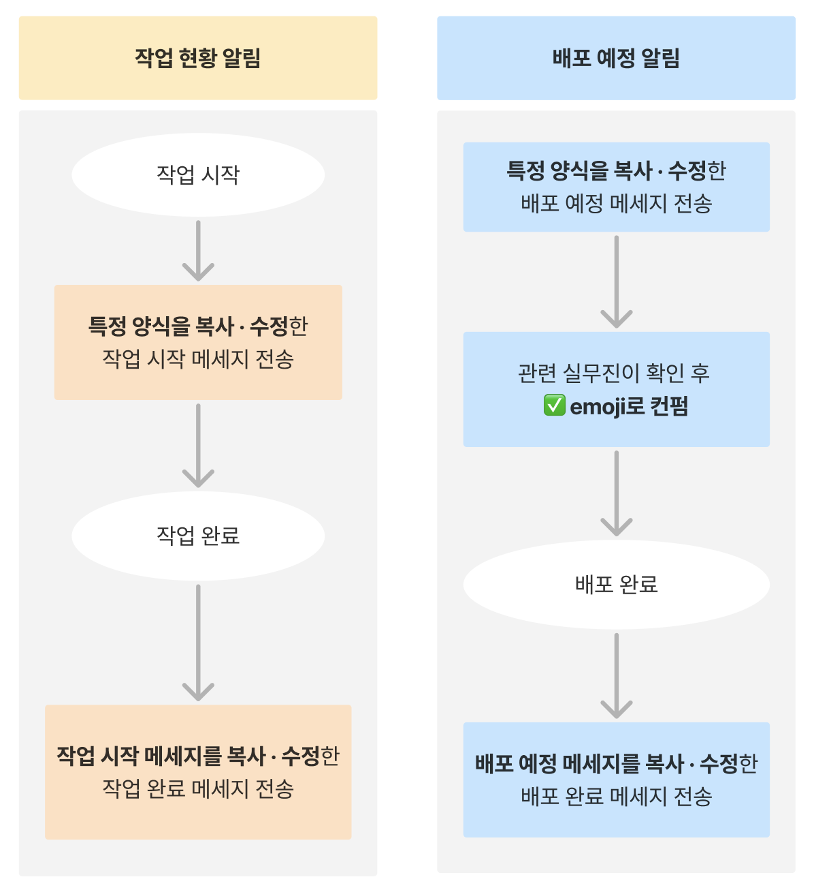
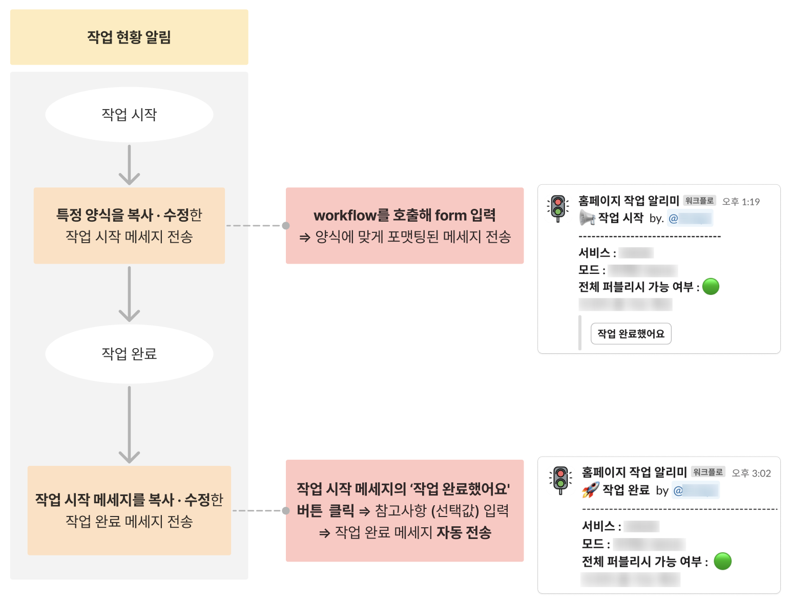
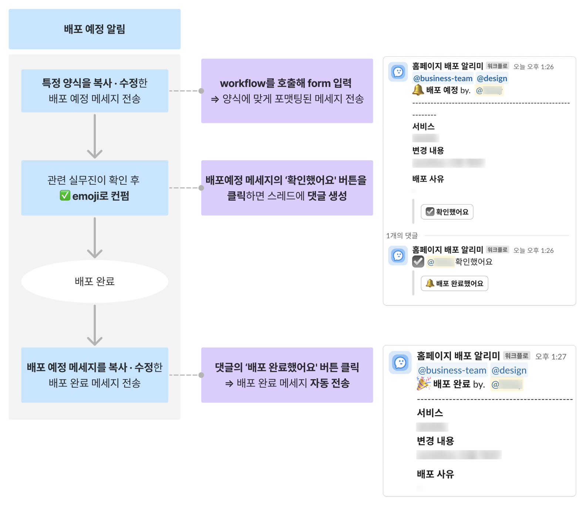
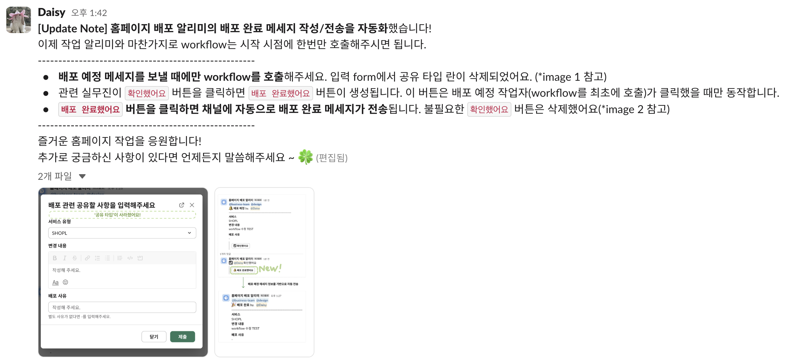
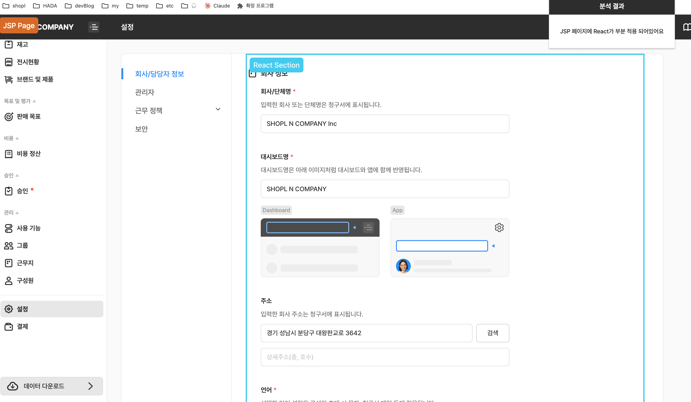
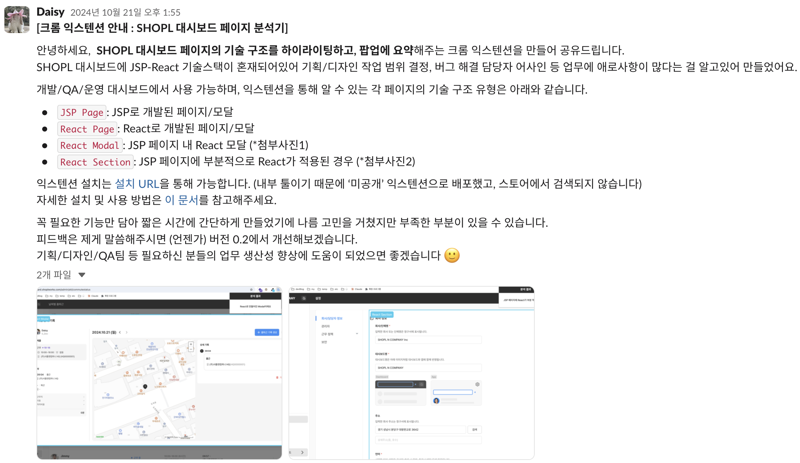

## 들어가며

재직 중인 회사에서 새로운 서비스를 맡게 된지도 어느덧 1년 반이 지났다. 소속이 변경된 직후는 새로 합을 맞추게 된 동료들과 익숙하지 않은 도메인에 적응하는데 집중했다. 낯선 요구사항이 주어져도 일정에 맞춰 최선의 방법으로 구현해내는걸 주요 과제로 삼았다. 시간이 흐르며 어느정도 동료들과 도메인에 익숙해졌고, 자연스럽게 새로운 갈증과 고민이 생겼다.

단순히 주어진 요구사항을 구현하는 것을 넘어 +α를 만들어내는 사람이 되고싶었다.

+α를 만들어내는 사람은 어떤 사람일까? 내가 만들 수 있는 +α는 무엇일까? 고민하면 할수록 점점 더 거창하게 느껴지고 답이 내려지지 않았다. 혼자서 끙끙 앓지말고 외부의 도움을 받아볼까싶어 적극적으로 도움을 구했다. 저분은 +α를 만들어 내시는 것 같다란 느낌이 드는 분들께 링크드인과 소속된 커뮤니티를 활용해 커피챗을 요청했고, 감사하게도 모든 분들이 기꺼이 수락해주셔서 이야기를 나눌 수 있었다.

다양한 관점에서 이루어진 대화 끝에 내린 결론은 마냥 거창하게 생각하지 말고, 회사에서 업무를 하며 느꼈던 문제나 불편함을 사소한 것부터 직접 개선해보기였다.

이후 업무를 할 때 자연스레 촉수를 곤두세우게 됐고, 협업 과정의 반복적인 수작업, 불필요한 커뮤니케이션 비용이 눈에 들어왔다. 이런 불편함을 기술적으로 해소할 수 있다면 조직에 기능을 만들어내는 것과는 결이 다른 임팩트를 줄 수 있고, 내가 고민하던 +α를 만들어낼 수 있지 않을까?란 생각에 작은 실험들을 시작했다. 그렇게 진행했던 두가지 실험에 대해 적어보려 한다.

## Slack 워크플로로 누구도 복붙하지 않는 채널 만들기

### 관찰, 그리고 문제 정의하기

우연히 비즈니스팀과 디자인팀이 소속된 홈페이지 작업 관련 Slack 채널을 보게 되었다. 채널엔 특정 양식을 복사/붙여넣기해 내용을 채워넣는 형태로 홈페이지 작업 현황이 공유되고 있었다.

매번 특정 양식을 찾아 복사해야 하고, 수동으로 작성하는 과정에서 오타나 포맷 오류가 자주 발생하고 있었다. 또 다양한 유형의 작업이 유사한 포맷으로 공유되다보니 현황을 한눈에 구분하기 어려워보였다.

채널 활동 빈도가 높은 동료들에게 파악한 문제점에 대해 이야기 해보았고, 비슷한 불편함을 느끼고 있다는 걸 확인했다. 관찰을 통해 문제점을 찾아냈으니 한 번 개선해보자는 마음이 들었다.

### 패턴 파악하기

문제를 해결하기 위해 우선 채널을 관찰하며 업무 흐름과 패턴을 파악해봤다.



채널에 공유되는 현황은 크게 작업 현황 알림과 배포 알림으로 나뉘어졌고, 각 현황마다의 업무 흐름은 위와 같이 이루어지고 있었다. 패턴을 파악하니 문제가 더 명확해졌다.

- 공유되어야 하는 정보는 각각 작업 시작, 배포 예정 메세지에 모두 작성되었으나 작업 완료/배포 완료 시점에도 공유하기위해 이전 단계에 작성했던 메세지를 복사해 수정해야했다.
- 배포 예정 알림 후 관련 실무진의 컨펌을 emoji를 통해 확인하는 과정이 번거로워 보였다.

### 자동화 도구 만들기

처음엔 홈페이지 작업 플랫폼을 Slack과 연동해 로그인/로그아웃, 배포시 자동 알림을 보내려했다.. 하지만 이것저것 고려한 끝에 Slack 워크플로로 결정했다.

공유되는 정보 중엔 배포 가능 여부 등 홈페이지 작업 플랫폼에서 알 수 없는 정보가 포함되어있었다. 배포 예정 알림은 홈페이지 작업 플랫폼과 별개의 프로세스이기에 단순히 알림을 주는 것만으로는 현재의 업무 흐름을 온전히 대체할 수 없다는 생각이 들었다. 워크플로는 노코드 툴이니 비개발직군인 디자인팀, 마케팅팀이 추후 필요에 따라 유지보수할 수 있다는 장점도 있었다.

앞서 정리한 두가지 작업 패턴에 따라 홈페이지 작업 알리미와 홈페이지 배포 알리미 워크플로를 만들었다.

#### 홈페이지 작업 알리미



홈페이지 작업 알리미 워크플로를 개발하기 전 동료들에게 작업 프로세스와 필요한 기능을 확인하는 시간을 가졌다. 이 과정에서 홈페이지 작업에서 가장 중요한 정보가 전체 퍼블리시 가능 여부라는걸 알게됐다.

> 🤔 : 가능 여부라면 boolean인데.. true of false.. 시각화하면 🔴 or 🟢?

boolean에서 시작되어 🔴 or 🟢 로 귀결된 의식의 흐름에 따라 워크플로의 컨셉은 신호등이 되었다. 🚥

1. 작업 시작 공유 : 워크플로를 호출해 form에 필수로 공유되어야 하는 사항을 작성한다. 작성이 끝나면 정해진 양식에 맞게 포맷팅된 ‘작업 시작’ 메세지가 전송된다.
2. 작업 완료 공유 : 작업 시작 메세지의 작업 완료했어요 버튼을 클릭해 참고사항을 입력한다. 간혹 작업을 하다보면 추가로 공유할 사항이 생길 수 있다는 실무진 분들의 의견을 참고해 이 단계를 추가했다.참고사항을 입력하면 기존의 작업 시작 메세지 정보와 참고사항을 포함한 작업 완료 메세지가 전송된다.

#### 홈페이지 배포 알리미



다음으로 홈페이지 배포 알리미에 대해 알아보자.

1. **배포 예정 사항 공유** : 워크플로를 호출해 form에 필수로 공유되어야 하는 사항을 작성한다. 작성이 끝나면 정해진 양식에 맞게 포맷팅된 배포 예정 메세지가 전송된다. (여기까진 작업 알리미와 거의 동일)
2. **관련 실무진 컨펌** : 관련 실무진은 배포 예정사항 확인 후 배포 예정 메세지의 확인했어요 버튼을 클릭한다. 버튼 클릭시 배포 예정 메세지의 스레드에 버튼을 클릭한 유저명과 함께 확인했다는 댓글이 달린다.
3. **컨펌 후 배포 완료** : 스레드 댓글에 달린 배포 완료했어요 버튼을 클릭한다. (워크플로를 최초 호출한 배포 예정 작업자가 클릭했을 때만 동작) 배포 예정 메세지의 정보를 기반으로 한 배포 완료 메세지가 자동 전송된다.

배포 예정 메세지를 작성한 뒤 버튼을 트리거로 1) 스레드에 확인 완료 댓글을 달고 2) 배포 완료 메세지도 전송해야 했다. 워크플로는 다음 단계로 이동시키는 버튼은 한 단계당 한개씩만 지원한다. 트리거를 하나씩만 사용할 수 있는 활경에서 최대한 어색하지 않은 흐름으로 단계를 구성하려 노력했다. 두 워크플로에서 가장 신경쓴 점은 기존의 업무 흐름을 동일하게 구현하되 그 내부의 불필요한 반복을 줄이는 것.

### 결과

워크플로 배포 및 안내 후, 감사하게도 동료분들이 적극적으로 사용해주셔서 워크플로만으로 원활히 돌아가는 채널이 되었다! 이제 아무도 복붙하지 않는다 🧚‍♂️



주기적으로 모니터링하며 자잘한 수정도 하고있다. 나만의 토이프로젝트를 운영하는 느낌이랄까,,

실무진분들께 워크플로 도입 전후에 대해서도 자주 의견을 여쭤보는데, 특정 양식을 찾아다니고 복붙하는 과정이 사라지다보니 업무 피로도가 줄고, 메세지 오타나 누락이 줄어 명시적으로 업무 흐름을 파악할 수 있다는 피드백을 받았다. 동료분들의 열화와 같은 성원에 자기효능감을 느낄 수 있었다.

노코드 기반이기에 기술적인 난이도는 높지 않았지만, **관찰 → 분석 → 자동화 → 개선**이라는 구조적인 문제 해결 과정을 거쳤다는 점에서 의미가 큰 경험이였다.

## React인지 JSP인지 셀프 확인하는 크롬 익스텐션 만들기

### 관찰, 그리고 문제 정의하기

현재 담당하고 있는 서비스는 대부분이 JSP로 구성되어 있고 점진적으로 React로 마이그레이션 해나가고 있다. 모든 서비스를 한번에 옮기기엔 서비스 규모가 너무 크기 때문에 달리는 열차의 바퀴를 교체하듯이.. strangler fig 패턴을 기반으로 기능 고도화를 곁들이며 모달, 특정 섹션 단위로 옮겨나가고 있다.

서비스 규모가 크고 마이그레이션 범위가 모호하다 보니 기획자, 디자이너, QA엔지니어가 해당 영역의 기술 스택을 파악하는 데 어려움을 겪었다. React와 JSP를 구분할 수 있는 공식적인 문서나 가이드는 존재하지 않았고 실제 기획자는 매번 프론트엔드 개발자에게 질문을 해야 했다.

> "이 페이지는 JSP인 것 같은데, 모달은 React인가요?"
>
> "이 섹션은 React처럼 보이는데 맞나요?"

작은 질문이지만 반복되면서 나도, 기획자도 피로도가 쌓이고 있었다.

### 패턴 파악하기

각 페이지별로 생길 수 있는 경우의 수를 나눠 카테고리를 나눠봤다. 크게 4가지의 유형으로 정리할 수 있었다.

- `JSP Page` : JSP로만 개발된 페이지
- `React Page` : React로만 개발된 페이지
- `React Modal` : JSP Page에 React Modal을 띄운 형태
- `React Section`: JSP Page의 일부분이 React로 구성된 형태

JSP Page와 React Page 여부는 URL 규칙을 통해 비교적 쉽게 구분할 수 있었다. JSP와 React가 공존할 경우는 JSP Page 내부 iframe 태그의 src를 활용했다.

iframe 태그의 src에 React Page URL이 포함되는지 확인
classList.contains() 으로 사내 디자인시스템 Modal 요소를 사용하는지 확인
사용할 경우 React Modal, 사용하지 않을 경우 React Section으로 분류

### 자동화 도구 만들기

비개발직군이 자동화 도구를 사용할 때 가장 중요한 점이 뭘까? 고민해보니 답은 쉬운 트리거 + 직관적인 시각화가 필요하다고 느꼈다. 그래서 다음과 같은 방식의 크롬 익스텐션을 직접 제작했다.



- 페이지 로딩 시 JSP Page, React Page, React Modal, React Section을 다른 색상으로 하이라이팅
- 각 요소 위에 해당 기술 스택 정보를 보여주는 라벨 표시

MVP 형태로 제작하여 테스트했고, 실제로 스쿼드 기획자분께 선보였더니 반응은 기대 이상이었다. 좀더 다듬어 전사에도 공유했다.



### 결과

이 결과를 가장 실감하는 사람 중 한명은 바로 나일텐데, 익스텐션을 배포한 이후 스쿼드 기획자님께 이 부분은 React인가요? 라는 질문을 받은 적이 없다. 이제 더 이상 질문하지 않아도 익스텐션을 통해 페이지별 기술 스택을 정확히 파악할 수 있게 되었기 때문. 작은 확장 프로그램이었지만, 실사용자인 내 업무 스트레스를 줄여준 사례였다.

## 느낀 점 – 도구보다 중요한 것은 문제 해결 능력

사실 이 글의 초안은 예전에 작성해두었지만, 포스팅을 하기까지 꽤 오랜 시간 망설였다. 기술적으로 난이도가 높지 않은데 이걸 기록하는게 의미가 있을까?라는 생각이 들었기 때문. (각종 회고글은 잘만 포스팅하면서..😶‍🌫️)

이 고민은 글의 초점을 ‘기술’보다 ‘문제 해결’에 두니 자연스레 해결됐다. 두 실험을 통해 **도구 자체보다 문제를 인식하고 해결해내는 과정이 중요하다**는 걸 깨달았다. 워크플로든, 크롬 익스텐션이든, 핵심은 사용된 기술의 종류보단 문제를 해결하는 방식에 있었다.

돌이켜보면 문제 해결의 첫 걸음은 관찰에서 시작됐다. 불편해 보이는 점을 그냥 넘기지 않고 “왜 이렇게 하고 있을까?”, “더 나은 방법은 없을까?” 고민하며 문제를 정의하고, 패턴을 파악하다보면 개선점을 찾아낼 수 있었다.

요즘 개발 환경은 무섭도록 빠르게 변화하고 있다. 바이브코딩으로 기획자나 디자이너가 각종 서비스를 출시하는 이른바 ‘딸깍의 시대’가 오고 있다. 그럴 수록 중요해지는 것은 **무엇을, 왜 구현해야 하는지 판단하는 능력**이라고 생각한다.

들어가며에서 언급한 +α를 만들어내는 사람은 **주어진 과제 외에도 문제를 주체적으로 정의하고, 이를 기술적으로 개선하고 해결해나가는 사람**이 아닐까? 여기서 가장 중요한 단어는 **주체적**이다. 이 실험 기록을 시작으로 앞으로도 기술로 더 나은 협업 환경을 만드는 사람으로 성장해나가고 싶다.

```toc

```
