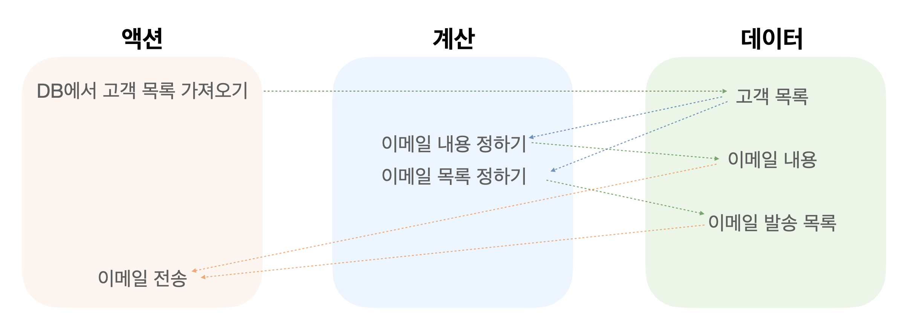

> 본 글은 [쏙쏙 들어오는 함수형 코딩 - 에릭 노먼드](http://www.yes24.com/Product/Goods/108748841) 저서를 읽고 학습한 내용을 정리한 글입니다. <br/>
> 예제로 작성한 코드는 책을 옮겨 적은 것이 아니라  학습한 내용을 바탕으로 직접 작성하였습니다.

## 들어가며 

기존에 함수형 프로그래밍이라 하면 순수 함수(결과값이 인자에만 의존)와 부수 효과(결과값을 리턴하는 것 외의 다른 동작)를 구분하고, 
부수 효과를 피하며 순수 함수만을 합성해 프로그래밍하는 기법이란 기조가 강했다.

다만 부수 효과를 완전히 제거하고 순수 함수를 합성하는 것만으로 프로그래밍을 하기는 다소 어렵다는 애매함이 존재했다.
예를 들어 특정한 리턴값이 존재하지 않는 부수 효과인 1) 전역 상태 수정이나 2) 무언가를 전송하는 동작을 하지 못한다면.. 🤯 프로그래밍하기에 분명한 어려움이 있다.

해당 서적에서는 함수형 프로그래밍을 액션, 계산, 데이터 3가지의 개념으로 프로그래밍하는 것이라 재정의하고 있다.
에릭 노먼드가 설명하는 함수형 프로그래밍을 이해하기 위해 이 핵심 개념들을 알아보자.

## 액션과 계산, 데이터 개념 알아보기

|     | 액션	                     | 계산	                                                | 데이터                       |
  |-----|----------------------------------------------------|-----------------------------|-------------------------------|
| 개념  | 부수 효과가 있는 함수 <br/> 순수하지 않은 함수	 | 순수 함수, 수학 함수	                                      | 이벤트에 대한 사실                |
| 특징  | 실행 시점/횟수에 의존            | 실행 시점/횟수와 관계없이 <br/> 입력값에 따라 출력되어 <br/> 테스트가 용이하다. | 무언가를 실행하지않고 <br/>그 자체로 의미가 있다 |
| 예시  | 이메일 보내기, DB읽기           | 최댓값 찾기, 비밀번호 유효성 확인                                | 사용자가 입력한 비밀번호             |

## 실생활 사례로 한 번 더 알아보기

오후 4시, 열심히 일하다 배가 고파진 짱구는 회사의 스낵바를 확인해보았는데 슬프게도 텅텅 비어있었다. <br/>
짱구는 떨어지는 당을 채우기 위해 편의점에 가서 간식을 사올 예정이다.


<br/>

앞으로 짱구가 취할 행동을 액션, 계산, 데이터로 분류해보자. <br/> 
실행 시점/횟수에 의존하면 액션, 의존하지 않으면 계산, 데이터 그 자체이면 데이터로 판단한다.

### 1차 분류
| 단계  | 	           항목           | 유형  |
|-----|----------------------------------|----|
| 1   | **스낵바 확인**	                      | 액션   |
| 2   | **편의점에서 간식 구입**	                 | 액션 |
| 3   | **간식가지고 돌아오기**	                  | 액션 |

이렇게만 보면 짱구가 취할 모든 행위는 액션이구나 쉽네~하고 끝낼 수 있는데, 어딘가 모르게 찜찜하다. <br/>
과연 이 과정에서 계산과 데이터는 존재하지 않을까?  조금 더 세밀하게 쪼개보자. 

### 2차 분류

| 단계  | 	           항목                                                          | 유형  |
|-----|-------------------------------------------------------------------------|-----|
| 1   | **스낵바 확인**	                                                             | 액션  |
|     | 스낵바 확인 행위	                                                              | 액션  |
|     | 현재 스낵바에 있는 간식 (스낵바 재고)                                                  | 데이터 |
| 2   | **편의점에서 간식 구입**	                                                        | 액션  |
|     | 현재 스낵바에 있는 간식 (스낵바 재고)                                                  | 데이터 |
|     | 먹고싶은 간식 (필요한 재고)                                                        | 데이터 |
|     | 쇼핑리스트 결정(필요한 재고 - 스낵바 재고) <br/> : 입력값인 필요한 재고/스낵바 재고에 따라 동일한 리스트가 출력된다. | 계산  |
|     | 쇼핑리스트                                                                   | 데이터 |
|     | 쇼핑리스트에 있는 간식 구입                                                         | 액션  |
| 3   | **간식가지고 돌아오기**	                                                         | 액션  |

각각의 액션을 세분화해보니 또다른 액션이나 계산, 데이터가 숨어있었다!  

### 알 수 있는 점
   해당 예시를 통해 아래 사항들을 알 수 있다.
1. 액션과 계산, 데이터는 어디에나 적용할 수 있는 개념이다. (현실과 동떨어진 개념이 아니다.)
2. 액션 안에는 계산, 데이터, 또다른 액션이 숨어있을 수 있다.

## 함수형 사고로 새로운 코드 작성해보기
이제 실습시간! 학습한 액션, 계산, 데이터 개념을 바탕으로 새로운 코드를 작성해보자. <br/>
2023년 기념, 23세 고객에게 이벤트를 안내하는 메일을 발송하는 기능을 구현하려 한다.

먼저, 기능 구현에 필요한 액션, 계산, 데이터를 생각한다.



위 그림과 같이 각 액션/계산을 통해 데이터가 얻어지고, 그 데이터를 활용해 또다시 액션/계산을 실행하게된다.
그렇다면 각 단계별로 코드를 작성해보자.

### 1. DB에서 고객 목록 가져오기 (액션) 

```typescript
export type Client = {
  birthYear: number,
  email: string,
}

// DB에서 받아온 고객 데이터
const clients:Client[] = [
  {
    email: 'dev-bomdong@gmail.com',
    birthYear: 2001,
  }, 
  // ...
]
```

### 2. 이메일 내용 작성 (계산)

```typescript
  const calcEmailContentsList = (client:Client, targetYear:number) => {
    if(client.birthYear === targetYear) {
      return {
        from : 'newsletter@gmail.com',
        to: client.email,
        subject: '23세를 위한 2023년 이벤트를 안내드립니다.',
        body: '안녕하세요, ...'
      };
    }
  };
```

`calcEmailContentsList`함수는 계산함수로, 호출 시점/횟수와 관계없이 고객 정보(client)와, 타겟 출생년도(targetYear)에 따른 이메일 내용(출력값)을 리턴한다.


### 3. 이메일 발송 목록 작성 (계산) 

```typescript
  const calcEmailList = (clients: Client[], targetYear: number) => {
    const emailList = [];
    clients.map((client: Client) => {
      emailList.push(calcEmailContents(client,targetYear));
    });
    return emailList;
  }
```

`calcEmailList`함수는 계산함수로, 호출 시점/횟수와 관계없이 고객 정보(client)와, 타겟 출생년도(targetYear)에 따른 이메일 발송 목록(출력값)을 리턴한다.


### 4. 이메일 전송 (액션)
```typescript
  const sendEmail = () => {
    const clients = getCLientsFromDB(); //DB에서 고객 데이터 조회 함수
    const emailList = calcEmailList(clients, 2001);
    emailList.map((email)=> emailSystem.send(email)); //이메일 발송 함수
  }
```

<br/>

이번 포스팅에선 함수형 프로그래밍의 핵심 개념인 액션, 계산, 데이터 각각의 의미를 살펴보고 이를 토대로 새로운 코드를 작성해보았다.
다음 포스팅에선 기존의 코드에 함수형 사고를 적용해서 어떻게 리팩토링 할지, 
짱구 사례에서처럼 액션을 또다른 액션, 계산, 데이터로 쪼개는 과정은 어떻게될지 차근차근 소개해볼 예정 💭


```toc
```