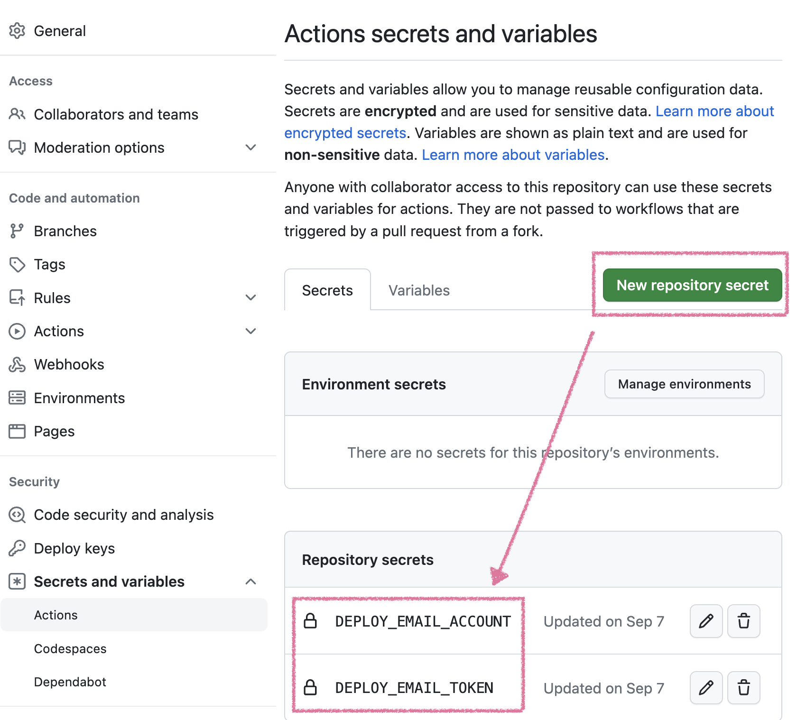
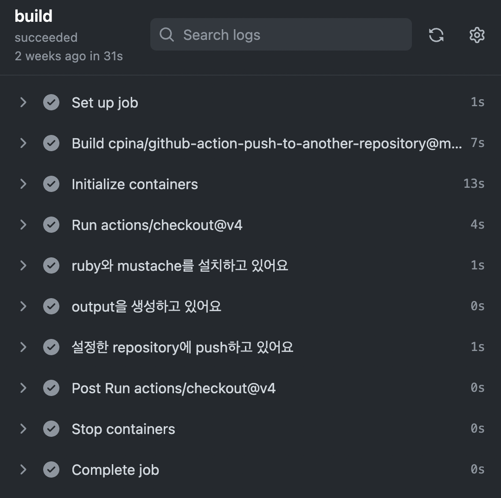

## 들어가며

사이드 프로젝트 결과물을 vercel에 배포하려는데,
organization 내부의 팀 repository는 vercel에 배포할 때 과금이 되어 내 개인 계정으로 fork하고 그 repo를 vercel에 올렸다.
그러다보니 팀 repo에 변경사항이 생길 때마다 fork한 내 개인 repo도 fetch해야해서 참으로 번거로웠다.

> 수익성있는 팀 프로젝트는 과금되는 플랜을 사용해야 하지만,
> Frontend & Server repo를 묶어두려 organization을 만든거고 말 그대로 hobby project이긴 하니까요..😇

fork한 repo에서 fetch하는 작업을 github action으로 해결할 수 있지 않을까싶어 기웃거리다 자동화에 성공했다. 누군가가 (혹은 미래의 내가 또) 비슷한 고민을 할 수 있다고 생각되어 방법을 정리해보는 글.

편의상 organization repository를 `팀 repo`로, 이를 fork한 개인 계정의 repository를 `개인 repo`로 표기했다.

## 환경 변수 설정

본격적으로 action을 설정하기 전, 우선 workflow script에서 환경 변수를 설정해야 한다. <br/>
action에서 사용할 환경 변수는 팀 repo의 Settings > Secrets and variables > Actions 에서 설정한다.



위의 New repository secret 버튼을 클릭하면 환경 변수를 설정하는 페이지로 넘어가는데, 작성을 완료하면 아래의 Repository secrets에서 확인할 수 있다.

설정해야 할 환경 변수는 아래 두 개로, 환경 변수명은 변경해도 상관없다.

1. `DEPLOY_EMAIL_ACCOUNT` : **fork한 개인 계정 email 주소**

2. `DEPLOY_EMAIL_TOKEN` : **fork한 개인 계정 token** <br/>(Settings > Developer Settings > Personal access tokens에서 발급할 수 있다.)

## github action 설정하기

이제 팀 repo에 action을 설정할 차례.

팀 repo의 root directory에 `.githun/workflows` 폴더를 만들고, yml 파일을 생성한다.

파일에는 아래와 같이 workflow를 작성해주면 되는데,
[push-to-another-repository-docs](https://cpina.github.io/push-to-another-repository-docs/) 플러그인을 기반으로 **main 브랜치에 어떤 commit이 push되면 또다른 repository에도 push**하는 작업을 수행한다.

```yaml
name: update a forked repository

# main branch에 push하면 실행
on:
  push:
    branches: [main]

jobs:
  build:
    runs-on: ubuntu-latest
    container: pandoc/latex
    steps:
      - uses: actions/checkout@v4
      - name: ruby와 mustache를 설치하고 있어요
        run: |
          apk add ruby
          gem install mustache

      - name: output을 생성하고 있어요
        run: sh ./build.sh

      - name: 설정한 repository에 push하고 있어요
        id: push_directory
        uses: cpina/github-action-push-to-another-repository@main
        env:
          # 개인 계정 token
          API_TOKEN_GITHUB: ${{ secrets.DEPLOY_EMAIL_TOKEN }}
        with:
          # GitHub Action will push files from
          source-directory: 'output'
          # 개인 계정 user/repository name
          destination-github-username: 개인계정 username
          destination-repository-name: 개인계정 repository name
          # 원본 commit message를 그대로 사용해 commit (optional)
          commit-message: ${{ github.event.commits[0].message }}
          target-branch: main
```

<br/>

위 단계까지 마치면 팀 repo의 Actions 탭에서 `update a forked repository main` (혹은 수정한 workflow name)을 확인할 수 있다.



이제 main 브랜치에 수정사항이 생길 때마다 위처럼 자동으로 action이 실행되어 개인 repo에 반영되고, <br/> 개인 repo와 연동된 vercel도 다시 배포를 진행하게 된다.

```toc

```
