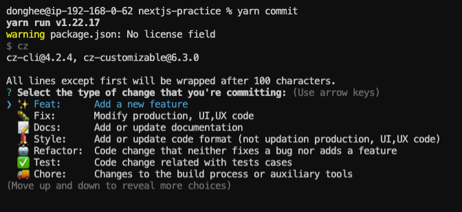
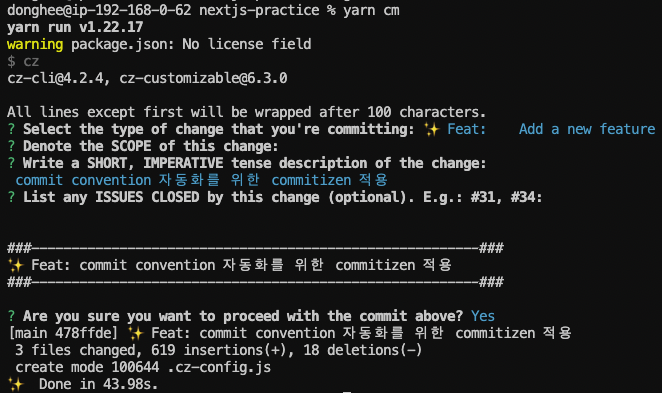

## 들어가며
최근 작은 부분부터 팀문화를 개선하는 데에 관심이 생겼고, 1순위로 눈에 들어온 건 Commit Convention이였다. 
Commit Convention을 정하고, 앞으로도 계속 지켜나가기 위해 소소한 시스템을 구축한 이야기를 적어보는 글.

### ☑️ 문제점
1. 팀원별로 commit style이 통일되지 않았다.
   (각자 다른 기준으로 정해진 commit Header를 사용했고, 첫글자를 대문자로/소문자로 작성하는지도 차이가 있었다.)
2. commit convention을 정하는 것보다 꾸준히, 혼선없이 지키는 게 어렵다.

### ☑️ 해결방안
1. commit의 목적별로 Header를 정해 commit만 봐도 어떤 작업인지 예상가도록 하자.
2. commitizen을 이용해 Header 입력을 반자동화하고, 상세 작업만 직접 작성하는 시스템을 구축해보자.
   (commitizen은 팀원분과 이야기를 해보다가 힌트를 얻었다.)

### ☑️ Commit Convention 정하기
금방 끝날거라 생각했지만 생각보다 세세한 범위까지 협의하며 꽤 시간이 걸렸던 convention 정하기.
몇 가지 경우만 예를 들어보자면,

👤 : 기능 추가는 Feat이라고 하자. <br/>
👥 :  기능의 범위가 무엇인가? (함수만? UI, UX 관련도 포함하는가? CSS는 포함하는가?)

👤 : 코드 수정은 Modify를 사용하자 <br/>
👥  : 코드 수정의 범위는 어디서부터 어디까지인가? 코드 삭제도 Modify의 범주에 들어가는가? <br/>
👥 : 단순 오타수정과 기능 수정을 동일한 Header에 둘 것인가?


*쉽지않네*

예상했던 것보다 더 깊게 수정할 코드의 범위를 세분화하고(함수, UI, package 관련 등) 
특정 예외케이스를 고려해(단순 오타 수정, 프로덕션 코드에 영향이 없는 포맷팅 수정 등) 협의를 마칠 수 있었다.

## Commitizen으로 Commit Convention 지키기

`Commitizen`은 일정한 commit message를 작성하기 위한 라이브러리로, 
아래 사진처럼 commit Header를 간단하게 선택하고 이후 관련된 Scope, Description, Issues 등을 입력하는 형태로 commit을 작성할 수 있다. 
(Header앞의 귀여운 emoji는 덤✨)

`cz-customizable` 라이브러리는 Commitizen에 적용될 commiting rule을 커스텀할 수 있도록 도와주는 라이브러리로, Commitizen + cz-customizable 조합을 통해 손쉽게 commit convention을 관리할 수 있다.



### 1. Commitizen, cz-customizable 설치

```html
$ npm install --save-dev commitizen cz-customizable
//using yarn
$ yarn add -D commitizen cz-customizable
```
### 2. package.json의 config에 commitizen config 추가하기

```html
{
  ....
  "devDependencies": {
    ...,
  },
  "config": {
    "commitizen": {
      "path": "cz-customizable"
    }
  }
}
```

### 3. root 경로에 cz-config.js 파일 생성 및 내용 입력하기
아래의 형식대로 CLI를 커스텀하기 위한 내용을 입력해준다. <br/>
객체의 `value`는 commit Header, `name`은 각각의 Header에 대한 설명이라고 생각하면 된다.

````
module.exports = {

    types: [
        { value: '✨ Feat', name: '✨ Feat:\tAdd a new feature' },
        { value: '🐛 Modify', name: '🐛 Fix:\tModify production, UI,UX code' },
        { value: '📝 Docs', name: '📝 Docs:\tAdd or update documentation' },
        {
          value: '💄 Style',
          name: '💄 Style:\tAdd or update code format (not updation production, UI,UX code)',
        },
        { value: '🤖 Refactor',
          name: '🤖 Refactor:\tCode change that neither fixes a bug nor adds a feature',
        },
        {
          value: '✅ Test',
          name: '✅ Test:\tCode change related with tests cases',
        },
        {
          value: '🚚 Chore',
          name: '🚚 Chore:\tChanges to the build process or auxiliary tools\n\t\tand libraries such as documentation generation',
        },
    ],
    allowCustomScopes: false,
    allowBreakingChanges: ['feat', 'fix'],
    skipQuestions: ['body'],
    subjectLimit: 100,
};
````

### 4. package.json 파일에 commitizen을 실행할 수 있는 script 추가하기
   key값은 commitizen을 실행할 수 있는 명령어로, 아래처럼 입력할 경우 `yarn commit`을 작성하면 commitizen을 실행시킬 수 있다.

````html
{
  "scripts": {
    ...,
    "commit”: "cz"  //yarn commit으로 실행하도록 custom
  },

  "dependencies": {
    ...
  }
}
````

### 5. 실행하기
파일 변경 후 이전과 동일하게 `git add .` 후, 이전 단계에서 추가한 실행 script (예시 기준으로 `yarn commit`)를 입력하면 commitizen이 실행된다.

````html
$ git add .

//using npm
$ npm run commit

//using yarn
$ yarn commit
````


*실행 화면*

 commitizen이 실행되면 방향키, 엔터를 통해 commit Header를 선택한다.

<br/>



Header를 선택하면 순차적으로 해당 commit에 관련된 Scope, Description, Issues를 입력하기위한 질문이 보여진다. 
(현재 팀에선 Description만 입력하고 있어서 다른 사항은 생략한 채로 입력했다.)

입력을 마치면 작성한 commit 미리보기와 함께 확인 질문이 보여지고, 마지막 확인까지 마치면 commit 완료!

상세 설명을 보면서 commit Header를 선택하고, 이어지는 질문에 응답하는 형식으로 commit message를 작성한 뒤 최종확인까지 할 수 있어 순간적인 오기나 Header의 대소문자 혼선 등을 방지할 수 있는 툴이라는 생각이 든다.


## 참고 자료
<a target="_blank" href="https://blog.dnd.ac/github-commitzen-template/">git commitizen의 사용방법 및 template에 대해서 알아보기</a> <br/>
<a target="_blank" href="https://www.npmjs.com/package/commitizen">commitizen-npm</a> <br/>
<a target="_blank" href="https://dev.to/sohandutta/make-everyone-in-your-project-write-beautiful-commit-messages-using-commitlint-and-commitizen-1amn">Make everyone in your project write beautiful commit messages using commitlint and commitizen 🚀</a>


```toc
```