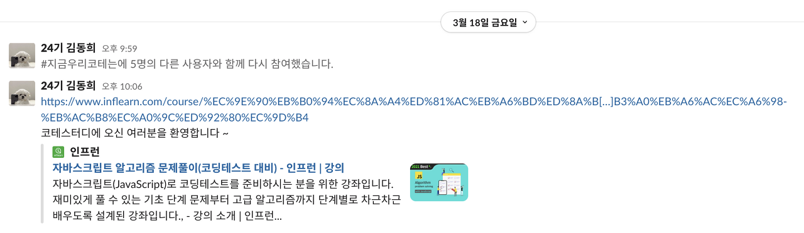
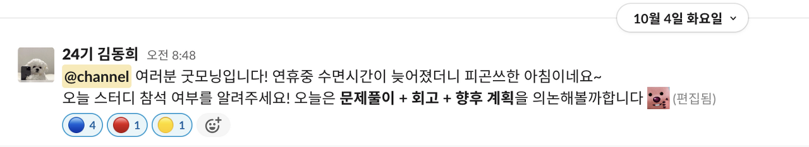
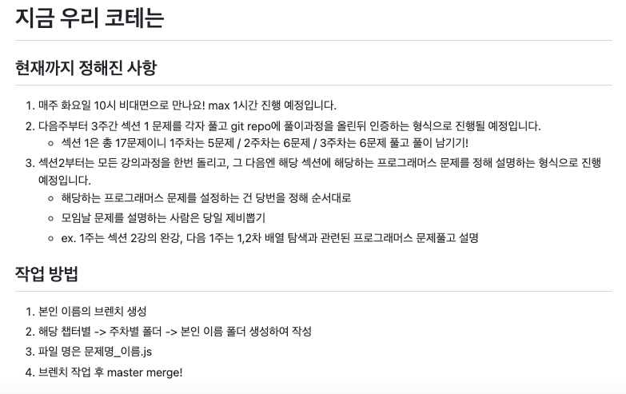
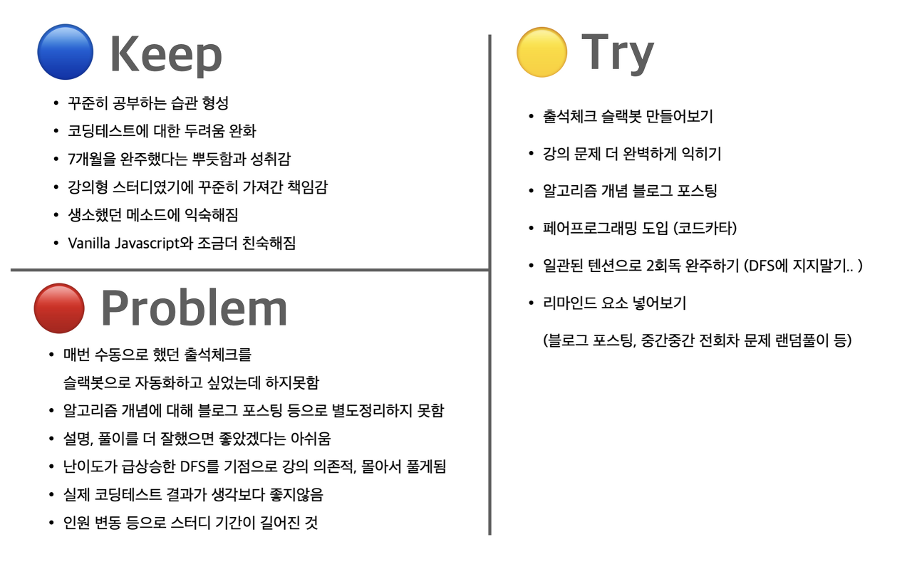

## 들어가며
올해 3월, 개발자로서 커리어를 막 시작한 6명이서 시작한 알고리즘 스터디가 약 7개월이 지난 10월 초,
최종인원 4명으로 1회차의 막을 내렸다.
1회차에서 얻은 교훈을 바탕으로 바로 2회차를 시작하기로 했지만
정확히 무엇이 좋았고 아쉬웠는지, 또 무엇을 배웠는지 돌이켜 정리해보는 글

## 스터디의 시작

*3월 18일 개설된 스터디 slack 채널*

인프런을 탐색하다가 흔치않은 '자바스크립트' 알고리즘 문제풀이 강의를 찾은게 시초였다.

이전까진 코딩테스트의 ㅋ만 들어도 내 길이 아니다하며 회피했는데,
문제 유형별로 상세하게 나뉘어진 강의 커리큘럼과 긍정적인 후기를 보며 이 강의를 완강하면 두려움이 완화되지않을까싶었다.

평소 퇴근 후 공부인증 스터디를 진행하며 이런저런 고민을 나누던 부트캠프 동기 개발자 6분(프론트엔드 5명, 백엔드 1명)과 스터디를 제안했고, 
모두 긍정적인 의견을 가지고 계셔서 본격적으로 Slack 채널과 GitHub Repo를 꾸려 시작하게 되었다.

## 스터디 진행 방식
### ☑️ 모임 방식
Google Meet를 활용한 주 1회 비대면, 사다리타기를 통해 랜덤으로 배정된 문제를 풀이하는 강의 형태

### ☑️ 커뮤니케이션 도구
Slack으로 출석체크 및 기타 커뮤니케이션을 진행했다.


*매주 스터디날 오전, slack 채널에서 진행한 출석 체크*

### ☑️ 풀이 공유
GitHub Organization을 만들어 Repository에 풀이 코드를 공유했다.


*팀원들과 협의해 GitHub Repo의 Readme에 정리해둔 진행방식*

## 스터디 1회차 회고
1회차 마지막 날, 스터디원들과 함께 KPT 방식으로 회고한 내용.
이를 기반으로 2회차도 힘차게 진행해보려 한다.



### 🔵 Keep : 좋았던 점

*네이버웹툰 대학일기 - 자까*

- 주1회 스터디를 7개월동안 포기하지않고 지속하며 얻은 성취감
- 알고리즘, 코딩테스트에 대한 막연한 두려움이 조금은 (정말 조금은!) 사라진 것
- 평소 생소했던 메소드도 사용해보며 어쩌면 나.. Javascript와 조금은 친해졌을지도? 라고 느낀 것

### 🔴 Problem : 아쉬웠던 점

*네이버웹툰 대학일기 - 자까*

- 난이도가 급상승한 DFS를 기점으로 문제 풀이를 강의에 의존하게 되고, 텐션도 떨어져 스터디 전에 몰아서 풀게된 것 ~~(위 모습은 DFS를 기점으로 급격히 텐션을 잃었던 Google Meet 속 우리의 모습이였다..)~~
- 문제 풀이에만 급급하고 그에 활용되는 개념들을 따로 정리하지 못했다는 아쉬움
- 예기치못한 인원 변동으로 소수인원이 불참해도 그 주는 쉬게되어 스터디 기간이 길어진 것
- 출석 체크를 Slack 채널에서 수동으로 진행했는데, 자동화하는 슬랙봇을 만들려했으나 끝까지 만들지 못한 것

### 🟡 Try : 액션 아이템
- 스터디 중간중간 리마인드 요소 넣어보기 (알고리즘 개념 블로그 포스팅 후 인증하기, 중간중간 랜덤하게 전회차 문제도 추가하며 풀이하기 등)
- 참여 인원이 극소수여도 페어프로그래밍으로 문제풀이하는 식으로 정상 진행하기
- 출석체크 자동화를 위한 슬랙봇 만들어보기 (여기서 연습해보면 회사에서도 필요할 때 만들어볼 수 있을 것)

```toc
```