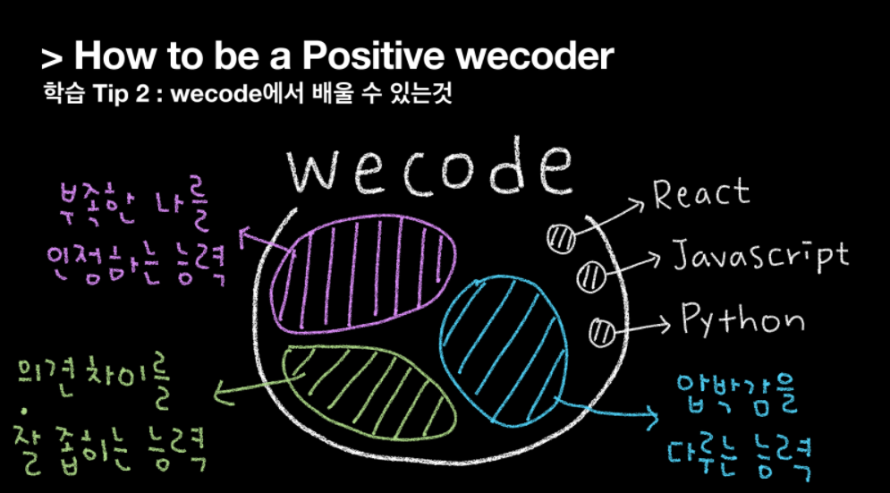

익숙하던 일상에서 잠시 벗어나, 새로운 커리어와 인생을 위해 있는 힘껏 몰입했던 3개월이 마무리되었다. <br/>
2개월간 하루 10시간이상 스스로 문제를 해결하는 연습도 해보고, 2주간의 협업 프로젝트를 2회 진행했다. <br/>
그 후 마지막 1개월은 프론트엔드 개발자로서 초기 스타트업에서 인턴쉽을 진행하며 부트캠프 과정을 수료했다.

쉴새없이 인풋을 채워넣기 바빴던 3개월은 마무리 되었지만 개발자로서의 커리어는 이제 시작이기에 지난 시간을 회고해보며 남겨진 것들을 동력으로 삼고자 한다.

## 개발자로 직무 전환을 한 이유
이전에 포스팅했었던 <a target="_blank" href="https://dev-bomdong.github.io/journal-career/">4년차 로펌비서였던 내가 개발자가 되기로 한 이유</a> 글에서 적어둔 내용이긴 하지만 그 생각에 변함이 없기에 간략하게 다시 적어본다.

내게 개발자는 (1) 그 과정은 다소 고통스러울지라도 기능이 구현되었을 때 짜릿한 성취감과 자기효능감을 가져다주고 (2) 공부하는 만큼 내 실력을 업그레이드 할 수 있는 직업이고, 이는 내 성향 및 직업관과 일치한다고 생각해 직무 전환을 하게 되었다.

나는 스스로를 성취주의자라고 칭할 만큼 계획을 세우고 성취하는 것에 큰 기쁨과 자기효능감을 느끼는 성향이고, 요즈음의 여론과는 조금 다르지만 직업이 자아실현의 수단이 될 수 있다고 믿는 사람이다. 일을 사랑하며 관련된 공부를 계속해 스스로를 끊임없이 발전시켜 나가는 삶을 꿈꿔왔고, 이러한 성향과 직업관을 유지하며 살아가기 위해선 개발자라는 직업이 적절하다고 생각했다. 그리고 이 생각은 개발자로서의 학습과 인턴쉽을 겪어본 지금 여전히 유효하다.

## 개발 공부를 하며 느낀 것
개발을 하며 느낀 건 오타 하나에서 비롯된 에러에 엄청난 시간을 소비하고 (a.k.a. 삽질),
새로운 기능을 이해하고 적용하기 위해 오랜 시간 찾아보며 익히는 작업은 꽤나 고통스럽다는 것.
하지만 코드가 실현되어 원하던 화면이 출력될 때의 짜릿함은 처음 느껴보는 신선한 성취감이였고, 함께 얻는 자기효능감과 만족감은 그 동안의 고생을 상쇄하고도 남았다.

## 부트캠프에서 배운 것
부트캠프 과정을 수료할 무렵 두 기수 아래의 분들께 전반적인 생활 팁을 발표하는 역할을 맡았고, 수료식 날 동기들에게 축사를 하는 영광도 얻게 되었다. 그 때 발표를 준비하며 스스로의 시간을 돌이켜보았는데 이 때 깨달은 것을 발표자료와 함께 기록해본다.



부트캠프를 등록할 당시엔 React, Javascript와 같은 기술 스택을 제대로 챙겨가야지! 라는 마음 뿐이었다. 하지만 실제로 자기주도학습을 진행하고, 2번의 실무 수준 프로젝트를 경험하며 든 생각은 위 그림처럼 기술은 빙산의 일각일 뿐이였다는 것. 그래서 그 나머지가 무엇이였냐하면 아래 세가지가 대표로 떠올랐다.

### 첫째, 부족한 나를 인정하는 능력
비전공자로 시작한 이상 어느 정도의 열등감은 상당 시간 존재할 것이기에 지금의 내 실력이 작고 초라해보이더라도 빠르게 받아들이고, 더 나은 내가 되기위한 동력으로 치환해야했다.

리액트를 처음 접한 3주차, 관련 과제는 쏟아지는데 아직 state와 props를 어떻게 연결해야하는지 감이 오지않아 너무 혼란스러웠다. 특히 Javascript로 완성했던 인스타그램 클론 페이지를 리액트로 다시 바꾼 뒤 코드를 리팩토링할 때 내가 이렇게 멍청했나 자괴감이 들기도했다.

하지만 이럴 때 드는 부정적인 감정을 긍정적으로 바꿔야한다는 생각이 들었고, 뒤쳐지는 느낌? 오히려 좋아를 매일 속으로 외치며 내 보폭으로 걸어가면 된다고 되뇌었다.
>그렇게 부트캠프 내에서 '오히려좋아'는 하나의 밈으로 떠오르게 되는데.. 

주변의 도움으로 기능 구현에 성공하거나 어쩌다 얻어걸려 기능이 잘 돌아가도 원리가 확실히 이해되지 않을 땐 처음부터 한 단계씩 짚어가며 꼭 이해하고 넘어갔다. 기능 구현 결과에만 치중하지 않고 내가 이해할 수 있는 선에서 최선을 다했고, 덕분에 슬럼프없이 꾸준히 성장해 목표로 했었던 필수 구현 과제 외에 추가 구현 과제까지 해낼 수 있었다. 내 보폭을 지키며 꾸준히 걸어나간 덕분이라고 생각한다.

앞으로 주니어 개발자로서 작고 소중한 실력의 나를 자각하게 될 때가 잦을텐데, 그 때마다 지금 체득한 마인드셋으로 부정적인 감정을 동기부여로 바꾸려 한다.

### 둘째, 의견 차이를 잘 좁히는 능력
프로젝트를 진행하며 아주 사소한 것부터 중대한 문제까지, 사사건건 의견이 충돌했다. 이 때 내가 갈등을 피하기 위해 의견 개진을 포기하지는 않는지, 혹은 무작정 우기고있지는 않은지 늘 경계했고 다른 팀원들의 의견이 부딪힐 때도 최대한 부드럽고 유연하게 잘 좁혀나가려 노력했다.

특히 넷플릭스를 모티브로 비디오 스트리밍 웹 애플리케이션을 개발한 프로젝트를 진행할 때 하나의 `end-point`에서 (1) 메인 페이지 컴포넌트  (2) Carousel 컴포넌트  (3) Carousel Slide 클릭을 통해 나타나는 Modal에 필요한 데이터를 모두 받아와야했는데, 이 과정이 다소 복잡하다고 판단되어 다른 data구조로 보내줄 것을 요청했으나 백엔드 측에서 이미 구축한 ERD상으로는 한계가 있어 변경이 어려웠다.

문제를 해결하기 위해 백엔드 개발자와 가장 효율적인 방법이 무엇일지 수차례 토론했다. 내가 구현한 결과물을 시연하기도, 그림을 그리며 설명하기도 했고 백엔드 측에서 구축한 ERD를 어느 정도까지 활용할 수 있을지 설명을 듣기도 했다. 여러 번 이야기를 나누며 데이터 구조를 변경한 끝에 초기 구조보다 더 편리한 형태로 데이터를 받아올 수 있었고, 기간 내에 결과물을 완성할 수 있었다.

덕분에 해당 프로젝트를 최상의 분위기 속에서 마무리지을 수 있었고, 감사하게도 부트캠프 멘토단으로부터 가장 모범적인 분위기 속에서 프로젝트를 진행했다는 평을 듣기도 했다.

### 셋째, 압박감을 다루는 능력
단기간에 많은 것을 흡수해야하는 부트캠프 특성상 늘 촉박한 일정 속에서 무언가를 학습하고 바로 적용해내야 했다. 그 과정 속에서 많은 압박감과 스트레스를 느꼈는데 sprint로 업무를 진행하는 개발자의 특성상 이러한 압박감과 스트레스는 평생 함께할 존재라고 생각했다. 때문에 이를 다루는 능력을 지금부터 깨우쳐야겠다 느꼈고, 평소 플래너를 작성하는 습관을 응용해 업무의 우선순위를 머릿속에 정리하고 실행하게 되었다.

같은 시간에 같은 작업을 하더라도 한결 정리된 마음가짐으로 시작하는 것과 불안하고 엉킨 마음으로 시작하는 것은 천지차이라고 생각하기에, 압박감과 스트레스를 다루는 태도를 체득하게된 건 지금까지도 상당히 만족스럽다.

## 앞으로 어떤 개발자로 성장하고 싶은가
웹 개발 공부 한달차에 했던 생각이 조금은 더 견고해졌다. 예전에는 그저 함께 일하고 싶은 개발자가 되고 싶다고 생각했는데 그래서 함께 일하고 싶은 개발자가 어떤 개발자인지 구체적으로 말하긴 어려웠다. 나는 어떤 개발자가 되고싶은지 꾸준히 고민해보았고, 결과적으로 나는 **유연한 개발자**로 성장하고 싶다.

유연한 팀플레이와 코드를 지향하며 개발자로서 그리고 인간적으로 말이 통하는 동료, 재사용성이 높아 이곳저곳 잘 어울리는 코드를 짜는 개발자가 되고싶다. 
예상치못한 환경에 봉착해도 흐름을 파악해 적응해내고, 팀원들간의 의사소통을 더 부드럽게 만드는 그런 개발자!


목표를 정했으니 이제 앞으로의 커리어를 시작해나가며 한발 두발 가까이 다가가야지. <br/>
지금까지 해왔던 것처럼, 긍정적으로 성실하게 노력해나가며 🤓

```toc
```