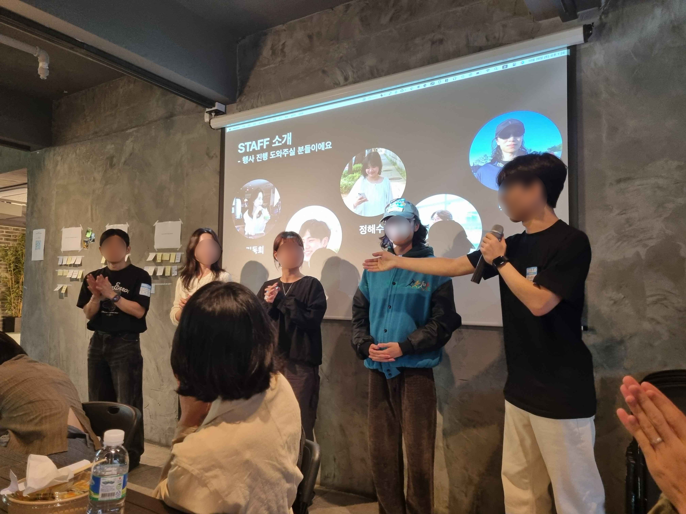

## 들어가며

소속되어있는 Discord 기반 프론트엔드 개발자 커뮤니티 `We Are The Future` 에선 반기마다 `퓨처콘`이란 이름으로 밋업 행사를 진행하고있다.
첫 번째 밋업에선 참가자로, 세 번째 밋업에선 기술 세션 발표자로서 참가한 바 있다. [(발표했던 내용)](https://dev-bomdong.github.io/react-strategy-pattern/)

밋업에 참가할 때마다 커뮤니티에 내적 친밀감이 생겨 좀더 적극적으로 참여하게 되었고, 특히 실무에서 겪은 문제 해결 경험을 바탕으로 한 기술 발표를 준비하며 스스로 많은 동기부여를 받았다.
어느 덧 2024년 하반기에 진행될 4번째 밋업 행사를 함께 준비할 기획단 모집 공고가 올라왔고 이전 참석에서 받았던 긍정적인 자극을 참가자분들께 돌려드리고 싶단 마음에 망설임없이 참여 의사를 밝혔다.
결과적으로 총 32명 정도가 참석하는 밋업 행사를 함께 기획하고, 운영해보게 되었다.

## 담당 역할



커뮤니티 빌더분께서 기술 세션 피드백을 위주로 총괄을 맡기로 하고, 차례차례 (사진의 왼쪽부터) 공간 대여 담당자, 식사 및 다과 담당자 분이 정해졌다.
나는 다른 한 분과 함께 행사의 전반적인 네트워킹 프로그램 기획을 담당하게 되었다.
주 역할을 나누긴 했지만 서로 아이디어를 주고받으며 다함께 준비해나가는 경험 또한 좋았다.

행사가 끝나고 돌아보니 주로 담당한 일은 아래로 정리될 것 같다.

- 네트워킹 프로그램 기획 (아이스 브레이킹, 네트워킹, 참여형 세션)
- [행사 참석 가이드 문서](https://dongdh.notion.site/2024-4th-Future-Conf-Guide-1286b2811c7180839b9ae41fd7d26e0e) 작성
- 행사 운영 지원

## 기획 과정

### 기획 방향 잡기

취업준비생부터 주니어, 더 나아가 중니어(4년차 이상이지만 시니어는 아닌) 연차까지 다양한 참가자분들을 포용하기 위해 아래 사항을 핵심 가치로 삼고 방향을 잡았다.

- 나만 가지고 있는 줄 알았던 고민과 생각이 사실은 남들도 가지고 있다는 **연대감**을 느끼실 수 있도록
- 아는 사람이 없거나 샤이한 편이더라도 **소외되지 않고 네트워킹**하실 수 있도록
- 밋업에서 생성된 내적친밀감을 기반으로 **커뮤니티의 참여도를 높이도록**

초기 기획 주제는 `고민상담소` 였다. 다양한 연차의 참가자들을 포용할 수 있는 가장 무난한 주제라고 생각했기 때문인데, 회의를 거듭하다보니 참가자들의 니즈는 고민 **해결보다는 공유**라는 생각이 들었다. (특별한 고민이 없는 참가자가 있을 수도 있다)
내 고민에 대한 해결방법을 찾는 것이 아니라 다른 사람도 이런 고민을 하고 있었구나란 연대감을 느끼는 것에 초점을 맞추고, `고민` 키워드를 `고민과 관심사`로 확장했다.

### 아이스 브레이킹

#### 동선 구성하기

모르는 사람들이 가득찬 곳에 홀로 들어서는 순간 뭘 어떻게 해야하나 쭈뼛쭈뼛 서성인 경험..다들 있잖아요?
혼자 오시는 분들도 심리적 안정감을 가지실 수 있도록 입장부터 자리 착석하기까지 물 흐르듯이 이동하도록 동선 구성을 신경썼다.


참가자의 입장부터 착석까지의 동선을 구성하며 고민한 흔적들

동선을 간략하게 요약하면 아래와 같다.
2~4 단계엔 모두 staff가 상주하며 다음 단계로의 이동을 도왔다

1. 입장
2. 참석자 확인 및 이름표 작성 & 부착
3. 참여형 세션
4. 식사, 물 수령
5. 네트워킹 zone 착석

#### 참여형 세션

이번 행사 기획을 하면서 퍼실리테이션 이라는 개념을 알게되어 찾아보다보니 ‘포스트잇’을 활용한 아이디어 발산법이 대다수였다.
그 중 [Concept Map](https://ko.wikipedia.org/wiki/%EC%BD%98%EC%85%89%ED%8A%B8_%EB%A7%B5) 방법론에 흥미가 갔다.
낯선 환경에서 긴장으로 경직된 몸과 마음도 풀어줄 겸, 간단한 질문에 답하는 참여형 세션을 기획했다.

붙여주신 포스트잇 답변들은 행사 종료 후 워드클라우드 형태로 만들어 공유하기도 했다.


사진에서 말한 것처럼 같은 질문에 대한 답변도 스스로의 생각과 결이 같을 수도 있을 것이고, 새로운 시각의 답변도 있을 수 있다.
전자의 답변을 통해선 나만 이렇게 생각하는게 아니였구나라는 **심리적 안정감과 연대감**을,후자의 답변을 통해선 저렇게 생각할 수도 있구나 신선한 인사이트를 얻어가시길 바랬다.

### 네트워킹 zone 구성하기

처음 보는 사람들과 어떤 얘기를 어디서부터 해야할지, 주제를
조금더 원활한 관심사에 따라 네트워킹 zone을 구성하기로 결정했다.
이 때 나눈 zone은 아이스브레이킹 뿐만 아니라 네트워킹 세션에서도 활용했다.

누군가는 개발과 깊게 관련된 이야기를 나누고 싶을수도, 누군가는 커리어패스에 대한 이야기를, 또 누군가는 취미생활에 대한 이야기를 하고싶을 수도 있다.
가급적 개발적인 주제와 비개발적인 성격을 모두 포함하도록 구성하고 싶었다.

밋업 참가신청 form에서 관심사에 대해 사전 조사를 진행했고,이 결과와 행사 장소의 테이블 구성을 고려해 최종적으로 아래와 같이 3개의 zone을 구성했다.


- `워크 & 커리어` 존 (취업, 이직, 회사생활, 앞으로의 커리어패스 등)
- `테크` 존 (특정 기술 스택, 스터디 방법 등)
- `라이프` 존 (재테크, 운동, 건강, 취미 등)

각 zone의 테이블엔 대화의 물꼬를 틀 수 있도록 간략한 온보딩 가이드를 비치해두었다.
커뮤니티 빌더분께서 [참가자들의 프로필을 보여주는 홈페이지](https://future-conf-4th-participants.pages.dev/)를 개발하셨고, 해당 페이지로 랜딩되는 QR코드를 인쇄해서 함께 비치해두었다.

- QR로 서로의 프로필을 확인하고 간단한 인사를 나눠보세요.
- zone을 선택한 이유에 대해서 공유하고 이야기를 나눠보세요.


혹시라도 정적이 흐르는 등 문제가 생길까봐 걱정했는데 다행히 zone에 따라 잘 착석해주셨고, 중간중간 적당히 자리도 바꾸시면서 와글와글 즐거운 대화가 이어졌다. (스태프들끼리 멀리서 바라보며 뿌듯해했다)

### 타임테이블 구성하기

아이스브레이킹과 2번의 기술 발표, 2번의 네트워킹 세션을 구성했다.
네트워킹 시간을 기술 세션 바로 뒤로 넣은 건 기술 세션에서 파생된 주제로 자연스레 대화를 이어나갈 수도 있고, 물리적으로 다른 시간에 세션을 진행하니 좀더 다양한 분들과 이야기하실 수 있지않을까하는 생각도 있었다.
각 세션은 10분정도 일찍 끝내 refresh 시간을 확보하려 했다.


## 회고

### 좋았던 부분들

- 이번 밋업의 핵심 가치이기도 한 **같은 고민, 관심사를 공유** 하는 시간이 좋았고, 공감과 위로를 느꼈다는 후기를 보며 밋업 기획 방향과 행사 후기가 일치하는 것을 보며 정말 정말 뿌듯했다.
- 기술 세션과 네트워킹 시간이 반복되도록 구성한 행사의 타임테이블에 대한 칭찬도 해주셔서 고민한 요소들은 다 이렇게 알아봐주시는구나.. 보람을 느꼈다.

### 아쉬웠던 부분들 & 러닝포인트

#### 공간 관련

- 정형화된 컨퍼런스 장소보다는 안락한 느낌을 위해 파티룸을 대관해 확실히 편안한 분위기를 만드는데 일조했다.다만 아무래도 **파티룸** 인지라 전날 대관하신 분들이 얼마나 깨끗하게 청소해주시는지가 중요하더라.. (행사 당일 아침부터 대걸레로 이곳저곳을 청소하느라 시간을 쏟은 웃지못할 에피소드 적립)
- 에코 조절이 불가하도록 되어있는 음향때문에 애를 먹기도 했다. 기술 발표 세션이 있다면 음향수준도 고려해야겠다는 러닝 포인트를 얻었다.

#### 운영시간 관련

- 전반적으로 타임 테이블에 따라 행사가 진행되었지만, 행사 시작과 마무리 부분에 대관 시간이 촉박해 다소 다급하게 마무리되어 아쉬웠다. 대관시간 앞뒤 30여분 정도는 준비/정리 시간으로 꼭! 빼두어야겠다는 러닝 포인트를 얻었다. (역시 버퍼가 중요하다..)

---

같은 직업을 가지고 있다는 것을 매개로 낯선 사람들과 어울려 고민과 관심사를 나누고 긍정적인 에너지를 얻어가는 경험을 직접 경험해본 사람으로서 이번엔 내가 그 경험을 만들어가는데 일조했다는 생각에 마음이 따뜻해진 시간이였다.

```toc

```
