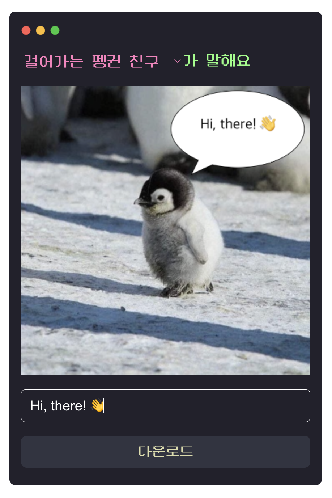

2024년 첫 주를 마무리하며 돌아보는 2023년.
기억에 남는 키워드를 중심으로 회고를 작성해 본다.

## 메인 기능 릴리즈, 이슈&해결

시설관리 서비스의 신규 메인 기능으로 사진을 첨부해 이슈를 등록하고, 해결하는 일종의 신문고와 같은 `이슈&해결` 기능을 개발했다.

- 하나의 모달 안에서 이슈 조회/해결/수정이 모두 이루어져야 했고, 각 상태에 따른 모달 구조가 비슷하지만 조금씩 달랐다. 이슈 등록도 유사한 형태였기에 모달 내부는 각 상태에 따라 세부적으로 달라지는 컴포넌트들을 조합해 개발했다. 이때 다양한 상태에 대응하기 위해 어떻게 하면 각 컴포넌트의 재사용성을 최대한 높일 수 있을까 고민하며 비즈니스 로직을 컴포넌트 외부로 빼내려 고민했다. 이 덕분인지 개발 기간 끝 무렵 기획이 자잘하게 계속 변경되었는데 큰 혼선 없이 대응할 수 있었다.

- 모든 기능은 사진 첨부/삭제/다운로드를 지원했는데, 이때 첨부된 사진을 개별/압축 다운로드하는 이미지 뷰어도 함께 개발했다. 최근 새롭게 담당하는 서비스에서 비슷한 기능을 한 번 더 개발할 일이 있었는데 나름 한 번 해봤다고 더 수월하게 작업할 수 있었다.

- 이슈 수정 시 날짜, 시/분까지 수정할 수 있어 이슈 등록일/해결일과 비교하며 꼼꼼하게 validation을 거쳐야 했다. 기획서를 토대로 하나하나 테스트하다 보니 생각보다 생각보다 예외 케이스가 많았다. 예외 케이스가 많으니 수정해 주세요~라고 말만 할 일이 아니란 생각이 들었고, 기획자 분과 머리를 맞대고 validation 정책을 함께 수정해나가며 찾아낸 케이스들을 하나하나 해결해나간 기억이 난다. 정해진 기획서에 따라 개발해나가는 것뿐만 아니라 기획자와 함께 정책 수립부터 함께 해나간다는 생각이 들었다.

## [동물 말풍선 짤 생성기](https://animal-meme-maker.vercel.app/)



평소 B급 감성의 동물 짤을 즐겨 사용하는 편인데, 그 짤들을 직접 만들려면 꽤나 번거로웠다. 먼저 사진 편집 앱에서 말풍선을 클릭해 적절한 위치에 배치하고, 그 위에 텍스트박스를 넣어 글을 써 다운로드 해야한다. 이때 말풍선과 텍스트박스는 별개의 요소이기에 말풍선을 넘어가지 않도록 신경 써야 해 불편함이 컸다. 귀찮아서 남이 만든 짤만 다운로드하다가 이럴 거면 내가 만들어보자 싶었다.

### 주요 기능

간단히 말하면 **이미지 선택 > text 입력 > image로 다운로드**를 지원하는 짤 생성기.

- `canvas`에서 image 다루기 : 특정 image 그려내기 및 다운로드
- `canvas`에서 text 다루기 : 말풍선 크기에 맞게 줄바꿈 및 말줄임처리
- `jotai`, `typescript`를 활용한 다국어 처리

### 내가 필요한 것을 만들어보는 경험

사실 이 무렵 건강도 안 좋았고 (올해는 아홉수란 이런 걸까 싶을 정도로 이곳저곳 아팠다) 회사는 구조조정을 하고.. 이래저래 몸과 마음이 어지러웠다.
이를 극복하고자 집중할 거리를 만들려고 첫 토이 프로젝트를 시작한 거였는데, **내가 쓰려고 만드는** 서비스라는 게 어찌나 뿌듯하고 재밌던지! 덕분에 매일 퇴근 후 책상 앞에 앉는 게 설렜다. 회사 동료들 및 주변인들의 후기를 듣는 것도 쏠쏠해 일상에 활력을 가져다 주더라.

### 익숙하지 않은 도구를 사용해 보기

빌드 도구와 상태 관리 라이브러리는 업무에서 써보지 않은 vite과 jotai를 선택했고 주로 활용한 canvas API도 처음 다뤄보는 거라 낯선 것들 투성이였다.
토이 프로젝트를 진행하며 경험해 보고 싶은 게 내가 필요한 것을 만들어보는 것, 이때 익숙하지 않은 도구를 사용할 것이었기 때문에 의도적인 선택이었다.
덕분에 문서를 읽고 바로 코드로 실습해 보는 연습, 공식 문서에 정리된 best practice가 아니더라도 응용해나가는 연습을 해볼 수 있었다.

조직 개편 후 맡게 된 서비스는 이전에 담당하던 서비스보다 복잡도가 높았는데, 이때 쌓은 경험들이 도움이 되었다.
(canvas로 이미지 리사이징을 하거나 써보지 않은 라이브러리를 활용해 바로 업무를 해나갈 때 등등)

하나 더, 처음으로 영문으로 README를 작성해 봤는데 GA를 확인해 보니 미국에서 접속한 기록도 있어 참으로 신기했던 기억이 난다.

## 구조조정과 조직개편

내 삶에서 이 단어를 경험할 일이 있을 줄이야..😇 <br/>
많이 혼란스러웠던 게 사실이지만, 자기 연민에 빠지지 않고 긍정적으로 생각하며 묵묵히 걸어나간 게 큰 힘이 되었다. 또 그렇게 잘 버텨내며 적응하고, 뒤돌아보니 지난 과정에서 배운 것들도 참 많았다.

구조조정과 조직 개편이 동시에 진행되었기에 하루아침에 동료들을 떠나보낸 것 외에도 개발해나가던 서비스, 팀도 변경되었다.

이전에 담당했던 `시설관리 서비스` 대시보드에선 주로 테이블(MUI Datagrid)을 다뤘는데 대규모 데이터 일괄처리를 하는데 진땀을 빼긴 했지만 CRUD 중심인지라 기능은 상대적으로 단순했다.

새롭게 담당하게 된 현 회사의 메인 서비스는 `직원/업무 관리 협업 툴`인지라 같은 대시보드이지만 다루는 기능과 영역의 폭이 훨씬 넓어졌다. (그중에서도 출퇴근, 근무지 기능을 담당하게 되어 지도와 점점 친해지는 중) 또 JSP에서 React로 점차 마이그레이션하고 있어 그 과정에서 겪는 시행착오도 적지 않다.

새로운 서비스에선 첫 프로젝트부터 장기 프로젝트인지라 2024년인 지금까지 릴리즈는 물론 QA도 전이다. 업무 프로젝트를 자세히 쓰지 못하는 게 아쉽다만 2024년 회고에서 써봐야지.

이와 관련된 내용은 [구조조정 3개월 후의 단상](http://localhost:8000/journal-after-restructuring/)이란 제목으로 포스팅 해둔 바 있어 추가적인 내용은 이전 글로 갈음합니다.

## 발레

기술 블로그에 웬 발레냐 싶을 수도 있지만, 운동 자체에 큰 흥미가 없는 내가 한 해 동안 꾸준히 한 운동이자 여러 배울 점도 가져다준 터라 함께 적어본다.

심란하거나 스트레스를 받은 날 아름다운 음악을 들으며 땀 흘리다 보면 (발레 특징 : 고운 선율의 음악 아래 바로바로 순서를 외우며 고강도 동작을 이어나가야 한다.) 뇌를 씻어낸 것처럼 마음이 정화되는 느낌이 든다. 독서, 글쓰기 외에 또 다른 나만의 건강한 스트레스 해소 방법을 찾아내어 기쁜 마음.

또 스스로에게 엄격해 서툰 나를 마주할 때 스트레스를 많이 받는 편인 내게 **잘 못하고 발전이 더뎌도 그저 과정을 즐기는 경험**은 참 귀하고 소중하다. 워낙 뻣뻣하고 어느 팔에 어느 발을 들어야 할지 헷갈리는 방향치지만 조금씩 자세와 동작이 나아지고 있는 게 느껴질 때 큰 재미와 성취를 느낀다. 못해도 돼! 다치지 말고 꾸준히 재밌게만 해!

## 2024년

2023년을 돌아보면 이런저런 변화 속에서 적응하느라 부단히 노력했던 한 해였다. <br/> 단순히 내 개인적 사정뿐만 아니라 chat GPT, Next.js 13 등 프론트엔드 생태계에도 큰 바람이 불었다.

다만 그 불안감 때문인지 하나를 진득하게 파기보단 이것저것 찍먹하느라 바쁘지 않았나란 반성도 하게 된다. 올해는 정신없이 변하는 환경에서도 내가 더 깊게 파내려가야 할 근본은 무엇일까? 고민하고 밀도있게 다뤄보고자 한다.

```toc

```
