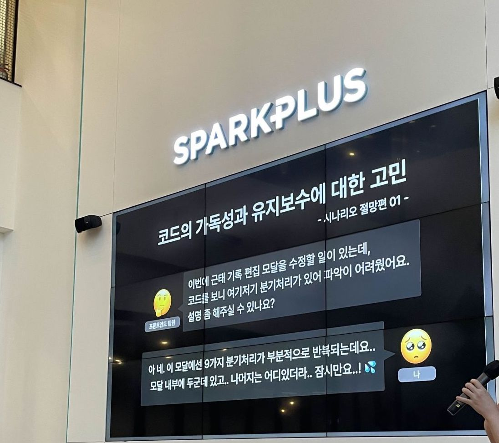
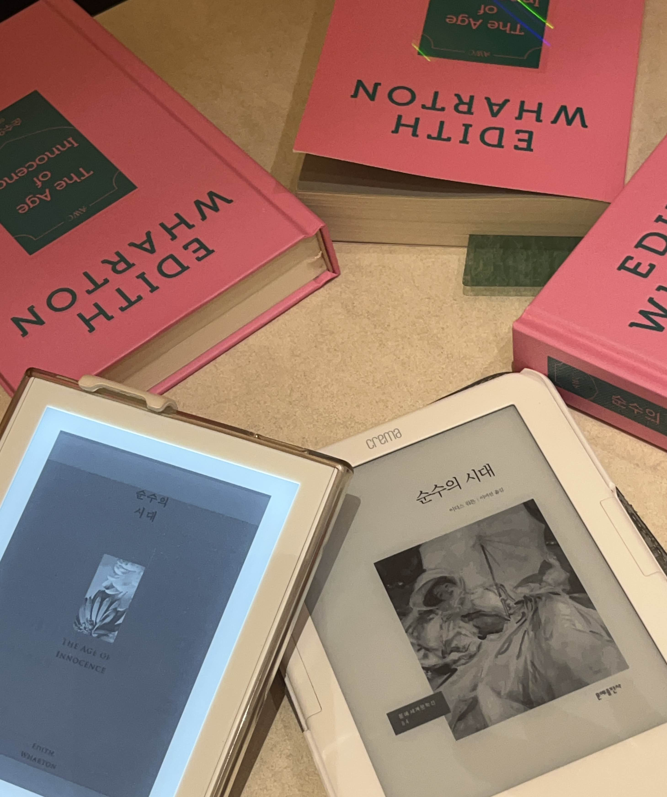

# 들어가며

2024년을 한 문장으로 표현하자면 **작은 시도를 반복하고, 그 안에서 꾸준히 의미를 찾아간 한 해**였다.<br/>
평소 일정을 `Work`, `Development`, `Health`, `Networking`, `Personal` 항목으로 나눠 관리하기에 회고도 동일한 분류로 진행했는데 적다 보니 각 항목별 분량이 너무 길어져 기술 블로그에선 `Work`,`Networking` 항목 위주로 작성하고 나머지 항목은 일상 블로그에 적어봐야겠다.

# Work

## 출퇴근 담당 스쿼드에서의 1년

출퇴근 기능을 담당하는 스쿼드에 소속된 만큼 1년 내내 `출퇴근 기록 편집 고도화`, `출퇴근 기록 수정 신청 및 승인`, `근태 마감` 등 출퇴근 기능에 집중했다.

기존의 출퇴근 기능은 모두 legacy 스택인 JSP로 이루어져 있어 작은 기능이 추가되더라도 연관된 부분을 React로 만들어 iframe으로 띄우거나 관련된 페이지를 React로 새로 만드는 방식으로 마이그레이션했기에 기존 기능에 살을 붙이는 고도화 프로젝트도 내겐 매번 신규 프로젝트처럼 다가왔다.

출퇴근 관리는 인력 관리 솔루션인 우리 서비스의 핵심 기능이기도 하고, 실제로 대부분의 고객이 사용하고 있어 이번에 손을 대면 핵심 기능에 오너십이 생긴다는 뿌듯함과 유지 보수에 대한 부담이 모두 있었다. 그만큼 책임감을 가지고 임하기도 했다

### 가장 기억에 남는 프로젝트

가장 기억에 남는 건 역시 `출퇴근 기록 편집 고도화`가 아닐까.
다양한 근태 유형에 따라 근무지 및 배정된 스케줄 정보를 포함한 출퇴근 기록을 보여주고 또 편집할 수 있게 해주는 기능인데, 이 기능 역시 JSP로 이루어져 있었기에 핵심 기능이 담긴 Modal을 React로 개발해 JSP에 연동하는 형태로 진행했다.

복병은 다양한 유형이었는데, 근태 유형이 그렇게 다양할 줄은 몰랐다.. **12가지에 육박하는 근태 유형마다 유효성 검증 로직, UI가 조금씩 달라졌고 이를 대응하기 위해 복잡하고 반복되는 분기 처리가 필요했다. 나 아닌 다른 팀원이 유지 보수하기 쉽고 요구사항 변경에 유연하게 대응할 수 있게 하려면 어떻게 해야 할까 머리를 싸매다가 전략 패턴을 도입하게 됐다.**

전략 패턴 예제는 대부분 클래스로 되어있어 클래스를 지양하는 팀의 코드에 맞게 전략 객체로 변형해 보는 식으로 응용해 보고, 흩어진 분기 처리를 일관된 구조로 모으는 과정에서 추상화의 대상에 대한 고민도 진득하게 해볼 수 있었다.
이 경험을 잘 정리해서 커뮤니티 밋업행사에서 발표도 하고 [블로그 포스팅](https://dev-bomdong.github.io/react-strategy-pattern/)도 했으니 여러모로 기억에 남는다.

## JSP-React 탐지 크롬 익스텐션

회사에서 주어진 요구사항 외에 주체적으로 문제를 정의해서 해결해 보자는 마음으로 진행한 혼자만의 프로젝트 `플러스알파 만들기`의 산출물
별도의 포스팅을 쓰려 했는데 일단 해가 넘어갔으니 회고록에 간략히 정리해 본다.

### 문제 정의

[출퇴근 담당 스쿼드에서의 1년]()에서 언급한 것처럼 회사에서 개발하고 있는 서비스는 90% 정도 JSP로 이루어져 있는데 기능이 너무 방대해서 한꺼번에 옮기기보다는 JSP 페이지에서 특정 모달만 React로 바꾸거나 특정 섹션만 React로 변경하는 등 기능 고도화와 함께 부분적으로 React로 마이그레이션 해나가고 있다.

JSP, React 페이지는 url 구조가 다르기에 쉽게 구분이 가능하지만 비개발자가 JSP 페이지에 부분적으로 React가 적용된 부분을 알아차리기가 쉽지 않았다.
기획자/디자이너/QA 엔지니어 분들은 미묘한 디자인 차이로 추측하거나 개발자에게 매번 질문하며 파악해야 했다.

- 이 페이지는 JSP 같은데.. 혹시 이 모달은 JSP인가요 아니면 React인가요?
- 이 부분은 React처럼 생겼는데 맞을까요?
  위와 같은 질문이 스프린트마다 반복되는 걸 느꼈고, **비개발자가 JSP 페이지의 React가 부분 적용된 부분을 알아차리기가 어려워 불필요한 커뮤니케이션 비용이 소모된다**는 것을 문제로 정의했다.

### 해결 과정

해결 방법으로 각 페이지별로 기술 스택을 시각화해 보여주는 사내 툴을 개발해 보자는 생각이 들었고, 실수요층은 비개발직군(기획,디자인,QA)이기에 손쉽게 사용할 수 있는 크롬 익스텐션으로 결정했다.
각 페이지별로 JSP 페이지, React 페이지, JSP 페이지에 React Modal이 뜨는 경우, JSP 페이지에 일부 영역만 React가 적용된 경우 이렇게 총 4 타입을 구분해 한눈에 보이도록 라벨링하고, 부분적으로 하이라이팅해도록 했다.


### 결과

기획, 디자인(이라고 하기엔 좀 머쓱한 수준이지만..), 개발, 배포까지 혼자 한 사이클을 경험한다는 뿌듯함도 있었고, 전사 공유 후 아래처럼 실무에 직접적인 도움도 줘 보람이 가득했던 프로젝트였다.

- 특정 Modal에 기능이 추가되는 프로젝트에서 해당 Modal이 JSP인 줄 알고 React로 다시 만드는 것으로 기획 방향이 잡혔으나 익스텐션을 통해 React 요소임을 확인하고 기획/개발 범위가 대폭 줄어듦
- 기획자-개발자 간의 불필요한 커뮤니케이션 사라짐 (기획자가 기술 스택 바로 파악 가능)

## 신규 입사자 온보딩

팀에 결원이 생겨 꽤 오랜 시간 동안 서류-과제 평가-면접을 통한 채용을 진행했고, 신입 개발자분을 채용하게 되었다. 현재 프로덕트 팀은 스쿼드 체제로 업무를 진행하며 각 스쿼드마다 1명의 프론트엔드 개발자가 배정되기에 스쿼드의 유일한 프론트엔드 개발자로서 업무를 진행해야 했다. 신입 개발자인 신규 입사자 입장에선 개발 역량과 별개로 이러한 상황이 부담될 수 있기에 비공식적인 멘토를 자처하며 협업 관련 도움을 드리려 노력했다.

- **가볍게 자주 협업 관련 이야기 나누기** <br/> 신규 입사자 입장에서 (또 성향을 고려했을 때) 대뜸 먼저 협업 관련 어려움을 이야기하기 어려울 수 있으니 수다 떨듯이 가볍게 이야기하는 시간을 유도했다. 일정에 부담이 되지 않도록 매일 10분 정도, 오늘 업무하며 어려운 부분이 있었는지, 있었다면 어떤 식으로 풀어보면 좋을지 함께 고민했다. 이때 **비대면으로 소통할 땐 불필요한 핑퐁이 생기지 않도록 지시대명사를 줄이고 사전 정보를 충분히 전달하도록** 말씀드렸는데, 이후 서버 개발자분께 비대면으로 원하는 바를 정확히 요청해서 만족스러웠다는 피드백을 전해 들어 뿌듯했던 기억이 생생하다.

- **QA 기간에 함께 이슈 트래킹 하며 해결 실마리 남기기** <br/> 이때 모든 해답을 남긴 것이 아니라 스스로 해결할 수 있도록 참고할 수 있는 부분을 언급하는 형태로 힌트만 제공했다. 이렇게 은근한 도움을 주는 게 PM 팀, QA 팀에 소문(?)이 나서 촉박한 일정 내에 릴리즈하기 위해 몇몇 이슈는 함께 해결하는 소방수 역할을 맡기도 했다.

내가 쏟는 에너지만큼 성장하시는 팀원분을 보며 이제껏 일하며 느껴왔던 보람과 다른 차원의 뿌듯함을 느꼈다. <br/>
이때부터 멘토링에 대한 관심이 깊어졌다.

# Networking

올해 네트워킹의 시작과 끝은 프론트엔드 개발자 커뮤니티 `the futures`와 함께했다고 해도 과언이 아니다.
밋업 행사에서 기술 발표를 진행해 보고, 행사를 직접 기획해 봤다. 또 멘토링과 커피챗 기회를 얻기도 했다.

## 기술 발표

**반복되는 분기 처리에 전략 패턴 적용하기**란 주제로 프론트엔드 커뮤니티의 밋업 행사에서 기술 발표를 했다.



처음 발표 제안을 받았을 땐 하고픈 마음 반, 나는 아직 부족한데 이런 내가 기술 발표를 해도 될까란 걱정 반이었다. (이때 오랜 시간 동안 맘고생하며 이사를 막 끝냈을 무렵이라 학습 루틴도 깨져있어서 한없이 자신감이 떨어져 있었다)
고민 끝에 경험을 공유하는 건 누구나 할 수 있는 일이고, 발표를 준비하며 스스로에게 다시 동기 부여를 하고 싶어 수락했다.

상반기에 가장 고민했던 프로젝트인 [출퇴근 기록 편집 고도화]()에서의 전략 패턴 도입이 떠올라 주제로 삼고, 밋업 호스트 분의 피드백을 참고하며 발표 자료를 구성해나갔다. 매일 퇴근 후, 주말을 투자해 짧은 시간 동안 몰입해서 준비한 기억이 생생하다.

대단한 학술적 지식을 소개하기보단 실무에서 겪었던 고민을 토대로 유대감을 형성하고 나름의 해결 방법을 고민해 보는 것이 목표였는데 발표가 끝난 후 본인도 겪고 있는 고민이라 공감이 갔다, 나도 전략 패턴을 고려해 봐야겠다는 후기를 들어 보람차고 뿌듯한 경험이었다.

## 밋업 행사 기획


개발자라는 공통분모를 토대로 유대감을 가지고 고민과 지식을 공유하는 행사를 기획해 볼 수 있음에 감사했던 경험.
더 깊은 이야기는 [프론트엔드 개발자의 커뮤니티 밋업 기획 도전기](https://dev-bomdong.github.io/journal-futureconf-meetup/) 포스팅으로 대체한다. (과거의 나야 고마워..)

## 멘토링 그리고 커피챗

어느덧 3년 차 프론트엔드 개발자가 되어버린 나.. 어떤 커리어 테크를 가져가야 할까? 어떤 방향으로 나를 발전시켜야 할까? 고민이 많을 무렵 마침 커뮤니티 호스트 분이 멘토링 참가자를 모집하셨고, 바로 손을 들어서 참가했다. 대화를 나누며 내가 고민하고 있는 영역을 잘 풀어나가고 있는 것 같은 개발자분께 커피챗을 요청해 대화를 나눠보는 건 어떨까란 이야기가 나왔고, 지금의 내게 필요한 액션이란 확신이 들어 용기를 내 평소 존경하고 있던 분께 링크드인 메세지를 보내 커피챗 일정을 잡았다.

그렇게 이루어진 커피챗에서 감사하게도 당장 시도해 볼 만한 것들을 얻었고, 이를 미루지 않고 시도하는 스스로를 보며 (크롬 익스텐션 개발도 액션 아이템 중의 하나였다) 이런 나.. 꽤나 추진력이 높은 편일지도.. 싶었다. 주변에 이야기하니 그걸 이제야 알았냐는 반응이.. 스스로의 성향을 잘 파악하고 있는 편이라 생각했는데 아직 멀었다.

이후에도 문서화를 넘어 테크니컬 라이팅 분야에 대한 깊은 관심이 생겨 관련 실무자분께 연락을 드려 커피챗을 진행했다. 혼자 서치해서 알기 어려운 정보를 얻고 개인적으로 고민하고 있던 부분을 풀어 나가는 데에도 큰 도움이 되었다.

**나의 부족함을 담백하게 드러내며 도움을 구하고, 함께 도출한 해결책을 미루지 않고 시도하는 과정** 속에서 커피챗이라는 문화를 통해 초면이라도 경험을 나눌 수 있는 업계에 있다는 것이 참 신기하고 또 감사하더라.

### 역할 바꿔보기

멘토링, 커피챗으로 받은 긍정적인 영향을 전파하고 싶은 마음도 있고, 신규 팀원의 온보딩을 도우며 코드를 짤 때와는 다른 차원의 보람을 느껴 멘토링 분야에 본격적으로 관심을 가지게 됐다.
마침 커뮤니티에 프론트엔드 개발 취업준비생분이 모의 면접 도움 요청글을 올리셔서, 2024년의 마지막 밤은 취업준비생 분들의 모의 면접을 진행해보며 마무리했다.
맨 땅에 헤딩하며 수십번 면접을 진행해본 경험을 바탕으로 미리 이력서를 전달받아 맞춤형 질문을 준비해 나름 성심성의껏 진행했는데, 정말 큰 도움이 되었다고 다들 고마워해주셔서 오히려 내가 더 좋은 에너지를 받았다. 또 요즘 워낙 시장이 좋지 않다보니 내 앞길만 살피다가 업계 전반에 대한 묵직한 고민을 해볼 수 있는 기회이기도 했다.
2025년에도 기회가 된다면 멘토링 분야에 점점 더 발을 담가보려 한다.

## 독서모임

2023년 하반기에 사내 모임으로 시작한 독서모임.
새 멤버도 영입하긴 했지만 어느새 멤버 절반 이상이 퇴사자가 되어 이젠 사내 모임이 아닌 직장인 모임에 가까워졌다.



올해 함께 토론한 책들. 우리들만의 고전 붐이 일어 7권 중 4권이 고전 작품이었다.

- 세상은 이야기로 만들어졌다
- 데미안
- 화씨 451
- 순수의 시대
- 코뿔소
- 미키 7
- 눈이 보이지 않는 친구와 예술을 보러 가다

독서모임의 장점은 1) 나와 다른 의견을 경청하는 연습 2) 발제에 맞게 본인의 생각을 논리적으로 구조화하며 말하는 연습을 해볼 수 있는 것이라 생각한다.
경청과 구조화는 협업을 할 때도 굉장히 중요한 것이어서 불가피한 일이 있지 않는 이상 2025년에도 쭉 함께할 예정

---

한 해 동안 딱 나이만큼의 책을 읽었고, 일상 블로그에 50개의 주간 일기를 포스팅했다.
1년이 대략 52주이니 거의 매주 일기를 쓴 셈인데 이렇게 주간 일기를 써온 게 벌써 9년 정도 되었다.
매일의 사건과 생각을 기록하다 보면 일상은 그냥 흘려보내기 아쉬운 소중한 것이 되고, 순간순간 의미를 부여하며 긍정적이고 주체적으로 살아가는데 큰 도움이 되었다.
또 이런 리추얼을 가지고 있다는 것에서 남이 함부로 훼손할 수 없는 자기효능감도 차곡차곡 쌓여간다. 열심히 읽고 쓰고 고민하고 시도했던 2024년을 뿌듯한 마음으로 보내줘야지.

```toc

```
