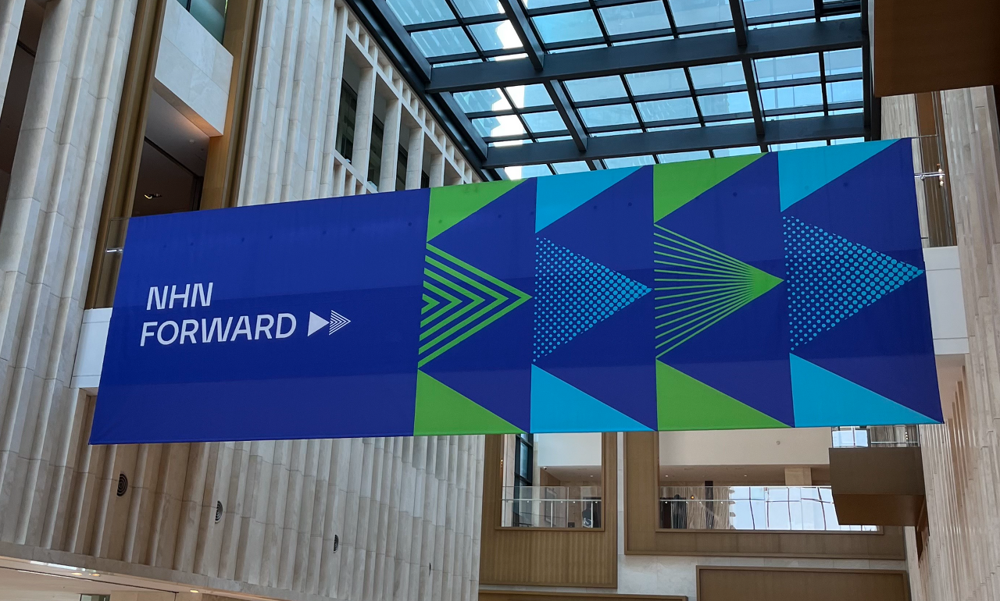
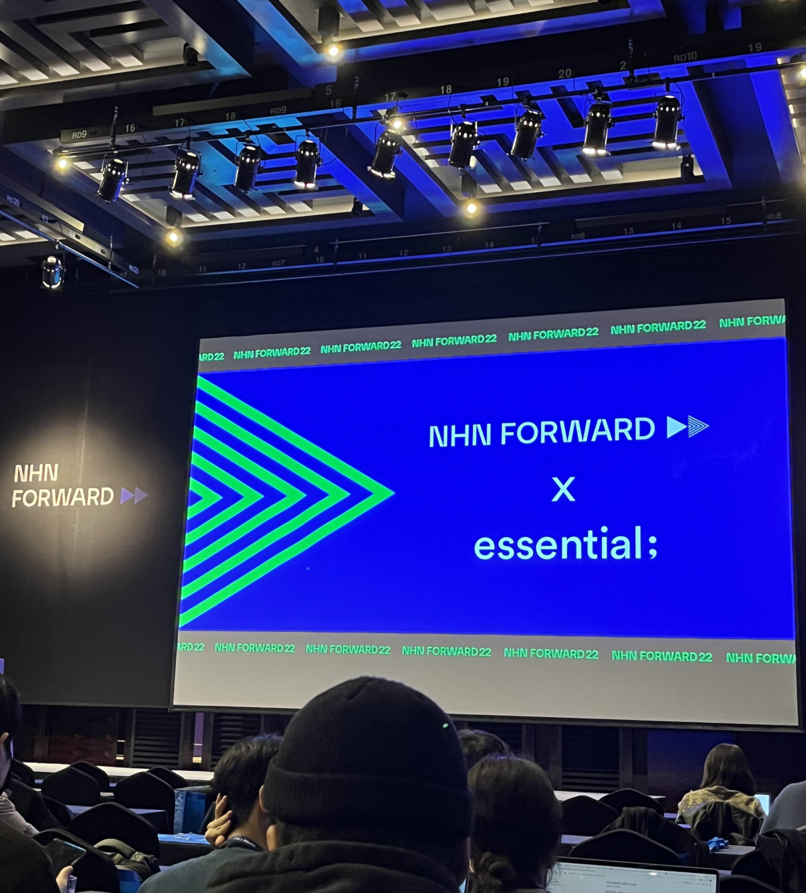
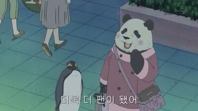

COVID의 영향으로 대부분의 기술 컨퍼런스가 온라인으로 진행되는 현 상황에서 <br/>
운좋게 NHN 주최 기술 컨퍼런스에 당첨되어 연차까지 내고 두근거리는 마음으로 참석하게 되었다.

개발자 인생 첫 오프라인 컨퍼런스인만큼 인터컨티넨탈 호텔의 두 층을 모두 대관한 넓은 공간에서 <br/>
오로지 기술 이야기를 하러 2500여명에 달하는 사람이 모였다는게 벅차오르기도 했고 신기하기도 했다.

다시금 되새겨보는 그 날의 기억과 느낀점들

---

## 좋은 기술이란? 



컨퍼런스의 시작인 키노트에서 좋은 기술이란 사용자가 체감하는 고마운 기술이라 생각한다는 내용이 있었다.

개발자로서 어떤 서비스를 만들어나가고, 더 나아가 어떤 기술에 기여하고 싶은가? 라는 질문을 스스로에게 던질 때 <br/>
지금껏 일상의 불편함을 해결해주는 기술이라고 생각해왔는데 두 정의 모두 일맥상통하는 결을 가지고 있다고 생각했다.

다만 일상 속 불편함을 어느 정도 해결해주는 것과 1) 사용자가 체감하고 2) 고마움을 느끼는 게 반드시 일치하지는 않는다.
(일치하는 예로는 코로나 라이브가 떠오른다.)
기술을 활용해 일을 하는 사람으로서 어떤 기술을 지향할 것인가에 대한 고민은 지속적으로 해나가야 한다고 생각한다.


## 디자인 시스템, 그리고 storybook
모든 프론트엔드 세션을 들으며 가장 크게 느낀 점 <br/>
프론트엔드 챕터 세션 4개 중 3개에서 디자인 시스템, 그리고 Storybook이 꽤나 높은 비중으로 다루어졌다.

특히 Storybook은 프레젠터(화면을 그리고 이벤트 발생시 전달) 컴포넌트를 테스트하는 수단으로 언급되었는데
마침 전부터 눈여겨보며 이미 도입을 완료한 회사 내 다른 서비스의 팀원분께 이것저것 물어보기도 했었던터라 굉장히 흥미로웠다.
(해당 팀원분께는 QA단계가 아닌 개발 단계에서 가이드에 따라 개발된 작업물을 서로 확인하고 소통할 수 있다는 점에서
단순히 프론트엔드 개발자가 개발할 때 컴포넌트를 재사용하기 편리할 뿐만 아니라 디자이너와 소통할 때도 굉장히 편리하다는 이야기를 들었었다.)

내가 속한 서비스에서도 디자인팀에서 디자인 시스템 가이드를 작업하고 계시니 작업이 끝나는대로 Storybook을 도입해보려 한다.
우선 이미 정의된 color 가이드를 변수화하고 자주 사용하는 컴포넌트는 별도의 ui-kit으로 분리해두고 있다.


## 능숙하게 '기술 이야기'를 하는 사람이 되었으면
사실 개발자의 발표라 하면 아래 모습이 자주 언급되는데..


이번 컨퍼런스에선 모든 발표자분들께서 또렷한 딕션과 위트있고 여유로운 발표를 보여주셔서 집중을 잃지않고 잘 따라갈 수 있었다.
대본을 이미 다 숙지하신 건지 대중을 보면서 자신있게 발표하는 모습이 참 멋졌고 언젠가 나도 이런 자리에 서보고싶다는 생각도 들었다.

대학생시절부터 이런저런 발표 경험이 많은 터라 사람들 앞에서 내 생각을 잘 정리해 전달하는 데 어려움이 없고 또 좋아하는 편이지만,
사실 아직까지 기술 이야기를 하는데는 어려움을 느낀다.
(사내 개발자 세미나에서 발표자를 무작위로 추첨하는데 아직 한 번도 걸려본 적 없지만 걸리게되면 눈앞이 캄캄하지 않을까..)

내가 알고 있는 것들, 적용해본 것들 등등을 평소에 잘 정리하는 습관을 들여야 그 어려움이 조금이나마 해소되고 자신감도 올라가지 않을까싶다. 결국 불특정 다수에게 설명하듯이 작성하는게 기술블로그이니까. 지금의 내가 바로 해볼 수 있는 것부터 해보자고

---

요즘의 트렌드는 이런 것이구나부터 시작해서 지극히 개인적인 깨달음까지 얻어온터라 너무나 유익했던 컨퍼런스.
나와 같은 업에 종사하고 그 업에 애정을 가지고 있는 이들이 모이는 행사에 이렇게 많은 사람들이 모였구나,
그리고 이 곳에 내가 와있다는 것에 순간순간 벅차오르기도 했다.



대부분의 오프라인 행사가 추첨제로 진행되는 터라 맘처럼 쉽지않지만, 기회가 닿는대로 계속해서 참석해야지.


```toc
```