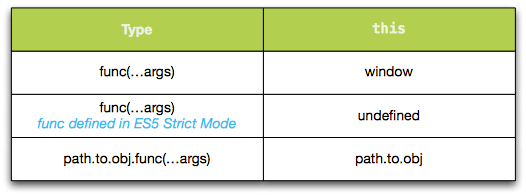

> 원문 : [Understanding JavaScript Function Invocation and "this"](https://yehudakatz.com/2011/08/11/understanding-javascript-function-invocation-and-this/)

본 글은 [Typescript Handbook - 함수](https://typescript-kr.github.io/pages/functions.html) 부분을 학습하던 중 본문에 링크되어있던 원문 글을 읽고 Javascript에서의 함수 호출과 알듯 말듯 모호했던 this를 학습하며 번역한 글입니다. <br/>
의역이 포함되어 있는 점 양해 부탁드리며, 잘못된 부분을 발견하셨을 경우 댓글로 알려주시면 감사하겠습니다. 😊

---

지난 시간동안 자바스크립트 함수 호출에 대해 많은 혼란이 있었습니다. <br/>
특히, 함수 호출에서의 this의 의미를 혼란스러워하는 사람들이 많았습니다.

이 혼란은 함수 호출의 핵심 원리를 이해하고, 그 원리를 기반으로 함수 호출 방법을 살펴보는 식으로 해결할 수 있다고 필자는 생각합니다.
사실 이것은 ECMAScript에서 이 문제를 다루는 방식이기도 합니다.
이 글은 ECMAScript보다는 단순하게 쓰여진 감이 있지만, 기본적인 아이디어는 같습니다.

## 핵심 기본 원리

먼저, 함수 호출의 핵심 원리인 `call` 메소드[1]를 살펴보겠습니다.
call 메소드는 상대적으로 직관적입니다.

1. 1번부터 끝까지의 매개변수로 인수 목록 (`argList`)을 만듭니다.
2. 첫 번째 매개변수는 `thisValue`입니다.
3. `this`를 `thisValue`로, `arg`를 `argList`로 설정해 함수를 호출합니다.

예시

```javascript
function hello(thing) {
  console.log(this + ' says hello ' + thing);
}

hello.call('Yehuda', 'world'); //=> Yehuda says hello world
```

우리는 "Yehuda"로 설정된 this와 하나의 인수 "world"로 hello 메소드를 호출했습니다.
이것은 자바스크립트 함수 호출의 핵심 기본 원리입니다.
다른 함수 호출들도 이 기본 원리로 설명할 수 있습니다. (이렇게 보다 기본적인 원리로 설명하는 것을 "desugar"라고 합니다.).

> [1] ES5에서는 call 메소드를 보다 낮은 수준의 기본 형태로 설명하지만,
> 본 글에서는 좀더 단순하게 설명하겠습니다. 자세한 정보는 이 글의 끝 부분을 참고하세요.

## 간단한 함수 호출

물론, 항상 call을 사용하여 함수를 호출하는 것은 꽤 귀찮을 것입니다.
자바스크립트에선 괄호 구문을 사용해 직접 함수를 호출할 수 있습니다. <br/>
예를 들어 `hello("world")`를 입력하면 함수 호출이 desugar됩니다:

```javascript
function hello(thing) {
  console.log('Hello ' + thing);
}

// this:
hello('world');

// desugars to:
hello.call(window, 'world');
```

<br/>

이 동작은 ECMAScript5에서 strict mode를 사용할 때 변경됩니다[2]:

```javascript
// this:
hello('world');

// desugars to:
hello.call(undefined, 'world');
```

간단히 말하면, `fn(...args)`과 같은 함수 호출은 `fn.call(window [ES5-strict: undefined], ...args)`과 동일합니다.

인라인으로 선언된 함수에 대해서도 마찬가지입니다.
`(function() {})()`은
`(function() {}).call(window [ES5-strict: undefined])`과 같습니다.

> [2] 사실 조금 거짓말을 했습니다.
> ECMAScript 5에선 (거의) 항상 undefined가 전달된다고 말하지만,
> strict mode가 아닌 경우 함수 호출 시 thisValue를 전역 객체로 변경해야 한다고 합니다.
> 이를 통해 strict mode 호출자는 기존의 strict mode가 아닌 라이브러리를 중단시키지 않을 수 있습니다.

## 멤버 함수

다음으로 가장 일반적인 메소드 호출 방법은 객체의 멤버로서 호출하는 것입니다<br/>
아래 코드의 `person.hello()` 에서 호출은 desugar됩니다:

```javascript
var person = {
  name: 'Brendan Eich',
  hello: function (thing) {
    console.log(this + ' says hello ' + thing);
  },
};

// this:
person.hello('world');

// desugars to this:
person.hello.call(person, 'world');
```

<br/>

hello 메소드가 객체에 추가되는 방식은 중요하지 않습니다.
이전에 hello를 독립적인 함수로 정의했다는 것을 기억하세요.
이번에는 객체에 동적으로 추가하는 경우를 살펴보겠습니다:

```javascript
function hello(thing) {
  console.log(this + ' says hello ' + thing);
}

person = { name: 'Brendan Eich' };
person.hello = hello;

person.hello('world'); // still desugars to person.hello.call(person, "world")

hello('world'); // "[object DOMWindow]world"
```

함수는 'this'에 대한 지속적인 개념이 없다는 사실을 기억하세요.
this는 항상 호출된 방식과 시간에 따라 설정됩니다.

## Function.prototype.bind 사용

때때로 변하지않는 this 값을 가지는 함수를 참조하는 게 편리할 수 있습니다.
따라서 사람들은 과거에 간단한 클로저 기법을 이용해 함수에서의 this가 변경되지 않도록 변환해왔습니다.

```javascript
var person = {
  name: 'Brendan Eich',
  hello: function (thing) {
    console.log(this.name + ' says hello ' + thing);
  },
};

var boundHello = function (thing) {
  return person.hello.call(person, thing);
};

boundHello('world');
```

`boundHello`는 여전히 `boundHello.call(window, "world")`로 변환되지만,
다시 원하는 값으로 this 값을 변경하기 위해 기본적인 호출(call) 메소드를 사용합니다.

이 기법을 조금 수정하면 일반적인 목적으로 사용할 수 있습니다:

```javascript
var bind = function (func, thisValue) {
  return function () {
    return func.apply(thisValue, arguments);
  };
};

var boundHello = bind(person.hello, person);
boundHello('world'); // "Brendan Eich says hello world"
```

이 동작을 이해하기 위해서는 두 가지 정보가 더 필요합니다.

첫째로, `arguments`는 함수에 전달된 모든 인수를 나타내는 유사 배열 객체입니다.
둘째로, `apply` 메소드는 인수를 하나씩 나열하는 대신 유사 배열 객체를 취한다는 점을 제외하고, call 메소드와 유사하게 작동합니다.

`bind` 메소드는 단순히 새로운 함수를 반환합니다.
호출될 때 새로운 함수는 원래 전달된 함수를 호출하고, 원래 값으로 this를 설정합니다.
또한 인수를 전달합니다.

이것이 다소 일반적인 관용구였기 때문에, ES5에서는 아래 동작을 구현하는 모든 Function 객체에 대해
새로운 bind 메소드가 도입되었습니다:

```javascript
var boundHello = person.hello.bind(person);
boundHello('world'); // "Brendan Eich says hello world"
```

이것은 콜백으로 전달할 원시 함수가 필요할 때 가장 유용합니다:

```javascript
var person = {
  name: 'Alex Russell',
  hello: function () {
    console.log(this.name + ' says hello world');
  },
};

$('#some-div').click(person.hello.bind(person));

// when the div is clicked, "Alex Russell says hello world" is printed
```

물론 이것은 다소 어색하며,
TC39(ECMAScript의 다음 버전)는 보다 나은 해결책을 위해 계속 작업하고 있습니다.

## jQuery에 대해

익명 콜백 함수를 많이 사용하는 jQuery에서는 내부적으로 콜백 함수의 this를 더 유용한 값으로 설정하기 위해 call 메서드를 사용합니다.

예를 들어, 특별한 처리 없이 모든 이벤트 핸들러에서 window를 this로 받는 대신,
jQuery는 이벤트 핸들러를 설정한 요소를 첫 번째 매개변수로 사용하여 콜백에 대해 call을 호출합니다.

이것은 익명 콜백 함수에서 this의 기본값이 특별히 유용하지 않기 때문에 굉장히 유용하지만,
JavaScript 초보자에게 this가 이상하고 추론하기 어려운 개념이라는 인상을 줄 수 있습니다.

당신이 sugary function 호출을 desugar된 `func.call(thisValue, ...args)`로 변환하는 기본적인 규칙을 이해한다면,
JavaScript의 this를 큰 어려움 없이 다룰 수 있을 것입니다.



## PS: 내가 속인 것

몇몇 부분을 단순화해 표기한 부분이 있습니다.

가장 주요한 부분은 `func.call`을 "원시적"이라고 부른 것일겁니다.
실제로 규격에서는 `func.call` 및 `[obj.]func()` 모두에서 사용하는 원시값이 있습니다. (그리고 그 값은 내부적으로 `[[Call]]`이라고 불립니다.)

하지만 func.call의 정의를 살펴봅시다:

1. IsCallable(func)가 false이면 TypeError 예외를 throw합니다.

2. argList를 빈값(list)으로 합니다.

3. 이 메서드가 하나 이상의 인수로 호출된 경우, 인수를 arg1부터 우측으로 추가해 argList의 마지막 요소로 추가합니다.

4. func의 내부 메서드 [[Call]]을 호출하고, thisArg를 this 값으로 제공하고, argList를 인수 목록으로 제공하여 결과를 반환합니다.

보시다시피, 이 정의는 본질적으로 기본적인 `[[Call]]` 동작에 대한 아주 간단한 JavaScript 언어 바인딩입니다.

함수를 호출하는 정의를 살펴보면, 처음 일곱 단계가 thisValue와 argList를 설정하고,
마지막 단계는 "func에서 내부 메서드 [[Call]]을 호출하여 thisValue를 this 값으로, argList를 인수 값으로 제공하고 결과를 반환한다"입니다.

argList와 thisValue가 결정된 후에는 동일한 용어를 사용합니다.

call을 primitive(원시적이라고)로 부르긴했지만, 본질적으로는 이 글의 첫 부분에서 규격을 이용한 부분과 거의 동일합니다.
여기에서 다루지 않은 추가적인 경우들 (특히 with와 관련된 경우)도 있습니다.

```toc

```
