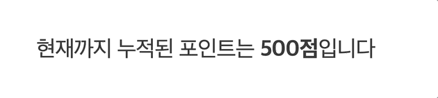
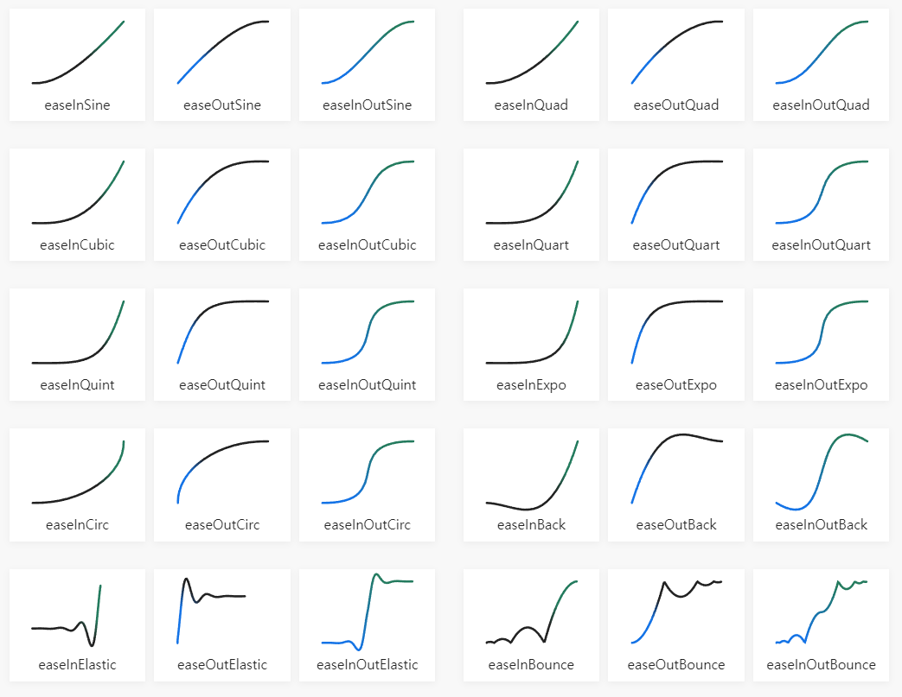
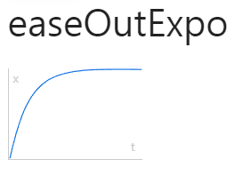
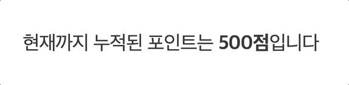

## 들어가며
우리는 종종 숫자를 count하는 애니메이션을 접하게된다.
예를 들어 게임 화면에서 유저가 획득한 포인트를 보여줄 때, 할인된 가격을 안내할 때, D-day까지 남은 일수를 보여줄 때 등등 숫자값을 강조해야하는 상황에서 자주 사용된다.

그럼 이 애니메이션은 어떻게 구현해야할까? 
단순한 count 애니메이션을 생각하고 setInterval로 금방 구현하겠네!하며 호기롭게 접근했다가 
count 속도를 조절하는 방법이 까다로워 혼쭐이 나 그 여정을 기록해보고자 한다. 
해당 기능은 재사용성을 고려해 custom Hook으로 구현했다.

## 1. setInterval 함수로 애니메이션 구현
우선 단순히 숫자를 count하는 애니메이션부터 구현해보자.
숫자를 카운트하는 애니메이션은 일정 기간동안 특정 작업을 반복 실행하는 setInterval 함수로 구현할 수 있다.

setInterval 함수의 구조 및 사용예시는 아래와 같다.

```javascript
//구조
setInterval(반복 실행할 함수, 함수를 반복 실행할 기간(ms));

//사용예시
const useInterval = setInterval(function, 300ms); 
clearInterval(useInterval);
```

이를 이용해 우선 동일한 속도로 숫자를 count하는 custom hook인 `useCountUp`을 구현해보자.

### 구현 코드

```typescript
/** count up 함수 */
const useCountUp = (num: number, duration: number) => {
  const [count, setCount] = useState(0)
  const frameRate = 1000 / 60
  const totalFrame = Math.round(duration / frameRate)

// useEffect로 mount되는 순간 한 번 실행
  useEffect(() => {
    let currentNumber = 0
    
// setInterval로 setCount
    const counter = setInterval(() => {
      const progressRate = ++currentNumber / totalFrame
      setCount(Math.round(num * progressRate))

// 진행 완료시 interval 해제
      if (progressRate === 1) {
        clearInterval(counter)
      }
    }, frameRate)
  }, []) 

// setInterval함수에서 세팅한 count return
  return count
}
```

주석으로 각 단계를 적어두긴 했지만 좀더 자세하게 알아보면,


1️⃣ custom hook `useCountUp`을 선언하고, useEffect로 mount되는 초기에 1번 실행되도록 한다. <br/>

2️⃣ useEffect의 내부에 setInterval 함수 `counter`를 선언한다.

첫 번째 인자인 **반복실행시킬 함수**는 (1) count를 증가시키고 
(2) 진행이 완료되면 clearInterval 함수를 호출하는 함수,
두 번째 인자인 **반복 기간**에는 `frameRate(1000ms / 60frame, 즉 16.6ms)`를 전달해준다.

3️⃣ useCountUp은 setInterval 함수에서 증가시켰던 `count`를 return한다.

> 이 때 애니메이션이 적용되는 숫자 부분에 width값을 주지 않으면 다른 글자들이 좌우로 떨리는 현상이 일어난다.

### 결과 화면



일정한 속도로 증가하다가 목표값에 도달하면 멈추는 형태의 count 애니메이션을 구현했다.
이것만으로도 큰 부족함은 없지만, 조금 더 생동감을 주기 위해 증가 속도를 조절해보자.

## 2. easeOutExpo로 Count 속도 조절하기

애니메이션 속도를 조절하기 위해서 시간 흐름에 따라 변화율을 변경할 수 있는 Easing 함수를 이용했다.
아래처럼 다양한 종류가 있고, 그래프는 시간에 따른 변화율을 나타낸다.




이 많은 선택지 중 사용할 함수는 easeOutExpo !



위 그래프에서 t는 시간, x는 움직임 시작인 0부터 움직임 끝인 1 사이의 진척률을 뜻한다. <br/>
코드로 나타내면 아래와 같다.

```javascript
function easeOutExpo(x: number): number {
	return x === 1 ? 1 : 1 - pow(2, -10 * x);
}
```

### 구현 코드

```javascript
/** 진행률에 따라 count 속도 조절 */
const easeOutExpo = (t: number) => {
  return t === 1 ? 1 : 1 - Math.pow(2, -10 * t)
}

/** 점차 느려지는 count up 함수 */
const useCountUp = (num: number, duration: number) => {
  const [count, setCount] = useState(0)
  const frameRate = 1000 / 60
  const totalFrame = Math.round(duration / frameRate)

  useEffect(() => {
    let currentNumber = 0
    const counter = setInterval(() => {
      const progressRate = easeOutExpo(++currentNumber / totalFrame)
      setCount(Math.round(num * progressRate))

      // 진행 완료시 interval 해제
      if (progressRate === 1) {
        clearInterval(counter)
      }
    }, frameRate)
  }, [])

  return count
}
```

최상단에 추가된 easeOutExpo 함수에 의해 애니메이션 속도는 점차 줄어들게 된다. <br/>
easeOutExpo 함수의 매개변수는 진척률을 나타내기 때문에 `useCountUp`에서 진척률로 정의해둔 변수 `progressRate`을 전달해준다.

### 결과 화면



setInterval로 기본 count 애니메이션을 구현하되 속도는 easing 함수를 활용하는 것이 핵심이였다.
두 함수를 사용할 때뿐만 아니라 이후 다른 easing 함수를 사용하더라도 제대로 이해하고 있어야하는 개념은 진척률.

결국 모든 애니메이션은 움직임의 시작인 0 부터 끝인 1까지의 진척률에 따라 그 속도를 조절할 수 있다는 걸 명심하자.

### 참고 자료

<a target="_blank" href="https://shylog.com/react-custom-hooks-scroll-animation-countup/">
React Custom Hooks로 scroll animation 만들기 CountUp편</a> <br/>
<a target="_blank" href="https://velog.io/@y_jem/react-%EC%8A%AC%EB%A1%AF-%EC%B9%B4%EC%9A%B4%ED%8A%B8-%EA%B8%B0%EB%8A%A5">
[react] 슬롯 카운트 기능 구현 (라이브러리 x)</a> <br/>
<a target="_blank" href="https://easings.net/ko#">Easing 함수 치트</a> <br/>
<a target="_blank" href="https://developer.mozilla.org/en-US/docs/Web/Performance/Animation_performance_and_frame_rate">
Animation performance and frame rate</a>

```toc
```