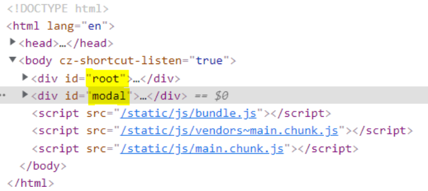

<br/>
한국인에게 portal이란.. 닥터스트레인지의 마법진같은 포탈만 떠오를 수 있다. <br/>
이미 충분히 익숙한 다른 곳으로 이동시킨다는 개념을 이어받아 <br/>
컴포넌트를 부모 컴포넌트의 바깥에 렌더링해주는 신기한 portal을 알아보자.

<br/>

## Portal이란
React 공식 문서에 따르면, Portal은 부모 컴포넌트의 DOM 계층 구조 바깥에 있는 DOM 노드로<br/>
자식을 렌더링하는 최고의 방법이다. '부모 컴포넌트의 DOM 계층 구조 바깥에 있는 DOM 노드' 라는 표현의 예시를 들어보자면,
<br/>



현재 `<div id="root">`와 `<div id="modal">`은 형제 관계처럼 보이지만 <br/>
실제로 modal은 root 안에서 보여지는 자식 컴포넌트이고, 렌더링만 root의 바깥에서 이루어지고 있다. <br/>
이때의 modal은 부모 컴포넌트(root)의 DOM 계층 구조 바깥에 있는 DOM 노드라고 할 수 있다.

react는 부모 컴포넌트가 렌더링되면 자식 컴포넌트가 렌더링되는 tree 구조를 가지고 있는데 <br/>
이런 tree구조는 종종 불편함을 가져다주기도 한다. 대표적인 예로 특정 컴포넌트의 자식 컴포넌트로 modal이 렌더링될 경우,부모 컴포넌트의 스타일링 속성에 제약을 받아 z-index 등으로 번거로운 후처리를 해줘야한다.

이럴 때 부모-자식 관계를 유지하지만 독립적인 위치에서 렌더링을 하면 훨씬 편리한데 그걸 Portal이 해냅니다. <br/>
독립적인 구조와 부모-자식 관계를 동시에 유지해 부모 컴포넌트의 제약에서 벗어날 수 있다.

## 구현 방법
portal을 통해 modal을 구현하는 방법을 알아보자. (불필요한 코드는 중간 생략)

### 1. Modal이 렌더링 될 위치 심어주기
```html
<body>
    <div id="root"></div>
    <div id="modal"></div>
  </body>
```

public/index.html에 portal을 구현할 tree의 부모 컴포넌트를 설정한다. <br/>
위 코드에선 기존 최상단 요소인 root의 형제관계로 modal 요소를 넣었는데 <br/>
이 요소에서 modal 컴포넌트가 렌더링되도록 만들 예정!


### 2. Portal.js 만들기
```javascript
//Portal.js

import reactDom from "react-dom";

const ModalPortal = ({ children }) => {
    const el = document.getElementById("modal");
    return reactDom.createPortal(children, el);
};

export default ModalPortal;
```

Portal 역할을 할 Portal.js를 만들어준다. 


### 3. Modal.js 만들기

```javascript
//Modal.js

import React from "react";
import styled from "styled-components";

const Modal = ({ onClose}) => {

  return (
      <Background>
        <Content>
  //  ... modal 안의 contents 코드 ...
         </ Content>
      </Background>
  );
};

export default Modal;

//아래는 styled-components를 통한 스타일링

const Background = styled.div`
  height: 100%;
  width: 100%;
  display: flex;
  align-items: center;
  justify-content: center;
  position: fixed;
  left: 0;
  top: 0;
  text-align: center;
`;

const Content = styled.div`
  height: 100%;
  width: 950px;
  margin-top: 70px;
  position: relative;
  overflow: scroll;
  background: #141414;
`;
```

portal을 통해 렌더링시켜줄 modal.js를 만들어준다. <br/>
이 때 modal의 뒷배경이 될 부분은 <Background>, modal은 <Content>로 styled-component 형태로 정의해두었다.


### 4. Modal을 띄울 컴포넌트에 Portal, Modal 조건부 렌더링
````javascript
//modal을 띄우려는 컴포넌트 파일

import styled from "styled-components";
import ModalPortal from "../Components/Modal/Portal";
import Modal from "./Modal/Modal";

const Carousel = props => {
  const [isModalOn, setIsModalOn] = useState(false);

  const handleModal = () => {
      setIsModalOn(!isModalOn);
  };
  
  return (
    <>
      <Container>
    	<button onClick={handleModal}/>
		// ... 코드 생략 ...
        <ModalPortal>
          {isModalOn && <Modal onClose={handleModal} />}
        </ModalPortal>
      </Container>
    </>
  );
};

export default Carousel;
````

modal을 렌더링하고자 하는 파일에서 Portal에 감싸진 형태로 modal을 넣어주고, <br/>
isModalOn이라는 state로 조건부 렌더링되도록 마무리! 

<br/>

## 참고 자료
<a href="https://ko.reactjs.org/docs/portals.html">React 공식 문서 - Portals</a> <br/>
<a href="https://blog.bitsrc.io/understanding-react-portals-ab79827732c7">Understanding React Portals and Its Use-Cases - blog.bitsrc.io</a> <br/>
<a href="https://yunsuu.github.io/portal/">Portal - yunsuu.github.io</a>

```toc
```