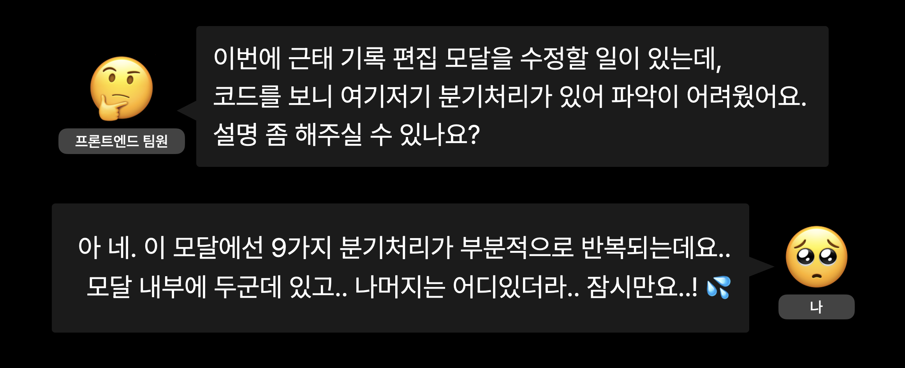
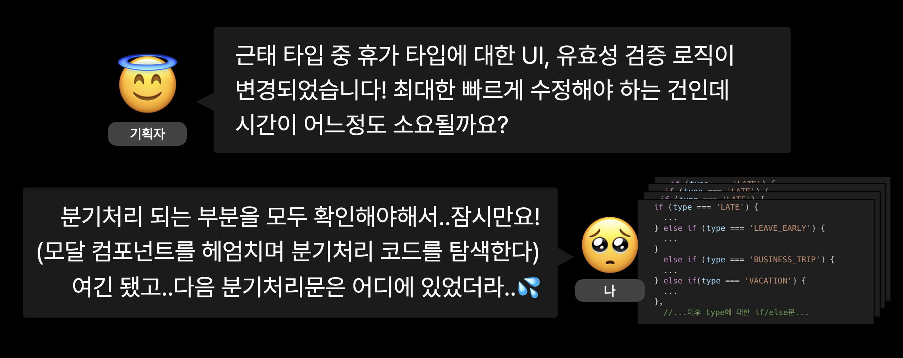
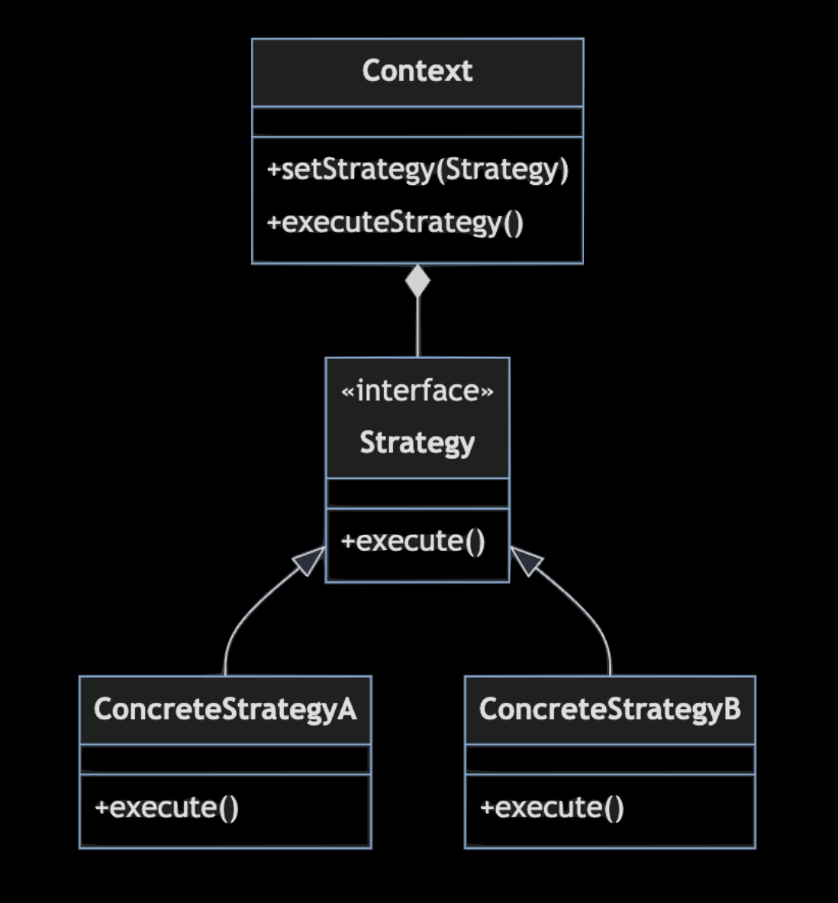

## 들어가며

최근 소속된 개발자 커뮤니티의 네트워킹 행사에서 **반복되는 분기처리에 전략패턴 도입하기**라는 제목으로 발표를 했다. 주제를 정해 발표 자료를 준비하고 피드백을 요청해 다듬어나간 경험만으로도 즐겁고 알찬 경험이었지만, 글로도 남겨보면 더 오래오래 남을 것 같아 블로그에도 정리해본다.

## 전략패턴에 관심을 가지게 된 계기

인력 관리 솔루션의 출퇴근 기능을 담당하며 다양한 근태 타입과 사용자 권한에 따른 따른 분기처리가 필요했다.

서비스 특성상 스케줄 등 다른 기능을 개발하는 팀원이 내 코드를 참고할 일도 있을 것이고, 추후 요구사항이 변동될 가능성도 있어(세상엔 내 생각보다 다양한 근태 유형이 존재했다..) 가독성과 유지보수에 대한 고민이 많았다.

머릿속을 스쳐지나간 절망편 시나리오들···




고민을 이어나가던 도중 개발 커뮤니티에서 보았던 **디자인 패턴은 내 코드를 공용어로 만든다**는 문장이 떠올랐고, 이를 인사이트 삼아 디자인 패턴을 적용해보자는 생각이 들었다.

## 디자인 패턴

Design Patterns: Elements of Reusable Object-Oriented Software의 분류에 따르면, 디자인 패턴은 크게 세 가지로 분류된다.

### 생성 패턴 (Creational Pattern)

- 객체 생성 과정을 추상화하는 패턴
- 싱글톤, 프로토타입, 팩토리 메서드 패턴 등
  <br/>

### 구조 패턴 (Structural Pattern)

- 클래스, 객체를 조합해 더 큰 구조를 만드는 패턴
- 데코레이터, 프록시, 어댑터, 브릿지 패턴 등
  <br/>

### 행동 패턴 (Behavioral Pattern)

- 객체, 클래스 간 상호작용과 책임 분배를 다루는 패턴
- 전략, 옵저버, 커맨드, 이터레이터, 메멘토 패턴 등

아무래도 ‘생성’ 혹은 더 큰 ‘구조’를 만드는 데 집중하는 다른 패턴보다 행동 패턴을 주목했다. 행동 패턴은 아래 방법을 통해 객체/클래스간의 상호작용을 효과적으로 처리하는 패턴이기에 분기처리에 적합할 거라 판단했기 때문.

1. 객체, 클래스 간의 **의존성을 최소화**해 느슨한 결합을 만든다.
2. 객체, 클래스의 행동을 **캡슐화**해 재사용성을 높인다.

그리고 이 중에서도 최종적으로 전략 패턴을 선택하게 되었다.

## 전략 패턴

전략 패턴은 **전략을 캡슐화해 런타임에서 동적으로 선택하는 패턴**으로, 다음과 같은 구성요소로 이루어져 있다.



### Context

전략을 사용하는 클래스

### Strategy

모든 전략에 대한 공통 인터페이스

### ConcreteStrategy

`Strategy` 인터페이스를 구현하는 구체적인 전략 클래스 <br/>
ConcreteStrategyA와 ConcreteStrategyB는 `Strategy` 인터페이스를 따라 `execute()`를 구현하고 있지만, 그 세부 구현은 같지 않다.

### 주요 특징

이 패턴의 핵심은 **`Context`는 구체적인 전략 `ConcreteStrategy`를 직접 참조하지 않고, `Strategy` 인터페이스를 통해 작업을 수행한다**. 이로 인해 다음과 같은 이점을 가져온다.

1. **결합도 감소** : `Context` 는 구체적인 전략에 의존하지 않고, 추상화된 전략 인터페이스에 의존한다. **구체화 대신 추상화에 의존한다**는 사실은 곧 SOLID 원칙의 **의존성 역전 원칙**(DIP: Dependency Inversion Principle)과 연결된다. 전략 패턴은 의존성 역전 원칙을 따르며 `Context` 와 `ConcreteStrategy` 사이의 결합도를 낮춘다.

2. **유연성 증가** : 각각의 전략은 별도의 클래스로 구현되어 있어, 전략의 내부 로직은 Context와 분리된다. 따라서 각 전략을 독립적으로 개발하고 테스트할 수 있으며, 새로운 전략을 추가하거나 기존 전략을 변경할 때 전략을 사용하는 `Context`의 코드를 수정할 필요가 없다.

## 도입 과정

> 간략하게 재구성한 예제 코드를 기반으로 작성했으며, 일부 type 정의 등이 생략되었을 수 있음

### 무엇을 추상화할까?

가장 먼저 어디까지를 전략으로 삼을지 고민하는 과정이 필요했다.

나의 경우 근태 기록 편집 Modal의 부분 부분에서 분기처리가 반복되었는데, 기획서를 보며 정확히 어느 부분에 분기처리가 반복되는지 파악하고, 추후 변경될 여지가 있는지도 기획자와 면밀하게 소통하며 전략을 정해나갔다. 그리고 최종적으로 아래 요소들을 전략으로 삼았다.

- 근태 타입 Icon path : `string`
- 근태 타입 PopOver : `UI component`
- 근태 상세 기록 List : `UI Component`
- 유효성 검증 로직 : `function`

전략의 범위를 결정하는 과정에서 **조건이 2가지로 적고 자주 변경되지 않는** 사용자 권한에 따른 분기처리는 전략 패턴을 적용하는 건 오버 엔지니어링이라 판단해 추상화 대상에서 제외했다.

### Strategy, ConcreteStrategy 정의

앞 단계에서 결정한 4개의 전략들로 구성된 **Strategy** interface인 `AttendanceStrategy`를 정의한다.
앞으로의 **ConcreteStrategy**는 모두 이 구조에 따라 일관성있게 구현된다.

```typescript
interface AttendanceStrategy {
  iconPath: string;
  AttendanceTypePopOver: React.FC;
  AttendanceDetails: React.FC;
  validateRecord: (data: RecordDataType) => boolean;
}
```

<br/>

이제 **ConcreteStrategy**를 구현할 차례. 각각의 근태 유형에 따른 전략을 담은 전략 객체 `attendanceStrategies`를 구현한다.
구조는 앞서 정의한 **Strategy** `AttendanceStrategy`를 따른다.

```typescript
const attendanceStrategies: Record<string, AttendanceStrategy> = {
  LATE: {
    iconPath: '/icons/late.svg',
    AttendanceTypePopOver: LatePopOver,
    AttendanceDetails: LateDetails,
    validateRecord: (data: RecordDataType) => {...},
  },
  EARLY_LEAVE: {
    iconPath: '/icons/early-leave.svg',
    AttendanceTypePopOver: EarlyLeavePopOver,
    AttendanceDetails: EarlyLeaveDetails,
    validateRecord: (data: RecordDataType) => {...},
  },
  // 다른 전략들 ...
};
```

추후 다른 전략을 추가해야 한다면 다른 전략과 동일하게 `AttendanceStrategy`의 구조를 따르는 전략을 객체의 하위에 생성하면 된다.
새로운 전략을 추가할 때 기존 코드에 영향이 가는 부분은 없다. 기존 전략을 수정할 때도 해당 전략의 코드만 수정하면 되므로 다른 전략 코드에서의 side effect를 걱정할 필요가 없다.

### 정의한 전략 사용하기

이제 **Context** 역할을 하는 코드를 살펴보자.

```typescript
export const AttendanceEditModal = ({ type }) => {
  const {
    iconPath,
    AttendanceTypePopOver,
    AttendanceDetails,
    validateRecord,
  } = attendanceStrategies[type];

  const handleSave = (data: RecordDataType) =>
    validateRecord(data) ? saveRecord(data) : handleError();

  // ...

  return (
    <Modal>
      <Modal.Header>근태 기록 편집</Modal.Header>
      <Modal.Body>
        <div onMouseEnter={() => setShowPopOver(true)} onMouseLeave={() => setShowPopOver(false)}>
          
          {showPopOver && <PopOver />}
        </div>
        <AttendanceDetails />
      </Modal.Body>
      <Modal.Footer>
        <button onClick={() => handleSave(recordData)}>저장</button>
      </Modal.Footer>
    </Modal>
  );
};
```

- `const { iconPath,... } = attendanceStrategies[type]` 을 통해 구체적인 로직은 모두 전략에 위임하고 있음을 알 수 있다. 새로운 전략이 생기거나 기존 전략에 수정이 생겨도 전략을 사용하는 부분을 수정할 필요가 없다.
- 전략을 사용하는 ` {showPopOver && <PopOver />}` 부분을 보면 근태 타입에 따라 런타임에서 전략이 결정됨을 알 수 있다. (그리고 그 전략의 세부 구현은 `AttendanceEditModal`에서 알 필요가 없다.)

## 느낀 것들

### 도입 과정에서 까다로웠던 점

전략패턴의 예제는 대부분 클래스형으로 되어있는데 (클래스의 관계에 초점을 맞추는 패턴이니 당연한 이야기) 회사 프로젝트의 경우 클래스를 지양하고 있었다. 전략 패턴 도입하자고 뜬금없이 클래스를 만들 수도 없는 노릇이기에, 전략 패턴의 핵심을 파악해 내 프로젝트의 코드에 녹여내려 노력했다.

그 결과로 클래스 없이 별도의 전략 객체를 만들어 패턴을 적용했다. 일반적인 적용 예제와는 다르지만 패턴의 핵심인 의존성 역전 원칙에 따라 의존성을 분리하고 수정에 용이하도록 만들었다.

### 도입 후 피부로 느낀 장점

결론부터 말하자면 디자인 패턴 도입 전, 시나리오 절망편으로 상상했던 상황이 모두 일어났다. (사실 다른 팀원이 내가 개발한 부분을 참고해야 하거나 요구사항이 변경되는 일은 그리 특별한 일이 아니기도 하다)

분기처리가 여기저기에 흩어져있지 않고 한 눈에 확인할 수 있다보니 동료에게 설명하기도 편했고, QA 기간 중 급하게 요구사항이 변경되었을 때도 신속하게 대응할 수 있었다.

## 세줄 요약

1. 복잡하고 반복되는 분기처리가 고민이라면 전략 패턴 도입이 하나의 선택지가 될 수 있다.
2. 추상화 과정이 까다로울 수 있지만 흩어진 분기처리를 일관된 구조로 모으고, 요구사항 변경에 유연하게 대응할 수 있다.
3. 분기처리의 수가 적거나 변경이 거의 없을 땐 다시 생각해보자

```toc

```
