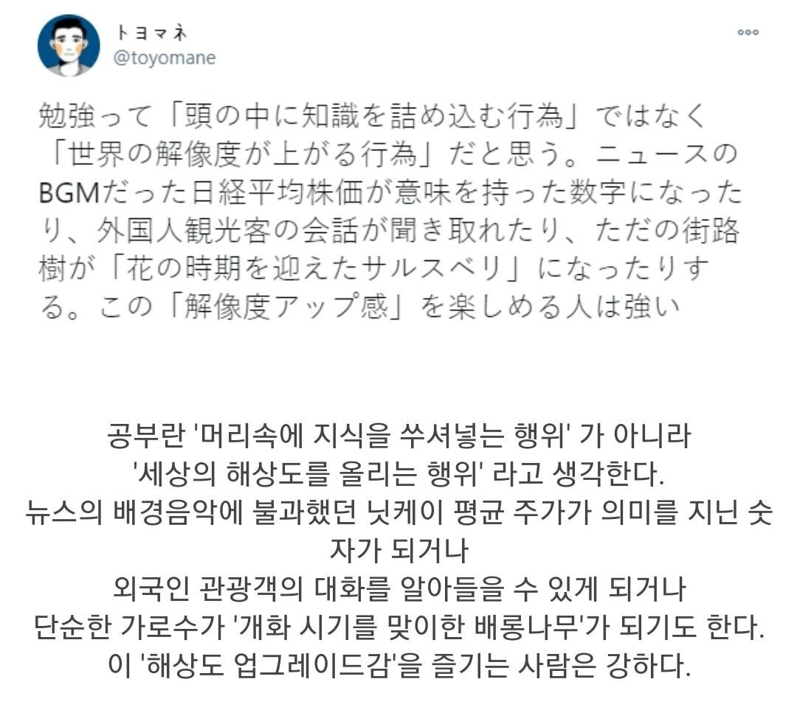

## 들어가며

7월부터 주 5일, 하루 30분씩 개발 탐구를 하는 시간을 가져보자라는 습관 만들기를 시작했고, 5일을 채우지 못할 때가 있어도 느슨하게 지속해나가고 있다.
매일 사용하는 React와 더 친해져보고 싶다는 생각이 들어 내부 구현에 대한 아티클을 하나 둘씩 찾아 읽어보다가 이미 유명한 Dan abramov의 블로그의 글 [A Complete Guide to useEffect](https://overreacted.io/a-complete-guide-to-useeffect/)에서 **useEffect는 lifecycle보다는 data의 동기화 메커니즘으로 바라보아야 한다**는 문장에 제대로 꽂혔다.

> To get productive, you need to “think in effects”, and their mental model is closer to implementing synchronization than to responding to lifecycle events.

그 전까진 useEffect는 대략 lifecycle, dependency에 따라 실행된다라고 뭉뚱그려 알고있던 터라 저 문장이 불명확하게 다가왔다. 나 빼고 다들 이해하고 있던건가.. useEffect의 내부 구현은 어떻게 구성되어있길래..?싶은 생각이 들었고, 제목은 거창하게 적어두었지만 결국 React 코드를 헤엄친 여정인 이 글이 탄생하게 된다.

> React 19를 기준으로 작성했으며, 인용한 코드에서 DEV 관련 코드, 주석은 때에 따라 생략했다.

## useEffect의 실행 과정

React 코드에서의 useEffect를 찾아 떠나보자. <br/>

### dispatcher.useEffect와 렌더링 단계별 처리

가장 먼저, 여러 hook의 기본 선언이 이루어져있는 `ReactHooks.js`에서 찾을 수 있다.

```tsx
//ReactHooks.js
export function useEffect(
  create: () => (() => void) | void,
  deps: Array<mixed> | void | null,
): void {
  const dispatcher = resolveDispatcher();
  return dispatcher.useEffect(create, deps);
}
```

useEffect가 호출되면 resolveDispatcher함수에서 리턴되는 dispatcher의 useEffect가 실행된다.

> dispatcher는 React hook의 구현을 포함하고 있는 객체로, 렌더링 단계에 따라 적절한 hook이 구현되도록 제공한다.

```tsx
function resolveDispatcher() {
  const dispatcher = ReactSharedInternals.H;
  if (__DEV__) {
    if (dispatcher === null) {
      console.error(
        'Invalid hook call. Hooks can only be called inside of the body of a function component. This could happen for' +
          ' one of the following reasons:\n' +
          '1. You might have mismatching versions of React and the renderer (such as React DOM)\n' +
          '2. You might be breaking the Rules of Hooks\n' + ...
      );
    }
  }
  return ((dispatcher: any): Dispatcher);
}
```

`resolveDispatcher` 함수를 살펴보면 dispatcher를 `ReactSharedInternals.H`라는 값에서 가져오고 있다.

> 개발모드일 때 **Invalid hook call. Hooks can only be called inside of the body of a function component** 이 에러가 resolveDispatcher 내부에서 dispatcher가 null일 때 나는 것이였구나.. 깨달음이 +1 되었다.💡  React는 컴포넌트를 렌더링할 때 dispatcher를 설정하니 렌더링 사이클 외부에서 hook을 호출하려고 하면 dispatcher가 null일수밖에 없다.

다시 돌아가서, `ReactSharedInternals.H`를 찾아보자.
`renderWithHooks` 함수는 component의 렌더링이 시작되면 호출되는데, 여기서 `ReactSharedInternals.H`에 Fiber의 상태에 따라 달라지는 dispatcher를 할당하고 있다.

```tsx
ReactSharedInternals.H =
  current === null || current.memoizedState === null
    ? HooksDispatcherOnMount
    : HooksDispatcherOnUpdate;
```

component가 처음 mount되면 `HooksDispatcherOnMount`, update될 땐 `HooksDispatcherOnUpdate`가 할당되는데, 각각의 dispatcher는 아래와 같다.

```tsx
const HooksDispatcherOnMount: Dispatcher = {
  readContext,
  ...
  useEffect: mountEffect,
};

const HooksDispatcherOnUpdate: Dispatcher = {
  readContext,
  ...
  useEffect: updateEffect,
};
```

각각의 dispatcher의 useEffect엔 mountEffect 혹은 updateEffect가 매칭된다.
useEffect 함수의 `dispatcher.useEffect(create, deps);`에서의 dispatcher를 이제야 확인한 셈.

### effect 생성 및 스케쥴링

mounteffect와 updateEffect의 실제 구현은 `mountEffectImpl` , `updateEffectImpl`에서 이루어지고, 두 함수 모두 `pushEffect` 함수를 호출하고 있다.

```tsx
function mountEffect(
  create: () => (() => void) | void,
  deps: Array<mixed> | void | null,
): void {
		...
    mountEffectImpl(
      PassiveEffect | PassiveStaticEffect,
      HookPassive,
      create,
      deps,
    );
}

function mountEffectImpl(
  fiberFlags: Flags,
  hookFlags: HookFlags,
  create: () => (() => void) | void,
  deps: Array<mixed> | void | null,
): void {
  const hook = mountWorkInProgressHook();
  const nextDeps = deps === undefined ? null : deps;
  currentlyRenderingFiber.flags |= fiberFlags;

  //pushEffect 호출
  hook.memoizedState = pushEffect(
    HookHasEffect | hookFlags,
    create,
    createEffectInstance(),
    nextDeps,
  );
}
```

```tsx
function updateEffect(create: () => (() => void) | void, deps: Array<mixed> | void | null): void {
  updateEffectImpl(PassiveEffect, HookPassive, create, deps);
}

function updateEffectImpl(
  fiberFlags: Flags,
  hookFlags: HookFlags,
  create: () => (() => void) | void,
  deps: Array<mixed> | void | null,
): void {
  const hook = updateWorkInProgressHook();
  const nextDeps = deps === undefined ? null : deps;
  const effect: Effect = hook.memoizedState;
  const inst = effect.inst;

  if (currentHook !== null) {
    if (nextDeps !== null) {
      const prevEffect: Effect = currentHook.memoizedState;
      const prevDeps = prevEffect.deps;
      if (areHookInputsEqual(nextDeps, prevDeps)) {
        hook.memoizedState = pushEffect(hookFlags, create, inst, nextDeps);
        return;
      }
    }
  }

  currentlyRenderingFiber.flags |= fiberFlags;

  //pushEffect 호출
  hook.memoizedState = pushEffect(HookHasEffect | hookFlags, create, inst, nextDeps);
}
```

`updateEffectImpl`에선 의존성 배열을 순회하면서 `areHookInputsEqual` 함수로 이전 의존성과 새로운 의존성을 비교하는 절차를 거친다.

두 의존성이 달라질 때 React에게 이 Fiber에 변경사항이 있음을 알려주고 (`currentlyRenderingFiber.flags |= fiberFlags;` ) pusshEffect에 첫 번째 인자로 `HookHasEffect | hookFlags`를 전달한다. HookHasEffect는 [비트플래그](http://localhost:8000/react-useEffect/#effect-%EA%B0%9D%EC%B2%B4%EC%9D%98-tag)로, commit phase에서 어떤 effect를 실행할지 결정하는데 사용되므로, 이 effect가 이번 렌더링 사이클에서 실행되어야 함을 나타낸다.

#### pushEffect()

```tsx
function pushEffect(
  tag: HookFlags,
  create: () => (() => void) | void,
  inst: EffectInstance,
  deps: Array<mixed> | null,
): Effect {
  const effect: Effect = {
    tag,
    create,
    inst,
    deps,
    // Circular
    next: (null: any),
  };
  let componentUpdateQueue: null | FunctionComponentUpdateQueue =
    (currentlyRenderingFiber.updateQueue: any); //component의 updateQueue 가져옴

  if (componentUpdateQueue === null) {
  // updateQueue가 없으면 새로 생성
    componentUpdateQueue = createFunctionComponentUpdateQueue();
    currentlyRenderingFiber.updateQueue = (componentUpdateQueue: any);
    componentUpdateQueue.lastEffect = effect.next = effect;
  } else {
    const lastEffect = componentUpdateQueue.lastEffect;
    if (lastEffect === null) {
      componentUpdateQueue.lastEffect = effect.next = effect;
    } else {
      const firstEffect = lastEffect.next;
      lastEffect.next = effect;
      effect.next = firstEffect;
      componentUpdateQueue.lastEffect = effect;
    }
  }
  return effect;
}
```

pushEffect함수는 effect 객체를 생성하고 component의 updateQueue에 effect를 추가한다.
~~effect도 결국 하나의 객체에 지나지 않았구나~~

#### effect 객체의 tag

effect 객체의 `tag`가 뭐지?하고 좀더 찾아봤더니 비트플래그였다. 각각의 tag는 `ReactHookEffectTags.js`에서 더 자세히 찾아볼 수 있었다.

```tsx
//ReactHookEffectTags.js
export type HookFlags = number;

export const NoFlags = 0b0000;

// Represents whether effect should fire.
export const HasEffect = 0b0001;

// Represents the phase in which the effect (not the clean-up) fires.
export const Insertion = 0b0010;
export const Layout = 0b0100;
export const Passive = 0b1000;
```

- NoFlags : 이름 그대로 아무 flag도 설정되어 있지 않음.
- HasEffect : 이번 렌더링 주기에 실행되어야 하는 effect flag
- Passive : 비동기적으로 실행되어야 하는 effect flag (useEffect에서 사용된다)
- Layout : Layout 계산하고 브라우저가 화면 그리기 전, 동기적으로 실행해야 하는 effect flag (useLayoutEffect에서 사용된다)
- Insertion : DOM 삽입 단계에서 실행되어야 하는 (DOM조작이 필요할 때) effect flag

> 💡 React는 결국 number type인 tag로 effect의 동작과 실행 시점을 나타내고 있던 거였다.

**비트 플래그**

궁금증은 꼬리에 꼬리를 물고.. 그럼 비트 플래그에 대해서도 좀더 알아보자.
비트 플래그의 각 플래그는 2의 거듭제곱 값을 가지며, 이진수로 표현된다.
`updateEffectImpl`에서 `pushEffect`를 호출했던 코드를 다시 보면,

```tsx
hook.memoizedState = pushEffect(HookHasEffect | hookFlags, create, inst, nextDeps);
```

여기서 `HookHasEffect | hookFlags`는 기존의 hookFlags에 HookHasEffect를 **추가**함을 뜻한다.

### **commit phase에서의 useEffect**

VDOM의 변경사항을 DOM에 반영하는 commit phase에 들어서면 변경사항을 실제 DOM에 적용하는 `commitRoot` 함수를 실행하고, 실제 작업은 commitRootImpl 함수에서 이루어진다. (##함수의 실제 구현은 추상화된 ##Impl 함수에서 이루어지는 경우가 대부분인듯)

#### commitRootImpl()

**초기 passive effects 처리**

```tsx
do {
  flushPassiveEffects();
} while (rootWithPendingPassiveEffects !== null);
```

`commitRootImpl` 함수는 위의 코드로 시작하는데, pending 상태인 passive effect가 있을 경우 반복 호출하면서 이전 렌더링에서 스케쥴링된 effect를 처리한다.

**passive effects 감지 / 스케쥴링**

```tsx
...
  // If there are pending passive effects, schedule a callback to process them.
  // Do this as early as possible, so it is queued before anything else that
  // might get scheduled in the commit phase. (See #16714.)
  if (
    (finishedWork.subtreeFlags & PassiveMask) !== NoFlags ||
    (finishedWork.flags & PassiveMask) !== NoFlags
  ) {
    if (!rootDoesHavePassiveEffects) {
      rootDoesHavePassiveEffects = true;
      pendingPassiveEffectsRemainingLanes = remainingLanes;
      pendingPassiveTransitions = transitions;
      scheduleCallback(NormalSchedulerPriority, () => {
        flushPassiveEffects();
        return null;
      });
    }
  }
...

```

주석에도 적혀있는 것처럼 새로운 passive effects가 있는지 확인하고, 있다면 `scheduleCallback`를 통해 비동기적으로 스케쥴링한다. 이 때 `NormalSchedulerPriority` 를 함께 전달하면서 즉시 실행되지 않고 다른 (우선순위가 높은) 작업 이후 실행되게한다.

**commit 후 Passive Effects 상태 설정**

```tsx
const rootDidHavePassiveEffects = rootDoesHavePassiveEffects;

if (rootDoesHavePassiveEffects) {
  // This commit has passive effects. Stash a reference to them. But don't
  // schedule a callback until after flushing layout work.
  rootDoesHavePassiveEffects = false;
  rootWithPendingPassiveEffects = root;
  pendingPassiveEffectsLanes = lanes;
} else {
  // There were no passive effects, so we can immediately release the cache
  // pool for this render.
  releaseRootPooledCache(root, remainingLanes);
}
```

passive effects를 가지고 있으면 관련 상태를 설정하고, 그렇지 않다면 cache pool을 clear한다.

#### flushPassiveEffects()

그럼 이제 `commitRootImpl`에서 호출하는, useEffect의 callback 함수들을 실행하는 함수 `flushPassiveEffects`를 알아보자.

**실행 조건 확인**

```tsx
if (rootWithPendingPassiveEffects !== null) {
...
}
```

최상단에서 pending passive effects가 있는 root가 존재할 때만 실행되도록 하고있다.

**상태 캐싱 & 초기화**

```tsx
const root = rootWithPendingPassiveEffects;
const remainingLanes = pendingPassiveEffectsRemainingLanes;
pendingPassiveEffectsRemainingLanes = NoLanes;
```

현재 root, lane을 캐시하고 남은 lane (`pendingPassiveEffectsRemainingLanes`)을 초기화한다.

**우선 순위 설정**

```tsx
const renderPriority = lanesToEventPriority(pendingPassiveEffectsLanes);
const priority = lowerEventPriority(DefaultEventPriority, renderPriority);
const prevTransition = ReactSharedInternals.T;
const previousPriority = getCurrentUpdatePriority();
```

이후엔 각종 우선순위를 설정하는데, 특히 `renderPriority`, `priority`에서 passive effects의 실행 우선순위를 정한다.

**효과 실행**

```tsx
try {
  setCurrentUpdatePriority(priority);
  ReactSharedInternals.T = null;
  return flushPassiveEffectsImpl();
} finally {
  // ...
}
```

전 단계에서 설정한대로 현재 업데이트 우선순위를 설정하고, `flushPassiveEffectsImpl`를 호출해 passive effects를 실행한다.

```tsx
finally {
  setCurrentUpdatePriority(previousPriority);
  ReactSharedInternals.T = prevTransition;
  releaseRootPooledCache(root, remainingLanes);
}
```

마지막으로 우선순위, 트랜지션 상태를 원복하고, root의 풀링된 캐시를 해제한다.
(주석을 보니까 추후 commitPassiveMountEffects로 갈 로직들이 꽤 있는듯.)

이 프로세스를 보다보니 잘 모르는 개념들이 몇개 나왔다.

효과 실행 후 **root의 풀링된 캐시를 해제한다**라는 말과 우선순위, 실행을 관리할 때 사용하는 **Lane** 개념이였다. 잘 몰랐던 개념이라 가볍게 정리해보기.

- **풀링(pooling)** : 자주 사용되는 객체들을 미리 생성하고, 필요할 때 꺼내쓰는 개념
- **해제(release)** : 더이상 사용하지 않는 메모리를 시스템에 반환하는 개념.
- **Lane** : Concurrent(동시성) Mode에서 도입된 개념으로, 우선순위를 보다 세밀하게 제어하는 메커니즘. 32비트 정수인 숫자 type으로, 비트 연산이 가능해 OR / AND연산으로 결합할 수 있다.

#### flushPassiveEffectsImpl()

이제 실제로 효과를 실행하는 로직으로 가보자.

```tsx
//flushPassiveEffectsImpl
if (rootWithPendingPassiveEffects === null) {
  return false;
}

// Cache and clear the transitions flag
const transitions = pendingPassiveTransitions;
pendingPassiveTransitions = null;
const root = rootWithPendingPassiveEffects;
const lanes = pendingPassiveEffectsLanes;
rootWithPendingPassiveEffects = null;
pendingPassiveEffectsLanes = NoLanes;
```

최상단에서 pending passive effects가 있는지 확인하고, 관련 상태들을 초기화하며 시작한다.

**실행 컨텍스트 확인 및 설정**

```tsx
 if ((executionContext & (RenderContext | CommitContext)) !== NoContext) {
    throw new Error('Cannot flush passive effects while already rendering.');
  }
....
const prevExecutionContext = executionContext;
  executionContext |= CommitContext;

```

실행 context를 확인해서 렌더링 중엔 passive effects가 실행되지 않도록 하고, 현재 실행 context를 CommitContext로 설정한다.

**Passive Effects 실행**

```tsx
commitPassiveUnmountEffects(root.current);
commitPassiveMountEffects(root, root.current, lanes, transitions);
```

cleanup 함수인 `commitPassiveUnmountEffects`를 먼저 실행하고, 새로운 effect 함수인 `commitPassiveMountEffects`를 실행한다. 이 부분이 실제로 useEffect 콜백이 실행되는 부분이다.
(이 함수가 useEffect 콜백 최최종 실행인줄 알았으나 여기도 아니였군.. 😇)

**실행 컨텍스트 복원 및 동기 작업 처리**

```tsx
executionContext = prevExecutionContext;
flushSyncWorkOnAllRoots();
```

실행 context를 원래대로 복원하고, 모든 root에 대한 동기 작업을 처리한다.

#### commitPassiveUnmountEffects()

```tsx
export function commitPassiveUnmountEffects(finishedWork: Fiber): void {
  if (__DEV__) {
   ...
  } else {
    commitPassiveUnmountOnFiber(finishedWork);
  }
}
```

Fiber를 순회하면서 unmount되는 컴포넌트의 cleanup 함수를 실행한다. 이 때 cleanup 로직은 tag에 따라 (FunctionComponent, ForwardRef, SimpleMemoComponent / OffscreenComponent / 그 외) 다른 로직이 적용된다.

#### commitPassiveMountOnFiber()

commitPassiveUnmountEffects()와 유사하게 Fiber 트리를 순회하면서 새로 mount/update되는 컴포넌트의 useEffect를 실행한다. 이 때 Fiber의 tag(FunctionComponent, ForwardRef, SimpleMemoComponent / HostRoot / OffscreenComponent / 그 외) 에 따라 다른 로직을 실행한다.

## 왜 useEffect는 데이터 동기화를 위한 메커니즘일까?에 답하기

앞 분량이 길어졌는데, 이 글의 시작은 useEffect는 데이터 동기화를 위한 메커니즘이라고? 왜? 라는 질문이였다. 지금까지 알아본 것들을 토대로 나름의 답변을 내려보자.

### 의존성 배열의 변화를 감지해 조건부로 실행

```tsx
// ReactFiberHooks.js (updateEffectImpl 함수 내부)
if (areHookInputsEqual(nextDeps, prevDeps)) {
  pushEffect(hookFlags, create, destroy, nextDeps);
  return;
}
```

[effect 생성 및 스케쥴링](http://localhost:8000/react-useEffect/#effect-%EC%83%9D%EC%84%B1-%EB%B0%8F-%EC%8A%A4%EC%BC%80%EC%A5%B4%EB%A7%81)에서 살펴본 `updateEffectImpl` 함수를 떠올려보면, `areHookInputsEqual`함수를 통해 의존성 배열의 변화를 감지하고(이전과 일치하는지 검증)하고 effect의 재실행 여부를 결정했다. 의존성 배열이란 데이터의 변경에 따라 조건부로 실행된다.

### 렌더링과 effect의 분리 및 비동기적 실행

```tsx
if (
  (finishedWork.subtreeFlags & PassiveMask) !== NoFlags ||
  (finishedWork.flags & PassiveMask) !== NoFlags
) {
  scheduleCallback(NormalSchedulerPriority, () => {
    flushPassiveEffects();
    return null;
  });
}
```

[commitRootImpl](http://localhost:8000/react-useEffect/#commitrootimpl) 함수에서 effect가 실행되는 코드를 다시 가져와봤다.
렌더링은 동기적으로 이루어지지만, effect의 실행(`flushPassiveEffects`)은 별도로 스케줄링 (`scheduleCallback`)된다. 따라서 UI 업데이트와 데이터 동기화 작업이 서로를 방해하지 않는다.

`scheduleCallback`은 React의 스케쥴러를 통해 작업을 비동기적으로 + 우선순위에 기반해 + 중단 가능하게 실행한다. 이 특징은 Concurrent mode에서 더 중요해지는데 화면이 갱신될 때 UI 먼저 즉시 반영하고, useEffect 내부에서 데이터를 불러올 경우 비동기적으로 실행할 수 있다.

### cleanUp 이후 새로운 동기화

```tsx
// ReactFiberWorkLoop.js
commitPassiveUnmountEffects(root.current);
commitPassiveMountEffects(root, root.current, lanes, transitions);
```

[flushPassiveEffectsImpl](http://localhost:8000/react-useEffect/#flushpassiveeffectsimpl) 함수 내부를 보면
이전 effect의 cleanUp 함수(`commitPassiveUnmountEffects`)를 먼저 실행하고, 그 다음 새로운 effect를 실행한다. 이전 상태와의 동기화를 해제하고, 그 다음 새로운 상태와 동기화하는 과정이라 할 수 있다.

## 마치며

사실 React 코드를 들여다본다고 해서 당장 다음날부터 개발 실력이 수직상승하는 건 아닐테지만 내가 잘 모르는 어떤 대단한 방법으로 알아서 처리되겠지라고 생각했던 것들의 실체와 가까워지며 매일 사용하는 React에 대한, 또 내가 코드를 쳐서 무언가를 만들어내는 작업의 해상도를 올리는 작업이 될 수 있을거라 생각했다.



예전엔 원리보단 어떻게든 빨리 활용해내서 일정안에 주어진 미션을 해내야한다..에 집중했고 그러다보니 모든 것들을 수박 겉핥기식으로 알고있다는 무력감이 있었다. (이 감정들을 그냥 "비전공자 컴플렉스"라는 단어로 퉁치고 회피했는데 이젠 알 것 같다. 중요한건 전공이 아니라 저 무력감이였다는 것을)

**내가 이해할 수 없는 코드로 짜여져 있을것 같고 막연해보였던 것들을 사소한 수준부터 이해의 영역으로 끌어오는 순간**이 (예를 들어 effect도 결국은 객체구나, useEffect와 useLayoutEffect는 결국 숫자 타입인 비트 플래그를 통해서 구분하는 거였구나 등) 효능감과 향상심을 천천히 야금야금 채워준 즐거운 경험이였다. 🍀 다음엔 어떤 부분을 채워볼까

## Reference

- https://ko.react.dev/learn/lifecycle-of-reactive-effects
- https://ko.react.dev/learn/synchronizing-with-effects
- https://d2.naver.com/helloworld/2690975
- https://jser.dev/2023-07-08-how-does-useeffect-work

```toc

```
