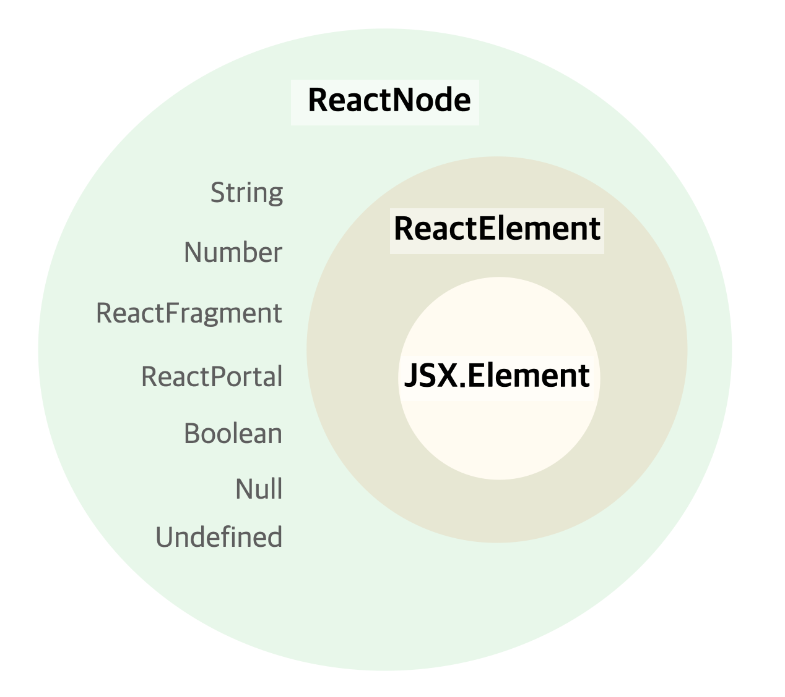

## 들어가며
Typescript로 개발을 하다보면 자주 마주치는 타입 ReactNode, JSX.Element 그리고 ReactElement. <br/>
어느 날 문득 나는 각 타입의 차이를 명확히 설명할 수 있나라는 의문이 들었고, 그 대답은 아니다였기에 정리해본다.

## ReactNode

```typescript
type ReactNode = 
    ReactElement 
    | string 
    | number 
    | ReactFragment 
    | ReactPortal 
    | boolean 
    | null 
    | undefined;
```

위 코드를 보면 알 수 있듯이 Javascript 데이터 타입 대부분을 아우르는 타입으로, <br/> 아래에서 설명할 ReactElement 역시 포함한다.
정확히 어떤 타입을 prop으로 받을지 확실치않을 때, 혹은 어떤 타입이라도 허용 가능하게 하고싶을 때 any대신 ReactNode를 활용할 수 있다.


## ReactElement와 JSX.Element

### 공통점

ReactElement와 JSX.Element는 모두 `React.createElement()`의 리턴 타입이라는 공통점을 가진다. <br/>
이를 더 정확히 알기 위해선 JSX에 대한 배경지식이 필요하니 간략하게 짚고 넘어가보자.

> **JSX**

JSX는 Javascript의 확장 문법으로, Javascript 파일 하나에 렌더링 로직과 마크업 로직을 함께 담을 수 있도록 해준다.
언뜻보면 HTML과 유사해보이지만 실제로는 명백히 다르며 별개의 규칙(반드시 하나의 root element를 가져야 한다, 모든 tag는 close 되어야한다 등)도 가지고 있다.
대부분의 React 개발자가 작성하는 코드는 JSX로 이루어져 있으며, [이곳](https://transform.tools/html-to-jsx)에서 직접 HTML 코드를 JSX로 변환해볼 수 있다.

>**React.createElement**

앞서 설명한 JSX는 Javascript의 확장 문법이므로 브라우저가 바로 실행할 수 있는 Javascript 코드는 아니다.
때문에 브라우저가 잘 이해해서 실행하도록 순수한 Javascript 파일로 변환해주는 트랜스파일 과정이 필요한데, 트랜스파일러 Babel을 이용하면 JSX 코드는 `React.createElement(...)`의 형태로 변환된다.

백문이 불여일견, 직접 코드로 확인해보자.<br/>
이름을 입력하면 웰컴 메세지를 출력하는 간단한 컴포넌트를 만들어보려 한다.

먼저 JSX 코드로는 아래와 같다. React 개발자에겐 너무나 익숙한 형태의 코드일 것.

```javascript
function WelcomeMessage({ name }) {
    return (
        <h1 className="WelcomeMessage">
          Hello <i>{name}</i>. Welcome!
        </h1>
    );
}

export default function App() {
return <WelcomeMessage name="Bomdong" />;
}
```

<br/>

위의 JSX 코드를 createElement 코드로 동일하게 구현하면 아래와 같다. <br/>
언뜻 봐도 코드 길이도 길고, createElement가 반복되는 구조에 가독성도 떨어진다. <br/> 
JSX가 없었다면 간단한 컴포넌트를 만드는 것도 꽤나 성가셨을 것.. 🫠

````javascript
import { createElement } from 'react';

function WelcomeMessage({ name }) {
  return createElement(
    'h1',
    { className: 'WelcomeMessage' },
    'Hello ',
    createElement('i', null, name),
    '. Welcome!'
  );
}

export default function App() {
  return createElement(
    WelcomeMessage,
    { name: 'Bomdong' }
  );
}
````


## ReactElement
ReactElement의 타입은 [React 공식 Repo의 ReactElementType.js](https://github.com/facebook/react/blob/main/packages/shared/ReactElementType.js)에서 확인할 수 있다. <br/>
type, props, key, ref 등 createElement()의 리턴 형태를 갖추고 있다.

```typescript
export type Source = {
  fileName: string,
  lineNumber: number,
};

export type ReactElement = {
  $$typeof: any,
  type: any,
  key: any,
  ref: any,
  props: any,
  // ReactFiber
  _owner: any,

  // __DEV__
  //  ...
};
```

<br/>

[DefinitelyTyped](https://github.com/DefinitelyTyped/DefinitelyTyped/blob/master/types/react/index.d.ts#L146)의 타입 정의도 살펴보자.

````typescript
interface ReactElement<P = any, T extends string | JSXElementConstructor<any> = string | JSXElementConstructor<any>> {
    type: T;
    props: P;
    key: Key | null;
}

type JSXElementConstructor<P> =
    | ((props: P) => ReactElement<any, any> | null)
    | (new (props: P) => Component<any, any>);

type Key = string | number;
````
`type`의 T generic은 해당 HTML태그를, `props`의 P generic은 해당 HTML태그 props의 타입을 받는다.

## JSX.Element
JSX.Element는 ReactElement의 type과 props을 any로 받아 확장한 타입이다. <br/>
따라서 ReactElement보다 좀더 범용적으로 사용할 수 있다.

```typescript
declare global {
    namespace JSX {
        interface Element extends React.ReactElement<any, any> {} 
        //...
    }
    //...
}
```

또하나 눈여겨볼만한 점은 global namespace로 선언되어 있다는 것. 

ReactElement 등 다른 React 관련 타입은 React namespace에 선언되어있는데, <br/> JSX는 global namespace로 선언되어 있어 
JSX를 import하지 않은 상태에서 바로 사용할 수 있다. 또 사용하는 라이브러리에서 자체적인 방법으로 사용될 수 있다는 걸 유의해야한다.

> namespace는 서로 구분이 가능하도록 정해둔 영역, 범위를 뜻한다.


## 한눈에 정리하기
세 타입의 관계를 한눈에 정리하면 아래의 형태와 같다. <br/>
> JSX.Element는 ReactNode의 타입으로 명시되어 있지는 않지만 ReactNode 하위의 ReactElement의 type, props를 any로 받아 확장한 타입이기 때문에 결과적으로 ReactNode의 하위로 정리했다.




### 참고 자료

<a target="_blank" href="https://react.dev/learn/writing-markup-with-jsx">
[React Reference] Writing Markup with JSX - React</a> <br/>
<a target="_blank" href="https://react.dev/reference/react/createElement">
[React Reference] createElement</a> <br/>

```toc
```