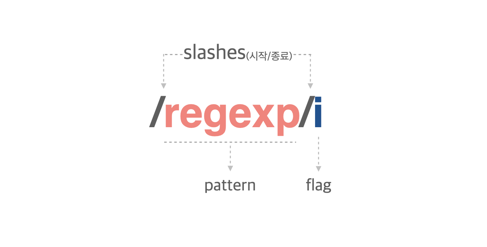

## 들어가며

사실 정규 표현식은 필요할 때마다 구글링을 해 원하는 식을 손쉽게 찾아낼 수 있고, 요즘 핫한 chatGPT에게 질문만 하면 적절한 예시까지 곁들여주기도 한다.
다만 알고 사용하는 것과 모르고 복붙하는 것은 큰 차이가 있다고 생각하기에 (또 서치한 결과를 스스로 검증하는 능력도 중요하기에) 정리해보는 글.

## 정규 표현식이란

정규 표현식 (Regular Expression)은 특정 패턴을 가진 문자열 집합을 뜻하며, 이를 활용해 문자열에서 원하는 패턴의 문자열을 찾아내고 테스트하거나 치환할 수있다.
예를 들면 이메일주소의 형식에 맞는 문자열인지 테스트하거나 휴대폰번호 입력 input에 숫자만 입력되도록 할 수 있다.

정규 표현식은 대부분의 프로그래밍 언어에 내장되어 있고, 코드 에디터에서 검색할 수도 있는데 자바스크립트에는 ES3부터 도입되었다.
여러 기호가 혼합되어 있는 형태가 처음엔 낯설 수 있지만 명확한 구조를 익히면 반복문, 조건문없이 문자열의 패턴을 정의하고 테스트할 수 있어 유용하다.

## 정규 표현식 생성하기

자바스크립트에서 정규 표현식은 객체(RegExp 객체)이며, 1)리터럴 문법 2)생성자 함수로 생성할 수 있다.
일반적으로는 리터럴 문법을 사용한다.

### 1. 정규 표현식 리터럴



정규 표현식 리터럴은 위와 같이 패턴과 플래그로 구성되며, `/`로 패턴의 시작과 종료를 나타낸다.

- `pattern` : 문자열의 일정한 규칙을 표현하기 위해 사용한다.
- `flag` : 정규 표현식의 검색 방식을 설정하기 위해 사용한다.

### 2. 생성자 함수

생성자 함수에 pattern과 flag를 명시하는 방법으로도 정규 표현식 객체를 생성할 수 있다.

```javascript
const regex = new RegExp(pattern[, flags])
```

## 정규 표현식 메서드

정규 표현식은 RegExp의 메서드 test(), exec()과 String의 메서드 match(), replace(), search(), split()에서 사용할 수 있다.

### RegExp 메서드

**`RegExp.prototype.exec()`**

인수로 전달받은 문자열에서 정규 표현식의 패턴을 검색해보고, 그 매칭 결과를 **배열 또는 null**로 반환한다.

> g 플래그(문자열 의 모든 패턴 검색)를 지정해도 첫 번째 매칭 결과만 반환한다.

```javascript
const regExp = /[0-9]/g; //숫자 검색

regExp.exec('test'); //null
regExp.exec('123'); //[ '1', index: 0, input: '123', groups: undefined ]
```

<br/>

**`RegExp.prototype.test()`**

인수로 전달받은 문자열에서 정규 표현식의 패턴을 검색해보고, 그 매칭 결과를 **boolean** 형태로 반환한다.

```javascript
const regExp = /[0-9]{2}/g; //숫자 패턴이 두 번 반복되는지 (숫자가 두 글자 있는지)

regExp.test('test123'); //true
regExp.test('test3'); //false
```

<br/>

### String 메서드

**`String.prototype.match()`**

대상 문자열과 인수로 전달받은 정규 표현식과의 매칭 결과를 **배열**로 반환한다.

> RegExp.prototype.exec()과 달리 g 플래그를 지정하면 모든 매칭 결과가 배열로 반환된다.

```javascript
const regExp = /[0-9]/g; //숫자 검색

//exec()
regExp.exec('123'); //[ '1', index: 0, input: '123', groups: undefined ]

//match()
'123'.match(regExp); //[ '1', '2', '3' ]
```

<br/>

**`String.prototype.replace()`**

대상 문자열에서 첫 번째 인수로 전달받은 문자열/정규 표현식을 검색해 이를 두 번째 인수로 전달받은 문자열로 **치환한 문자열**을 반환한다.
검색된 문자열이 여러 개일 경우엔 첫 번째로 검색된 문자열만 치환한다.

```javascript
const regExp = /^[\s]+/g;

//문자 앞쪽의 공백을 제거
'   let me know'.replace(regExp, ''); //'let me know'
```

<br/>

**`String.prototype.search()`**

대상 문자열에서 인수로 전달받은 정규 표현식과 매치하는 문자열을 검색해 **일치하는 문자열의 인덱스 또는 -1**을 반환한다.

<br/>

**`String.prototype.split()`**

대상 문자열에서 첫 번째 인수로 전달받은 문자열/정규 표현식을 검색해 이를 기준으로 문자열을 구분하고, **분리된 각 문자열로 이루어진 배열**을 반환한다.

## 플래그

플래그는 정규 표현식의 검색 방식을 설정하기 위해 사용하며, 선택적으로 사용할 수 있는 옵션이다. <br/>
아래 플래그 중 g, i, m이 주로 사용된다.

| 플래그 | 의미        | 설명                                                                                             |
| ------ | ----------- | ------------------------------------------------------------------------------------------------ |
| `g`    | Global      | 전역 검색                                                                                        |
| `i`    | Ignore case | 대소문자를 구분하지 않고 패턴 검색                                                               |
| ` m`   | Multi Line  | 문자열 행이 바뀌어도 계속해서 검색                                                               |
| ` s `  | Single Line | `.`으로 검색시 개행 문자 `\n`도 포함하도록 검색                                                  |
| ` u`   | unicode     | unicode property를 활용해 검색<br/>(4바이트인 unicode에서 생길 수 있는 surrogate pair 문제 대응) |
| ` y `  | sticky      | 대상 문자열의 특정 위치에서 검색                                                                 |

## 패턴

### Groups and Range

문자의 그룹과 범위를 나타낸다.

| Character | 의미                                                                  |
| --------- | --------------------------------------------------------------------- |
| `\| `     | or                                                                    |
| `()`      | 그룹                                                                  |
| `[]`      | 괄호 안의 모든 문자<br/>범위를 지정하고 싶으면 []내에 `-`를 사용한다. |
| `[^]`     | not 의미. 괄호 안의 문자가 아닌 문자                                  |
| `(?:)`    | 괄호 안의 문자를 match시키지만 기억하지는 않는다                      |

### Quantifiers

| Character | 의미                                                                                            | 같은 패턴 |
| --------- | ----------------------------------------------------------------------------------------------- | --------- |
| `?`       | 앞선 패턴이 최대 한 번 이상 (0번 포함) 반복되는 문자열                                          | {0,1}     |
| `*`       | 앞선 패턴이 존재하지 않거나 존재하는, 또는 반복되는 문자열                                      |           |
| `+`       | 앞선 패턴이 최소 한 번 이상 반복되는 문자열                                                     | {1,}      |
| `{n} `    | 앞선 패턴이 n번 반복되는 문자열                                                                 | {n,n}     |
| `{n,}`    | 앞선 패턴이 최소 n번 이상 반복되는 문자열                                                       |           |
| `{n,m} `  | 앞선 패턴이 최소 n번, 최대 m번 반복되는 문자열<br/>(`,`뒤에 공백이 있으면 정상 동작하지 않는다) |           |

### Assertions

시작과 끝을 나타내는 경계와, 패턴과 문자열을 일치시키는 방법(전방/후방 탐색, 조건문 등)을 나타낸다.

| Character | 의미             |
| --------- | ---------------- |
| `\b`      | 단어 경계        |
| `\B`      | 단어 경계가 아님 |
| `^`       | 문자열의 시작    |
| `$`       | 문자열의 마지막  |

### Character classes

문자의 유형을 구분한다.

| Character | 의미                                 | 같은 패턴     |
| --------- | ------------------------------------ | ------------- |
| `\`       | 특수 문자가 아닌 문자                | [^a-za-z0-9]  |
| `.`       | 임의의 문자 한 개 (개행문자 제외)    |               |
| `\d`      | 숫자                                 | [0-9]         |
| `\D`      | 숫자가 아닌 문자                     | [^0-9]        |
| `\w`      | 알파벳, 숫자, 언더스코어             | [A-Za-z0-9_]  |
| `\W`      | 알파벳, 숫자, 언더스코어가 아닌 문자 | [^a-za-z0-9_] |
| `\s`      | 공백 (space, tab 등)                 | [\t\r\n\v\f]  |
| `\S`      | 공백이 아닌 문자                     |               |

## 자주 사용하는 정규표현식

### 숫자만으로 이루어진 문자열인지 검사

```javascript
const regExp = /^\d+$/g; //문자열의 처음과 끝이 숫자이고 최소 한 번 이상 반복

const example1 = '1234';
const example2 = 'one2three4';

regExp.test(example1); //true
regExp.test(example2); //false
```

### 휴대폰 번호 형식 검사

`숫자 3글자 - 숫자 4글자 - 숫자 3글자` 형식의 입력값을 검사해보자.

```javascript
const regExp = /^\d{3}-\d{4}-\d{4}$/g;

const example1 = '010-0000-0000';
const example2 = '010-00000000';

regExp.test(example1); //true
regExp.test(example2); //false
```

### 문자열이 하나 이상의 공백으로 시작하는지 검사

```javascript
const regExp = /^[\s]+/g;

regExp.test('  example'); //true
regExp.test('example'); //false
```

### 특수문자 포함 여부 검사

특수문자의 범위에 따라 두 가지 방법을 사용해 검사할 수 있다.

#### 1. 특정 특수문자를 검사

`/[\특수문자\특수문자2...]/gi`의 형태로 검사하고 싶은 특수문자를 `\`와 함께 정규표현식에 넣어준다.

```javascript
const regExp1 = /[\!\?\@\[\]\{\}\-]/gi; //-포함
const regExp2 = /[\!\?\@\[\]\{\}]/gi; //-미포함

const example = '010-0000-';
regExp1.test(example); //true
regExp2.test(example); //false
```

#### 2. 한글, 영어, 숫자를 제외한 다른 문자를 특수문자로 규정하고 검사

```javascript
const regExp1 = /[^A-Za-z0-9ㄱ-ㅎㅏ-ㅣ가-힣]/g; //영어 대소문자,숫자,한글 제외
const regExp2 = /[\!\?\@\[\]\{\}]/gi; // !,?,@,[,],{,}

const example = '비밀번호****';

regExp1.test(example); //true
regExp2.test(example); //false

const example2 = '#hello';

regExp1.test(example2); //true
regExp2.test(example2); //false
```

<br/>

단순히 true/false의 결과값을 얻는 검사가 아니라 특수문자를 지워주고 싶다면 아래의 방법으로 특수문자를 `''`(공백)으로 바꿔줄 수 있다.

```javascript
const regExp = /[^A-Za-z0-9ㄱ-ㅎㅏ-ㅣ가-힣]/g; //영어 대소문자,숫자,한글 제외

const example = '비밀번호****';
example.replace(regExp, ''); //비밀번호

const example2 = '#hello';
example2.replace(regExp, ''); //hello
```

## 참고 자료

- RegExp - 모던 자바스크립트 Deep Dive
- [정규 표현식 - MDN](https://developer.mozilla.org/ko/docs/Web/JavaScript/Guide/Regular_Expressions)

```toc

```
