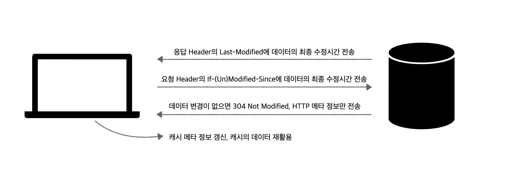
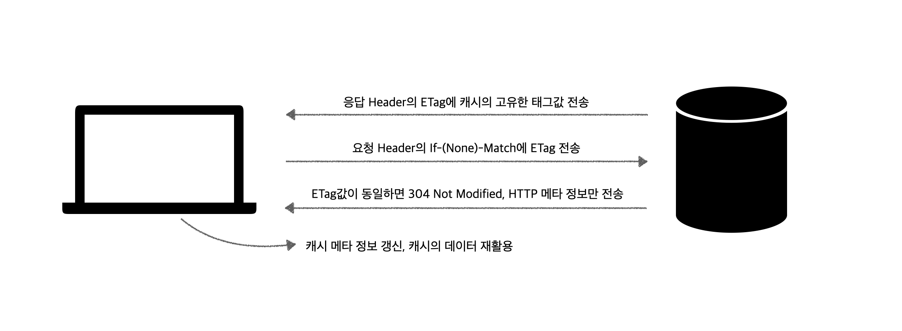

## HTTP 캐시

웹 브라우저가 서버로부터 받은 데이터를 일시적으로 저장하는 공간을 HTTP 캐시라고 한다.

> 캐시는 데이터,값을 복사해 임시로 저장하는 장소를 가르키고 [AWS](https://aws.amazon.com/ko/caching/)에 따르면 다양한 유형이 있다. (데이터의 복사본을 저장하는 장소는 캐시, 캐시에 복사본을 저장하고 있다가 요청시 제공하는 과정 전체는 캐싱이라 한다.) 다만 조건부 요청 헤더와의 상호작용에 대한 이 글에선 HTTP 캐시(웹 캐시)만 다룰 예정.

HTTP 캐시는 웹 서비스 성능 최적화에 도움을 주는데, 이미지나 자바스크립트 파일 등을 매번 다운로드하지 않고 복사본을 캐시에 저장해 두었다가 이후의 요청에 (유효시간 검증 후)캐시의 리소스를 사용할 수 있기 때문이다. 우리가 어떤 페이지에 처음 진입할 때와 n번째 진입할 때의 로딩 속도가 차이나는 이유도 여기에 있다.

HTTP 캐시는 주로 HTTP 헤더를 통해 제어되는데, 대표적인 헤더는 아래 정도가 있다.

- `Cache-Control` : 캐시의 유효시간을 초 단위로 설정하거나 (max-age) 특정 데이터가 캐시하지 않도록 설정하는(no-store) 등 세밀한 제어를 할 수 있다.
- `Last-modified` : 검증 헤더 중 하나로, 데이터가 마지막으로 수정된 시간을 뜻한다.
- `ETag`(Entity Tag) : 캐시용 데이터에 임의로 고유한 이름을 달아두는 것으로, 데이터가 변경되면 이름도 함께 변경된다. 검증 헤더 중 하나.

## 조건부 요청 헤더

조건부 요청 헤더는 말 그대로 웹 브라우저가 서버에 요청을 보낼 때 특정 조건을 명시하는 역할을 한다.

조건부 요청 헤더는 HTTP 캐시와 상호작용해 웹 성능 최적화를 향상시킬 수 있다. 조건부 요청 헤더로 서버에 캐시된 데이터의 유효성을 확인요청하면, 서버는 유효하다면 데이터가 변경되지 않았음을 결과로 전달하고, 유효하지 않다면 새로운 데이터를 전송한다. 이 때 사용되는 헤더는 아래와 같다.

- `If-Modified-Since`, `If-UnModified-Since` : 검증 헤더인 last-modified와 함께 사용된다.
- `If-Match`, `If-None-Match` : 검증 헤더인 ETag와 함께 사용된다.

## HTTP 캐시와 조건부 요청 헤더의 상호작용

그럼 앞서 소개한 조건부 요청 헤더는 HTTP 캐시와 어떻게 상호작용하는걸까?

### Last-Modified와 If-(Un)Modified-Since

데이터의 최종 수정시간을 기준으로 데이터의 유효성을 검증한다.



1. Client의 요청에 따른 응답을 보낼 때, Server는 `Last-Modified` 헤더에 데이터의 최종 수정시간을 전송한다.

2. Client는 이후 요청을 보낼 때 `If-(Un)Modified-Since` 헤더에 데이터의 최종 수정시간을 전송한다.

3. Server는 Client가 보낸 헤더값으로 데이터의 최종 수정시간을 비교하고, 변경이 없으면 `304 Not Modified`로 응답하며 body없이 HTTP 메타 정보를 함께 전송한다. 변경이 있어 새로운 데이터로 갱신해야 할 경우, (일반적으로)`200 ok`와 body로 데이터를 전송한다.

4. Client는 304 응답을 받을 경우 함께 전달받은 메타 정보로 캐시의 메타 정보를 갱신하고, 갱신한 캐시의 데이터를 재활용한다.

### ETag와 If-(None)-Match



> 데이터의 유효성을 최종 수정시간이 아닌 캐시의 고유한 태그값(ETag)로 검증한다는 것을 제외하면 `If-Modified-Since`, `If-UnModified-Since`와 거의 동일하다.

1. Client의 요청에 따른 응답을 보낼 때, Server는 ETag 헤더에 캐시의 고유한 태그값을 전송한다.

2. Client는 이후 요청을 보낼 때 `If-(None)-Match` 헤더에 캐시의 고유한 태그값

3. Server는 Client가 보낸 헤더값으로 ETag값을 비교하고, 변경이 없으면 `304 Not Modified`로 응답하며 body없이 HTTP 메타 정보를 함께 전송한다.
   변경이 있어 새로운 데이터로 갱신해야 할 경우, (일반적으로)`200 ok`와 body로 데이터를 전송한다.

4. Client는 304 응답을 받을 경우 함께 전달받은 메타 정보로 캐시의 메타 정보를 갱신하고, 갱신한 캐시의 데이터를 재활용한다.

---

물론 리소스의 성격에 따라 `Cache-Control : no-cache, no-store, must-revalidate`로 애초에 캐시를 무효화 시킬 수도 있고, [토스](https://toss.tech/article/smart-web-service-cache)처럼 `Cache-Control : max-age=31536000` (최대값) 을 설정해 새로운 배포 전까지 계속해서 캐시된 리소스를 사용하게 제어할 수도 있다.

```toc

```
