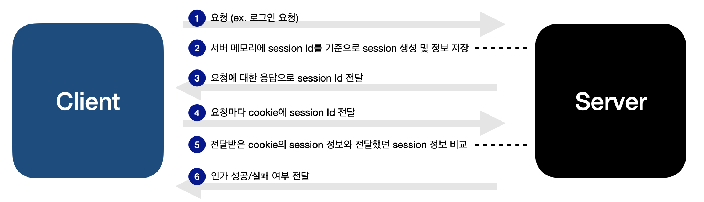

## 들어가며

프로젝트를 진행할 때 JWT를 활용한 인증 방식으로 로그인을 구현한 적이 있다. <br/>
백엔드 개발자분과 협업을 하며 key값을 맞춰보고, 인증이 완료되었다고 기뻐하던 추억은 선명하지만.. <br/>
JWT가 무엇인가란 질문에 자신있게 대답할 수 없었다. <br/>
추억속의 JWT를 꺼내 등장 배경부터 인증 프로세스, 장단점까지 알아보자.

## JWT의 등장배경

JWT가 무엇이고 어떤 형태로 사용되는지도 중요하지만, 먼저 그 배경을 알아야 어떤 장점과 특징을 가지고 있는지 제대로 이해할 수 있다. 그렇다면 JWT는 어떻게 등장하게 되었을까? 이는 HTTP의 특징과 연관된다.

### HTTP의 특징

HTTP는 `contactless` (클라이언트의 요청이 처리되면 연결이 끊어짐), `stateless` (서버가 클라이언트의 이전 상태를 저장하지 않음)라는 특징을 가지고 있어
인증이 필요한 페이지에 접근할 경우 서버는 클라이언트가 누구인지 매번 확인해야했다.

예를 들어 쇼핑몰에서 로그인을 하고 마음에 드는 제품을 장바구니에 담을 때마다 다시 로그인을 하며 내가 회원이라는 걸 알려줘야 했다는 것. 상상만해도 번거롭다. 🤯

### ① 서버기반 인증

인증이 필요한 페이지에서 매번 로그인을 해야하는 이러한 불편을 보완하고자 가장 먼저 쿠키와 세션을 활용한 서버기반 인증 방식이 등장했다.

#### ❶ cookie (쿠키)


아마 쿠키라 한다면 위 화면과 함께 티켓팅, 수강신청 꿀팁 중 하나인 '쿠키를 삭제해라' 를 떠올리는 사람들이 대부분이지 않을까?
지금껏 아무 생각 없이 쿠키를 삭제하는 작업을 했었지만, 내가 삭제한 쿠키가 정확히 뭘 의미하는지는 몰랐다.

한 마디로 정리해보자면, 쿠키는 **client가 웹사이트에 접속할 때 그 사이트의 서버를 통해 브라우저에 설치되는 작은 기록 정보 파일**이다. 여기서 '작은'이라 칭한 이유는 기록할 수 있는 데이터 용량이 작고 귀여운 4kb이기 때문이다.

#### 쿠키를 활용한 인증 프로세스


1. Client는 Server에 어떠한 요청을 한다. (ex. 로그인 요청)
2. Server는 요청에 대한 응답의 Header의 set-cookie에 Client에 저장하고 싶은 정보를 담아 보낸다.
3. Client는 요청을 보낼 때마다 Header의 cookie에 전달받았던 정보를 함께 보낸다.
4. Server는 전달받은 cookie의 정보로 Client를 식별한다.

#### 쿠키의 단점

- 보안 취약성 : Header를 통해 그대로 전달되므로 유출될 위험이 높다.
- 용량 제한 : 4kb라는 작고 귀여운 용량으로 제한된다.
- 브라우저간 공유 불가 : 서로 다른 각 웹 브라우저마다 지원하는 방식이 다르기 때문에 공유가 되지 않는다.

#### ❷ session

세션은 Client의 정보를 Client쪽이 아닌 Server쪽에 저장하고 관리함으로써 보안이 취약한 cookie의 단점을 보완해준다.

#### 세션을 활용한 인증 프로세스



1. Client는 Server에 어떠한 요청을 한다. (ex. 로그인 요청)
2. Server는 메모리에 session Id를 기준으로 session을 생성하고, 정보를 저장한다.
3. Server는 Client의 요청에 대한 응답으로 session Id를 전달한다.
4. Client는 Server에 요청을 할 때마다 cookie에 session Id를 함께 전달한다.
5. Server는 전달받은 cookie의 session 정보와 이전에 발급해 전달했던 session 정보를 비교한다.
6. Server는 인가 성공/실패 여부를 Client에게 전달한다.

#### 세션의 단점

- 서버 부하 : Server에 세션을 저장하는 저장소가 필요하고, 저장소에 데이터 정보 조회 요청을 계속 보내야하므로 서버에 부담이 된다.
- stateful : Server가 정보를 계속 기억하므로 HTTP의 특징인 stateless에 위배된다.
- 토큰 기반 인증, JWT의 등장

### ② 토큰 기반 인증

앞서 언급한 서버의 부담, stateless 위배라는 서버기반 인증의 약점을 보완하기위해 토큰 기반 인증이 등장했다. <br/>
토큰 기반 인증은

1. 인증받은 Client에게 Server가 토큰을 부여하고
2. 인증이 필요한 요청의 HTTP Header에 이 토큰을 담아 보내면
3. 토큰을 기준으로 Server가 Client를 식별하는 방식이다.

#### JWT (JSON Web Token)

인증에 필요한 정보들을 암호화시킨 토큰을 뜻한다. <br/>
JWT 기반 인증 방식이란 Client가 Server에게 요청을 보낼 때 HTTP의 Header에 이전에 Server로부터 발급받은 JWT를 담아 보내고, 이를 기반으로 Server가 Client를 식별하는 방식을 뜻한다.

## JWT의 구조

```
XXXXXX.YYYYYY.ZZZZZZ
// Header(헤더).Payload(내용).Signature(서명)
```

JWT는 `.`로 구분된 세 문자열인 Header, Payload, Signature로 이루어져있다. <br/>
각각의 구조를 더 딥하게 알아보자.

### ① Header

signature를 암호화하는 알고리즘과 토큰의 유형을 포함한다.

```javascript
// 디코딩된 형태
{
"alg" : ... , //서명 암호화 알고리즘
"typ" : "JWT", //토큰 유형
}
```

### ② Payload

서버와 클라이언트가 주고받는 시스템 속에서 실제로 사용될 정보

> claim : key-value 형식의 정보 한 쌍

- `Registered claims` : 미리 정의된 클레임 ex. iss(발행자), exp(만료시간), iat(발생시간) 등
- `Public claims` : 공개용 정보 전달을 위한 클레임 (사용자가 정의가능)
- `Private claims` : 당사자들간 정보 공유용 사용자 지정 클레임

### ③ Signature

header의 인코딩 값 + payload의 인코딩 값 + 서버의 key값 을 header에서 정의한 알고리즘으로 암호화한 것. <br/>
이 때 서버의 key값이 유출되지 않는 이상 복호화할 수 없다.

## JWT를 이용한 인증 Process


1. Client가 Server에 요청을 보낸다. (ex. 로그인 인증 요청)
2. Server는 Header, Payload, Signature를 정의하고 각각 암호화해 JWT를 생성한다.
3. Server는 생성한 JWT를 cookie에 담아 Client에게 발급한다.
4. Client는 JWT를 저장하고, 이후 인증이 필요한 요청마다 Authorization Header에 Access token을 담아 보냄
5. Server는 발행했던 token과 Client로부터 받은 token의 일치여부를 확인한다 (인증).
6. token이 서로 일치하면 payload의 정보를 Client에게 전달한다.
7. Access token이 만료될 경우, Client는 refresh token을 Server에 보낸다.
8. Server는 새로운 Access token을 발급해 Client에 전달한다.

## JWT의 장점

Header와 Payload로 signature를 생성하기 때문에 데이터가 위,변조되었을 때 더 쉽게 판별할 수 있다. <br/>
Session과 달리 아래의 특징을 가지고 있다.

- 별도 저장소가 불필요하다.
- 서버를 stateless로 유지할 수 있다.
- 정보를 자체적으로 보유할 수 있어 요청할 때마다 DB조회를 하지않아도 된다.
- 모바일 환경에서도 잘 동작한다.

## JWT의 단점

- token의 길이가 길어 인증 요청이 많아질수록 네트워크 부하 위험이 있다. (DB 성능면에선 이득이지만)
- token은 탈취당할 경우 대처하기가 어렵다.
- token의 만료시간을 설정해두었을 경우, 그 전에 강제로 만료시키기 어렵다.
- payload의 내용은 암호화가 되지않아, Server와 Client간에 나누는 내용에 중요한 정보 (ex. 고객 개인정보)를 담을 수는 없다.

## 정리

cookie,Session 인증 방식과 JWT 인증 방식을 비교해보면 아래와 같다. <br/>
각각의 방법에 따라 네트워크 / 서버에 상대적으로 부하를 주는 비중이 달라지게되니, 환경에 따라 취사선택하면 좋을 듯 싶다.

|                    | 인증 방식 | 장점                                                                      | 단점                                           |
| ------------------ | --------- | ------------------------------------------------------------------------- | ---------------------------------------------- |
| Cookie<br/>Session | 서버 기반 | 네트워크 부담 낮음                                                        | Session 저장소가 필요해 <br/>서버 부하 위험    |
| JWT 인증 방식      | 토큰 기반 | 별도의 저장소가 필요치않고 <br/>DB조회를 하지않아도 되므로 서버 부담 낮음 | 토큰 길이가 길어질수록 <br/>네트워크 부하 위험 |

```toc

```
